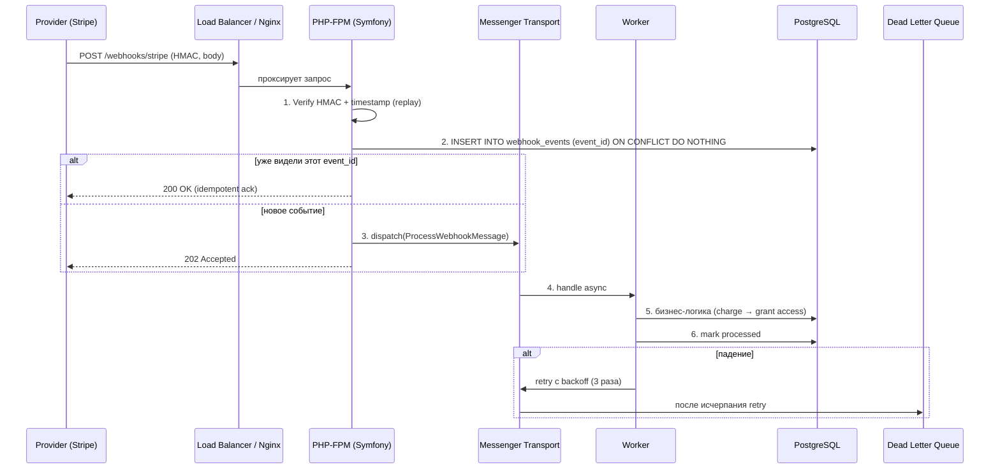

# PHP Webhooks: полное и исчерпывающее руководство для Senior-разработчика (PHP 8.2 + Symfony 6.4)

> Это руководство — практический справочник по проектированию, приёму, отправке, безопасности, идемпотентности, ретраям, мониторингу и тестированию вебхуков на стеке PHP 8.2+ / Symfony 6.4+. Покрывает теорию, архитектурные паттерны (Transactional Outbox, async-обработка через Symfony Messenger), интеграции с реальными провайдерами (Stripe, GitHub, Slack, Telegram), production-нюансы и сравнение с альтернативами (polling, SSE, WebSocket, очереди). Все примеры — реальные и работоспособные.

---

## Оглавление

1. [[#1. Что такое webhook и зачем он нужен|Что такое webhook и зачем он нужен]]
2. [[#2. Webhooks vs alternatives: polling, SSE, WebSocket, очереди|Webhooks vs alternatives: polling, SSE, WebSocket, очереди]]
3. [[#3. Архитектура и жизненный цикл webhook|Архитектура и жизненный цикл webhook]]
4. [[#4. Анатомия HTTP-запроса webhook|Анатомия HTTP-запроса webhook]]
5. [[#5. Приём webhook: controller, validation, parsing|Приём webhook: controller, validation, parsing]]
6. [[#6. Безопасность: HMAC, mTLS, IP allow-list, timestamp, replay|Безопасность: HMAC, mTLS, IP allow-list, timestamp, replay]]
7. [[#7. Идемпотентность и дедупликация|Идемпотентность и дедупликация]]
8. [[#8. Порядок доставки (ordering) и out-of-order events|Порядок доставки (ordering) и out-of-order events]]
9. [[#9. Асинхронная обработка через Symfony Messenger|Асинхронная обработка через Symfony Messenger]]
10. [[#10. Ретраи, backoff, jitter и Dead Letter Queue|Ретраи, backoff, jitter и Dead Letter Queue]]
11. [[#11. Отправка webhook (producer side)|Отправка webhook (producer side)]]
12. [[#12. Transactional Outbox для надёжной отправки|Transactional Outbox для надёжной отправки]]
13. [[#13. Хранение событий и схема БД|Хранение событий и схема БД]]
14. [[#14. Версионирование payload и эволюция API|Версионирование payload и эволюция API]]
15. [[#15. Symfony Webhook Component (официальная интеграция)|Symfony Webhook Component (официальная интеграция)]]
16. [[#16. Реальный кейс: Stripe webhook|Реальный кейс: Stripe webhook]]
17. [[#17. Реальный кейс: GitHub webhook|Реальный кейс: GitHub webhook]]
18. [[#18. Реальный кейс: Telegram bot webhook|Реальный кейс: Telegram bot webhook]]
19. [[#19. Тестирование webhooks: unit, integration, e2e, ngrok|Тестирование webhooks: unit, integration, e2e, ngrok]]
20. [[#20. Мониторинг, observability, метрики, алерты|Мониторинг, observability, метрики, алерты]]
21. [[#21. Производительность, масштабирование и rate limiting|Производительность, масштабирование и rate limiting]]
22. [[#22. SSRF-защита при исходящих webhook|SSRF-защита при исходящих webhook]]
23. [[#23. Регистрация подписок (subscription management)|Регистрация подписок (subscription management)]]
24. [[#24. Анти-паттерны и типичные ошибки|Анти-паттерны и типичные ошибки]]
25. [[#25. Чек-лист production-ready webhook endpoint|Чек-лист production-ready webhook endpoint]]
26. [[#26. Проверочные вопросы с ответами|Проверочные вопросы с ответами]]
27. [[#27. Источники|Источники]]

---

## 1. Что такое webhook и зачем он нужен

**Webhook** (он же *HTTP callback*, *reverse API*) — это HTTP-запрос (обычно `POST`), который **сервер-источник** инициативно отправляет на заранее зарегистрированный URL **сервера-получателя** в момент наступления события. Вместо того чтобы клиент опрашивал API раз в N секунд («произошло ли что-то?»), сервер сам «толкает» данные, когда они появились.

Аналогия: разница между «звонить в пиццерию каждые 5 минут — готов ли заказ» (polling) и «оставить номер телефона, чтобы перезвонили, когда будет готово» (webhook).

**Бизнес-ценность:**
- **Низкая задержка**. Событие обрабатывается за сотни миллисекунд после возникновения, а не через интервал опроса.
- **Экономия ресурсов**. Не нужно опрашивать API «вхолостую» — ни траффика, ни вычислений.
- **Real-time UX**. Платёж подтверждён → пользователю мгновенно открывается доступ к курсу/файлу.
- **Декаплинг систем**. Сервис-источник не знает, как именно получатель использует событие; контракт — только HTTP + payload.

**Где применяется на практике:**
- Платёжные шлюзы: Stripe, YooKassa, CloudPayments, PayPal — `payment_intent.succeeded`, `charge.refunded`.
- VCS: GitHub, GitLab, Bitbucket — `push`, `pull_request`, `issues`.
- Мессенджеры/боты: Telegram Bot API, Slack Events API, Discord Interactions.
- CRM/маркетинг: HubSpot, Mailchimp, SendGrid (`bounce`, `delivered`, `opened`).
- Доставка/логистика: трекинг статусов от СДЭК, DHL, FedEx.
- Внутренние event-driven архитектуры: один микросервис уведомляет другой по HTTP.

**Ключевое отличие от REST API.** Обычный REST — это `request → response`, инициатор клиент. Webhook — наоборот: ваш сервис становится **HTTP-сервером для коллбэков**, а провайдер — клиентом. Это инвертирует ответственность: вы должны держать публичный endpoint, валидировать подпись, обрабатывать ретраи и at-least-once доставку.

---

## 2. Webhooks vs alternatives: polling, SSE, WebSocket, очереди

| Подход | Кто инициирует | Задержка | Сложность | Когда выбирать |
|---|---|---|---|---|
| **Polling** | Клиент | секунды–минуты | низкая | Простые интеграции, нет публичного URL, мало событий |
| **Long polling** | Клиент | секунды | средняя | Когда нет webhook на стороне провайдера |
| **Webhooks** | Сервер | мс–секунды | средняя | Event-driven интеграции, есть публичный HTTPS |
| **SSE (Server-Sent Events)** | Сервер | мс | средняя | Однонаправленный поток в браузер (live-уведомления UI) |
| **WebSocket** | Bidirectional | мс | высокая | Чаты, торговые терминалы, многонаправленный обмен |
| **Очереди (Kafka/RabbitMQ/SQS)** | Producer | мс | высокая | Внутренние событийные шины, гарантии порядка/durability |
| **gRPC streaming** | Любой | мс | высокая | Внутренние сервисы, высокая нагрузка, типизация контракта |

**Когда webhook — НЕ лучший выбор:**
- Получатель не имеет публичного HTTPS (мобильное приложение, локальная машина) → polling или SSE через шлюз.
- Нужна гарантированная упорядоченность по партиции → Kafka/RabbitMQ с partition key.
- Объём — миллионы событий/сек → шина сообщений; webhook рассыпется на ретраях и DLQ.
- Получатели внутри одной инфраструктуры → внутренний message bus дешевле и надёжнее, чем HTTP с подписями.

**Webhook + очередь — типичная гибридная схема:** провайдер шлёт webhook → ваш endpoint **только** валидирует подпись и кладёт сообщение в очередь → отдаёт `202 Accepted` за <50 мс → воркеры разбирают очередь асинхронно. Это решает три проблемы разом: SLA endpoint, изоляцию падений, throughput.

---

## 3. Архитектура и жизненный цикл webhook

Жизненный цикл события у consumer-а (нашего сервиса, принимающего webhook):



**Ключевые архитектурные принципы:**
1. **Тонкий endpoint, толстый воркер.** Контроллер делает только: верификацию подписи, дедупликацию, сохранение «сырого» события, постановку в очередь. Бизнес-логика — асинхронно.
2. **At-least-once доставка.** Любой провайдер, который заявляет «exactly-once», на деле даёт at-least-once. Поэтому **идемпотентность — это не опция, это требование**.
3. **Сохраняем сырой payload.** Запись `raw_body + headers + received_at` в БД до любой обработки. Это позволяет переиграть события, расследовать инциденты и отвечать на «у нас webhook не пришёл» с цифрами.
4. **Подпись проверяется на сыром body.** Любая `json_decode → json_encode` сломает HMAC. Читаем `php://input` один раз, верифицируем, парсим — именно в этом порядке.
5. **Возвращаем 2xx как можно раньше.** Большинство провайдеров считают всё, что не 2xx, неудачей и ретраят. Если воркер упадёт через минуту — уже не важно: ack уже отдан, обработка идёт асинхронно, ретраи у нас локальные.

**Жизненный цикл события на стороне producer-а** (когда ваш сервис сам шлёт webhook наружу):

```text
[Domain Event] → [Outbox table (in same TX)] → [Relay worker]
                                                     │
                                                     ▼
                                    [HTTP POST с HMAC + Idempotency-Key]
                                                     │
                              ┌──────────────────────┼─────────────────────┐
                              ▼                      ▼                     ▼
                       2xx → mark sent      4xx → mark failed      5xx/timeout → retry
                                              (no retry)            (exp backoff + jitter)
                                                                          │
                                                                          ▼
                                                                   N attempts → DLQ + alert
```

---

## 4. Анатомия HTTP-запроса webhook

Типичный webhook-запрос (на примере Stripe):

```http
POST /webhooks/stripe HTTP/1.1
Host: api.example.com
User-Agent: Stripe/1.0 (+https://stripe.com/docs/webhooks)
Content-Type: application/json
Content-Length: 1834
Stripe-Signature: t=1714060800,v1=5257a869e7ecebeda32affa62cdca3fa51cad7e77a0e56ff536d0ce8e108d8bd
Idempotency-Key: evt_3PaQz12eZvKYlo2C0XYZ1234

{"id":"evt_3PaQz12eZvKYlo2C0XYZ1234","type":"payment_intent.succeeded","data":{...}}
```

**Что важно вычитать:**
- **`Content-Type`**: чаще всего `application/json`, но Slack legacy шлёт `application/x-www-form-urlencoded` с полем `payload=...`. GitHub поддерживает оба. Смотрите доки конкретного провайдера.
- **Signature header**: имя и формат разные. Stripe — `Stripe-Signature: t=...,v1=...`. GitHub — `X-Hub-Signature-256: sha256=...`. Slack — `X-Slack-Signature: v0=...` + `X-Slack-Request-Timestamp`. Telegram — `X-Telegram-Bot-Api-Secret-Token`.
- **Event ID header или поле в body** — нужен для дедупликации. У Stripe это `id` в JSON и нет отдельного header; у GitHub — `X-GitHub-Delivery: <uuid>`.
- **Timestamp** — отдельным header или внутри подписи. Используется против replay-атак.
- **User-Agent** — НЕ доверяйте ему как механизму безопасности (его легко подделать), но логируйте для диагностики.

> **Что должен сделать новичок при первой интеграции.** Открыть документацию провайдера по webhooks → выписать: (1) точное имя header подписи, (2) алгоритм HMAC (sha256/sha1/sha512), (3) что именно подписывается (body / `timestamp.body` / `version:body`), (4) откуда брать event-id для дедупа, (5) сколько попыток ретрая шлёт провайдер и с какой задержкой, (6) ожидаемый статус ответа (200/202/204) и таймаут. Без этих 6 пунктов писать код бесполезно.

---

## 5. Приём webhook: controller, validation, parsing

Базовая идея: контроллер должен быть **детерминированным и быстрым**. Никакой бизнес-логики. Только верификация → дедупликация → enqueue → ответ.

### 5.1 Контроллер

```php
<?php
declare(strict_types=1);

namespace App\Webhook\Controller;

use App\Webhook\Message\ProcessStripeEvent;
use App\Webhook\Security\StripeSignatureVerifier;
use App\Webhook\Security\SignatureException;
use App\Webhook\Storage\WebhookEventStore;
use App\Webhook\Storage\DuplicateEventException;
use Psr\Log\LoggerInterface;
use Symfony\Component\HttpFoundation\JsonResponse;
use Symfony\Component\HttpFoundation\Request;
use Symfony\Component\HttpFoundation\Response;
use Symfony\Component\Messenger\MessageBusInterface;
use Symfony\Component\Routing\Attribute\Route;

/**
 * Webhook endpoint для платёжного провайдера Stripe.
 *
 * Делает ровно три вещи: верифицирует HMAC-подпись, дедуплицирует
 * по event_id и кладёт сообщение в очередь. Любая бизнес-логика
 * (выдача доступа, отправка письма, перерасчёт баланса) — в Handler-е.
 *
 * Возврат 2xx критичен: Stripe считает всё кроме 2xx неудачей и ретраит
 * до 3 суток с экспоненциальным backoff. Лишние ретраи = шум в метриках.
 */
final class StripeWebhookController
{
    public function __construct(
        private readonly StripeSignatureVerifier $verifier,
        private readonly WebhookEventStore $store,
        private readonly MessageBusInterface $bus,
        private readonly LoggerInterface $webhookLogger, // канал monolog "webhook"
    ) {
    }

    #[Route(
        path: '/webhooks/stripe',
        name: 'webhook_stripe',
        methods: ['POST'],
        // Отключаем CSRF, firewall и сессию — это публичный машинный endpoint.
        // В security.yaml путь должен быть в access_control с PUBLIC_ACCESS.
    )]
    public function __invoke(Request $request): Response
    {
        // 1. Сырое тело — подпись считается ровно от тех байт, что прислал Stripe.
        //    json_decode/encode здесь категорически нельзя: PHP пересортирует
        //    ключи и подпись перестанет сходиться.
        $rawBody = $request->getContent();
        $signature = $request->headers->get('Stripe-Signature', '');

        // 2. Верификация HMAC + timestamp (защита от replay).
        try {
            $this->verifier->verify($rawBody, $signature, toleranceSeconds: 300);
        } catch (SignatureException $e) {
            // 401 — единственный честный ответ. Не 400 и не 500: запрос
            // не от Stripe или подделан, и мы не хотим его ретраить.
            $this->webhookLogger->warning('Stripe signature verification failed', [
                'reason' => $e->getMessage(),
                'ip' => $request->getClientIp(),
            ]);
            return new JsonResponse(['error' => 'invalid signature'], Response::HTTP_UNAUTHORIZED);
        }

        // 3. Парсим JSON только после успешной верификации.
        /** @var array{id: string, type: string, created: int} $event */
        $event = json_decode($rawBody, true, flags: JSON_THROW_ON_ERROR);

        // 4. Идемпотентность через INSERT ... ON CONFLICT DO NOTHING.
        //    Если событие уже видели — отвечаем 200 и НЕ ставим в очередь повторно.
        try {
            $this->store->record(
                eventId: $event['id'],
                provider: 'stripe',
                eventType: $event['type'],
                rawBody: $rawBody,
                headers: $request->headers->all(),
            );
        } catch (DuplicateEventException) {
            $this->webhookLogger->info('Stripe duplicate event ignored', ['event_id' => $event['id']]);
            return new JsonResponse(['status' => 'duplicate'], Response::HTTP_OK);
        }

        // 5. Постановка в очередь. Сообщение содержит только event_id —
        //    handler сам прочитает payload из webhook_events. Это делает
        //    сообщение маленьким и устойчивым к изменениям payload.
        $this->bus->dispatch(new ProcessStripeEvent($event['id']));

        // 6. 202 Accepted — стандартный ответ для async-обработки.
        //    Stripe одинаково примет и 200, и 202.
        return new JsonResponse(['status' => 'accepted'], Response::HTTP_ACCEPTED);
    }
}
```

### 5.2 Конфигурация security и routing

```yaml
# config/packages/security.yaml
security:
    firewalls:
        webhook:
            pattern: ^/webhooks/
            stateless: true
            security: false  # никакой аутентификации Symfony — только HMAC в контроллере
    access_control:
        - { path: ^/webhooks/, roles: PUBLIC_ACCESS }
```

```yaml
# config/packages/framework.yaml
framework:
    # Сессия для webhook не нужна и опасна (cookies, регенерация).
    # Symfony 6.4 уже не открывает сессию автоматически без обращения к ней.
    trusted_proxies: '%env(TRUSTED_PROXIES)%'  # критично за CDN/LB для getClientIp()
```

### 5.3 Почему именно так — пояснения по алгоритму

1. **`$request->getContent()` без аргументов** возвращает строку (не resource). Symfony кеширует её, так что повторный вызов безопасен.
2. **Подпись до парсинга.** Если сначала декодировать JSON и работать с массивом — теряем исходные байты, и провайдеры это явно запрещают (Stripe, GitHub, Slack — все три).
3. **`tolerance = 300` секунд**, как у эталонной библиотеки Stripe. Меньше — ловите ложные срабатывания из-за clock drift; больше — окно для replay растёт.
4. **`ON CONFLICT DO NOTHING`** в Postgres даёт атомарную дедупликацию без race condition. Альтернативы (`SELECT → IF NOT EXISTS → INSERT`) ломаются под параллельными ретраями провайдера.
5. **Логгер с отдельным каналом** `webhook` — чтобы в production легко отделить шум webhook-логов от прикладных.

---

## 6. Безопасность: HMAC, mTLS, IP allow-list, timestamp, replay

Webhook-endpoint — это публичный URL в интернете. Любой может слать на него POST. Без защиты атакующий выдаст себя за провайдера и заставит ваш сервис, например, «выдать доступ к курсу» без оплаты.

### 6.1 HMAC-подпись — основа

**Идея.** Провайдер и вы заранее обмениваетесь секретом `S` (через дашборд/CLI). Провайдер вычисляет `signature = HMAC_SHA256(S, body)` (или `HMAC_SHA256(S, "${timestamp}.${body}")` у Stripe) и шлёт её в header. Вы повторяете вычисление и сравниваете.

**Почему HMAC, а не «просто сравнить пароль в header»:**
- Секрет никогда не передаётся по сети.
- Любая модификация body ломает подпись.
- Атакующий, перехвативший один запрос, не может составить подпись для другого.

```php
<?php
declare(strict_types=1);

namespace App\Webhook\Security;

/**
 * Верификатор подписи Stripe.
 *
 * Формат header: Stripe-Signature: t=<timestamp>,v1=<sig>[,v1=<sig>...]
 * v1 = HMAC_SHA256(secret, "{timestamp}.{rawBody}")
 *
 * При rotation секретов Stripe некоторое время шлёт несколько v1=... в одном header.
 */
final readonly class StripeSignatureVerifier
{
    public function __construct(
        private string $signingSecret,
        // Опциональный второй секрет на период rotation. Когда null — игнорируется.
        private ?string $previousSigningSecret = null,
    ) {
    }

    /**
     * @throws SignatureException
     */
    public function verify(string $rawBody, string $signatureHeader, int $toleranceSeconds = 300): void
    {
        $parsed = $this->parseHeader($signatureHeader);

        // 1. Защита от replay: запрос не должен быть слишком старым.
        //    Атакующий, перехвативший валидный webhook, иначе мог бы переиграть его через час.
        $age = time() - $parsed['t'];
        if ($age > $toleranceSeconds || $age < -$toleranceSeconds) {
            throw new SignatureException(sprintf('Timestamp out of tolerance: %ds', $age));
        }

        // 2. Сама подпись — HMAC_SHA256 от строки "timestamp.body".
        $signedPayload = $parsed['t'] . '.' . $rawBody;
        $expected = hash_hmac('sha256', $signedPayload, $this->signingSecret);

        // 3. Сравнение в постоянном времени (защита от timing attack).
        foreach ($parsed['v1'] as $candidate) {
            if (hash_equals($expected, $candidate)) {
                return;
            }
        }

        // 4. Fallback на старый секрет в период rotation.
        if ($this->previousSigningSecret !== null) {
            $expectedOld = hash_hmac('sha256', $signedPayload, $this->previousSigningSecret);
            foreach ($parsed['v1'] as $candidate) {
                if (hash_equals($expectedOld, $candidate)) {
                    return;
                }
            }
        }

        throw new SignatureException('No valid v1 signature found');
    }

    /**
     * @return array{t: int, v1: list<string>}
     */
    private function parseHeader(string $header): array
    {
        $t = null;
        $v1 = [];
        foreach (explode(',', $header) as $part) {
            [$k, $v] = array_pad(explode('=', $part, 2), 2, null);
            if ($k === 't' && $v !== null) {
                $t = (int) $v;
            } elseif ($k === 'v1' && $v !== null) {
                $v1[] = $v;
            }
        }
        if ($t === null || $v1 === []) {
            throw new SignatureException('Malformed Stripe-Signature header');
        }
        return ['t' => $t, 'v1' => $v1];
    }
}

final class SignatureException extends \RuntimeException {}
```

### 6.2 Подводные камни HMAC

| Ошибка | Чем грозит | Как избежать |
|---|---|---|
| `==` вместо `hash_equals` | Timing attack — подбор подписи побайтово | Всегда `hash_equals` |
| Подпись от `json_encode($parsed)` вместо raw body | Все запросы будут «невалидными» | Читать `php://input` / `$request->getContent()` до парсинга |
| Секрет в `.env` без `.env.local` в `.gitignore` | Утечка секрета в git | Vault / AWS Secrets Manager / Symfony Secrets |
| Один секрет на все окружения | Утечка тестового = компрометация прода | Отдельные endpoints + секреты на dev/stage/prod |
| Игнор timestamp | Replay-атаки | `tolerance = 5 минут`, проверять возраст |
| Доверие к `X-Forwarded-For` без trusted proxies | Подмена IP в логах | `framework.trusted_proxies` |

### 6.3 IP allow-list

Stripe, GitHub, Slack публикуют диапазоны IP, с которых шлют webhooks. Это **второй эшелон защиты** (HMAC всё равно обязателен).

```php
// В отдельном EventSubscriber или middleware
$providerCidrs = ['3.18.12.63/32', '3.130.192.231/32', /* ... из доков Stripe ... */];
$clientIp = $request->getClientIp(); // требует trusted_proxies!
if (!IpUtils::checkIp($clientIp, $providerCidrs)) {
    throw new AccessDeniedHttpException();
}
```

**Минусы.** IP-листы меняются; провайдер может добавить новый CIDR — и вы это пропустите. Не делайте allow-list единственной защитой и подпишитесь на их changelog.

### 6.4 mTLS

В B2B-интеграциях (банки, госсервисы) часто требуют **взаимный TLS**: ваш сервер показывает свой сертификат, и принимает запросы только с клиентским сертификатом, выпущенным определённым CA. Конфигурируется на уровне Nginx/HAProxy:

```nginx
server {
    listen 443 ssl;
    ssl_client_certificate /etc/ssl/provider-ca.crt;
    ssl_verify_client on;
    location /webhooks/bank {
        proxy_pass http://php-fpm;
        proxy_set_header X-Client-DN $ssl_client_s_dn;
    }
}
```

PHP получает DN клиентского сертификата в `$_SERVER['HTTP_X_CLIENT_DN']` и может дополнительно сверить его с whitelist.

### 6.5 Защита от replay глубже

HMAC + timestamp + tolerance защищают от replay в окне `tolerance`. Если хотите 100% защиту — храните `(event_id, signature)` в БД и проверяйте уникальность. Это **усиливает идемпотентность до exactly-once-в-приложении**.

### 6.6 Защита самого endpoint

- **HTTPS only.** HTTP без TLS = подпись и payload в открытом виде. HSTS + редирект 301 → HTTPS.
- **Rate limiting на уровне Nginx/CDN.** 100 req/sec на endpoint достаточно даже для крупных интеграций.
- **Размер тела.** `client_max_body_size 1m` в Nginx — webhook payload редко больше 256 КБ.
- **Не отдавайте детальные ошибки.** Атакующий по разнице между «invalid signature» и «event not found» построит оракул. Возвращайте только `401` без подробностей.
- **Не логируйте секреты и полный body на уровне INFO.** Только при `DEBUG` и с маскировкой PII.

---

## 7. Идемпотентность и дедупликация

**Аксиома вебхуков:** провайдер пришлёт **одно и то же событие минимум один раз, а возможно — несколько**. Причины:
- Ваш сервер ответил `2xx`, но ответ не дошёл до провайдера (network timeout) → ретрай.
- Вы упали посреди обработки → провайдер ретраит.
- Сам провайдер «пересылает все события за последние сутки» после своего инцидента.

**Идемпотентность** — это свойство обработчика: сколько бы раз ни прислали одно и то же событие, результат в системе будет одинаковый. Без неё клиенту дважды спишут деньги, дважды отправится письмо «спасибо за заказ», дважды выдастся доступ.

### 7.1 Уровни дедупликации

```text
┌─────────────────────────────────────────────────────────┐
│  L1: HTTP-приём — INSERT ... ON CONFLICT по event_id    │
│      Дешёвый путь: 99% дубликатов отсекаем сразу.       │
├─────────────────────────────────────────────────────────┤
│  L2: Бизнес-логика — natural idempotency keys           │
│      INSERT INTO orders (external_payment_id) UNIQUE.   │
│      Даже если L1 пропустит — БД не даст дубль.         │
├─────────────────────────────────────────────────────────┤
│  L3: Идемпотентность сторонних вызовов                  │
│      Stripe/SendGrid принимают Idempotency-Key —        │
│      используйте event_id как ключ.                     │
└─────────────────────────────────────────────────────────┘
```

### 7.2 Реализация L1 — таблица входящих событий

```sql
CREATE TABLE webhook_events (
    id              BIGSERIAL PRIMARY KEY,
    event_id        TEXT NOT NULL,           -- из payload или header провайдера
    provider        TEXT NOT NULL,           -- 'stripe', 'github', 'telegram'
    event_type      TEXT NOT NULL,           -- 'payment_intent.succeeded'
    raw_body        BYTEA NOT NULL,          -- сохраняем как есть, для replay/расследований
    headers         JSONB NOT NULL,
    received_at     TIMESTAMPTZ NOT NULL DEFAULT now(),
    processed_at    TIMESTAMPTZ,
    failed_at       TIMESTAMPTZ,
    last_error      TEXT,
    attempts        INT NOT NULL DEFAULT 0,
    UNIQUE (provider, event_id)              -- L1 dedup ключ
);

CREATE INDEX webhook_events_unprocessed_idx
    ON webhook_events (received_at)
    WHERE processed_at IS NULL;              -- partial index — крошечный, для admin-панели «застряло»
```

```php
<?php
declare(strict_types=1);

namespace App\Webhook\Storage;

use Doctrine\DBAL\Connection;
use Doctrine\DBAL\Exception\UniqueConstraintViolationException;

final readonly class WebhookEventStore
{
    public function __construct(private Connection $conn) {}

    /**
     * Атомарно записать входящее событие. Если такой (provider, event_id)
     * уже есть — кидает DuplicateEventException, controller отвечает 200.
     *
     * Используем INSERT ... ON CONFLICT DO NOTHING + RETURNING — это
     * гонко-безопасно даже при параллельных ретраях провайдера.
     */
    public function record(
        string $eventId,
        string $provider,
        string $eventType,
        string $rawBody,
        array $headers,
    ): int {
        $sql = <<<SQL
            INSERT INTO webhook_events (event_id, provider, event_type, raw_body, headers)
            VALUES (:event_id, :provider, :event_type, :raw_body, :headers)
            ON CONFLICT (provider, event_id) DO NOTHING
            RETURNING id
        SQL;

        $id = $this->conn->fetchOne($sql, [
            'event_id'   => $eventId,
            'provider'   => $provider,
            'event_type' => $eventType,
            'raw_body'   => $rawBody,
            'headers'    => json_encode($headers, JSON_THROW_ON_ERROR),
        ], [
            'raw_body' => \PDO::PARAM_LOB, // BYTEA
        ]);

        if ($id === false) {
            throw new DuplicateEventException($eventId);
        }
        return (int) $id;
    }

    public function markProcessed(int $id): void
    {
        $this->conn->executeStatement(
            'UPDATE webhook_events SET processed_at = now() WHERE id = :id',
            ['id' => $id],
        );
    }
}

final class DuplicateEventException extends \DomainException
{
    public function __construct(public readonly string $eventId)
    {
        parent::__construct(sprintf('Event %s already received', $eventId));
    }
}
```

### 7.3 Идемпотентность бизнес-операции (L2)

L1 ловит ретрай провайдера. Но представьте: webhook пришёл первый раз, мы его записали и поставили в очередь, начали обработку, упали посреди — `processed_at` так и остался `NULL`. Воркер взял задачу повторно. Что в L2?

**Правило:** обработчик пишет результат через **естественные уникальные ключи** доменной модели:

```php
// ВНУТРИ handler-а, в одной транзакции с markProcessed:
$em->getConnection()->executeStatement(
    'INSERT INTO orders (external_payment_id, user_id, amount, status)
     VALUES (:pid, :uid, :amount, :status)
     ON CONFLICT (external_payment_id) DO NOTHING',
    [...]
);
```

Если по `external_payment_id = 'pi_3PaQ...'` запись уже есть — мы её просто не создадим повторно. Никаких «двойных заказов».

**Когда естественного ключа нет** (например, «отправить email пользователю» — нет «уникальной таблицы писем»), создаётся искусственный:

```sql
CREATE TABLE webhook_side_effects (
    event_id TEXT PRIMARY KEY,
    side_effect TEXT NOT NULL,    -- 'email_sent', 'access_granted'
    executed_at TIMESTAMPTZ NOT NULL DEFAULT now()
);

-- Перед отправкой email:
INSERT INTO webhook_side_effects (event_id, side_effect) VALUES (?, 'order_confirmation_email')
ON CONFLICT DO NOTHING RETURNING event_id;
-- Если RETURNING пустой — кто-то уже отправил, выходим.
```

### 7.4 Идемпотентность исходящих вызовов (L3)

Когда handler сам зовёт Stripe/SendGrid/Twilio — передавайте `Idempotency-Key`:

```php
$client->request('POST', 'https://api.stripe.com/v1/refunds', [
    'headers' => ['Idempotency-Key' => 'wh:'.$eventId.':refund'],
    // ...
]);
```

Stripe в течение 24 часов вернёт тот же ответ на повторный запрос с тем же ключом, не создав второго refund.

> **Почему именно так — алгоритмически.** L1 — это «дешёвый» фильтр на 99% случаев (один SQL-insert), но он не покрывает падение **после** insert и **до** успешной обработки. L2 закрывает этот зазор уникальными доменными ключами на уровне БД. L3 закрывает зазор «успешно обработали локально, но дёрнули внешний API дважды». Все три уровня нужны одновременно — это «defense in depth» для at-least-once мира.

---

## 8. Порядок доставки (ordering) и out-of-order events

**Webhooks почти никогда не гарантируют порядок.** Stripe прямо предупреждает: события могут прийти не в том порядке, в котором они произошли. GitHub то же самое для одного и того же ресурса. Это следствие распределённой архитектуры провайдера и независимых ретраев.

**Пример проблемы.** Заказ:
1. `payment_intent.created` → `pi_123, status=requires_payment_method`
2. `payment_intent.succeeded` → `pi_123, status=succeeded`
3. `charge.refunded` → `pi_123, status=refunded`

Если webhooks пришли в порядке 3, 2, 1, наивный обработчик после события 1 поставит статус «требует оплаты», хотя на деле уже был возврат.

### 8.1 Стратегии обработки

**Стратегия A: «последний по версии».** Каждое событие содержит `created` (timestamp) или `version` (монотонный счётчик у провайдера). Применяем только если `event.created > resource.updated_at`:

```sql
UPDATE payments
SET status = :new_status, updated_at = :event_created
WHERE external_id = :pi
  AND updated_at < :event_created;  -- compare-and-set
```

Если `UPDATE` затронул 0 строк — значит, есть более свежее событие, и текущее устарело.

**Стратегия B: «source of truth — провайдер».** В обработчике игнорируем `event.data` и **дёргаем API провайдера** (`stripe.paymentIntents.retrieve(pi)`), чтобы получить актуальное состояние. Это защищает от out-of-order, но добавляет round-trip и квоту API.

**Стратегия C: переупорядочивание через очередь с partition key.** Если используете Kafka/RabbitMQ внутри — пишите все события одного `pi_*` в одну партицию по `pi_id` как ключу. Это сохранит порядок per-resource.

> **Аналогия.** Представьте, что почтальон может перепутать порядок писем за день. Стратегия A — «читать только то, что новее последнего прочитанного». Стратегия B — «получив любое письмо, идти в офис и спросить актуальное состояние». Стратегия C — «попросить секретаря отдать все письма по одному адресату пачкой в правильном порядке».

### 8.2 Когда порядок критичен

- **Финансовые операции, балансы.** Используйте A или B.
- **Уведомления, аналитика.** Часто порядок не важен — at-least-once + дедуп достаточно.
- **State machines.** Обязательно guard на «нельзя из refunded в pending». БД ловит инвариант.

---

## 9. Асинхронная обработка через Symfony Messenger

**Зачем async.** Контроллер должен ответить за <1 сек (Stripe считает таймаутом 10 сек, но рекомендует <1 сек). Бизнес-логика — обращения к 5 микросервисам, отправка email, генерация PDF — может занимать секунды или падать. Развязка через очередь даёт три бонуса: быстрый ack, изолированные ретраи, горизонтальное масштабирование воркеров.

### 9.1 Конфигурация Messenger

```yaml
# config/packages/messenger.yaml
framework:
    messenger:
        failure_transport: failed

        transports:
            # Основная очередь webhook-обработки. Doctrine transport
            # хранит сообщения в той же БД (таблица messenger_messages),
            # что упрощает локальную разработку и MVP. Для серьёзной
            # нагрузки замените на amqp:// (RabbitMQ) или redis://.
            webhook_async:
                dsn: '%env(MESSENGER_WEBHOOK_DSN)%'  # doctrine://default?queue_name=webhook
                retry_strategy:
                    max_retries: 5
                    delay: 1000           # 1 сек на первой попытке
                    multiplier: 3         # 1, 3, 9, 27, 81 сек
                    max_delay: 600000     # cap 10 минут
                    # jitter в Symfony Messenger 6.4 нативно нет — добавим в middleware ниже

            failed:
                dsn: '%env(MESSENGER_FAILED_DSN)%'  # doctrine://default?queue_name=failed

        routing:
            App\Webhook\Message\ProcessStripeEvent: webhook_async
            App\Webhook\Message\ProcessGithubEvent: webhook_async
            App\Webhook\Message\ProcessTelegramUpdate: webhook_async
```

### 9.2 Message и Handler

```php
<?php
declare(strict_types=1);

namespace App\Webhook\Message;

/**
 * Сообщение «обработать stripe-событие». Содержит ТОЛЬКО ID —
 * сам payload читается из webhook_events в handler-е.
 *
 * Почему не передаём весь payload в сообщении:
 * 1. Сообщение легче, очередь дешевле, сериализация быстрее.
 * 2. Если на лету поменяем структуру payload-обёртки —
 *    старые сообщения в очереди не сломаются.
 * 3. raw_body всегда «единый источник правды» в БД.
 */
final readonly class ProcessStripeEvent
{
    public function __construct(public string $eventId) {}
}
```

```php
<?php
declare(strict_types=1);

namespace App\Webhook\Handler;

use App\Webhook\Message\ProcessStripeEvent;
use App\Webhook\Storage\WebhookEventStore;
use App\Webhook\Stripe\StripeEventDispatcher;
use Doctrine\DBAL\Connection;
use Psr\Log\LoggerInterface;
use Symfony\Component\Messenger\Attribute\AsMessageHandler;
use Symfony\Component\Messenger\Exception\UnrecoverableMessageHandlingException;

#[AsMessageHandler]
final readonly class ProcessStripeEventHandler
{
    public function __construct(
        private Connection $conn,
        private WebhookEventStore $store,
        private StripeEventDispatcher $dispatcher, // мапит type → конкретный domain handler
        private LoggerInterface $webhookLogger,
    ) {
    }

    public function __invoke(ProcessStripeEvent $message): void
    {
        // 1. Тянем сырой payload из БД. Если не нашли — событие удалили
        //    (например, ретеншном) или это баг → не ретраим.
        $row = $this->conn->fetchAssociative(
            'SELECT id, raw_body, processed_at FROM webhook_events
             WHERE provider = :p AND event_id = :id',
            ['p' => 'stripe', 'id' => $message->eventId],
        );
        if ($row === false) {
            throw new UnrecoverableMessageHandlingException(
                "Webhook event stripe/{$message->eventId} not found"
            );
        }

        // 2. Если уже обработали раньше — выходим. Это второй слой
        //    защиты от ретрая Messenger-а после рестарта воркера.
        if ($row['processed_at'] !== null) {
            $this->webhookLogger->info('Already processed, skipping', [
                'event_id' => $message->eventId,
            ]);
            return;
        }

        $payload = json_decode((string) $row['raw_body'], true, flags: JSON_THROW_ON_ERROR);

        // 3. Бизнес-обработка и пометка processed — в одной транзакции.
        //    Это даёт идемпотентность: либо всё применилось и пометилось,
        //    либо ничего не применилось и ретрай повторит.
        $this->conn->beginTransaction();
        try {
            $this->dispatcher->dispatch($payload);
            $this->store->markProcessed((int) $row['id']);
            $this->conn->commit();
        } catch (\Throwable $e) {
            $this->conn->rollBack();
            // Помечаем попытку даже при rollback — для метрик
            $this->conn->executeStatement(
                'UPDATE webhook_events SET attempts = attempts + 1, last_error = :err WHERE id = :id',
                ['err' => $e->getMessage(), 'id' => $row['id']],
            );
            throw $e; // отдаём в Messenger — он применит retry_strategy
        }
    }
}
```

### 9.3 Запуск воркеров в production

```bash
# Один воркер. Production: Supervisor / systemd / k8s Deployment с N репликами.
php bin/console messenger:consume webhook_async \
    --time-limit=3600 \      # перезапуск раз в час — защита от утечек памяти PHP
    --memory-limit=256M \
    --limit=1000 \           # после 1000 сообщений выйти (k8s/supervisor поднимет заново)
    --sleep=1 \
    -vv
```

```ini
; supervisor: /etc/supervisor/conf.d/webhook-worker.conf
[program:webhook-worker]
command=php /app/bin/console messenger:consume webhook_async --time-limit=3600 --memory-limit=256M
numprocs=4              ; 4 параллельных воркера
autostart=true
autorestart=true
startsecs=10
stopwaitsecs=120        ; SIGTERM → дать дообработать сообщение → SIGKILL
user=www-data
stdout_logfile=/var/log/webhook-worker.log
```

**Почему `numprocs=4`, а не 100.** Доступ к одной таблице БД через `SKIP LOCKED` хорошо масштабируется до десятков воркеров, дальше — узкое место в БД. Реальное число подбирается под p95 длительности handler-а: воркеров нужно `peak_rps × p95_seconds`.

### 9.4 Graceful shutdown

`messenger:consume` ловит SIGTERM, доводит текущее сообщение до конца, выходит. **Никогда не убивайте воркер `kill -9`** — это потеряет статус «уже обработано» в сторонних системах (а в БД у нас транзакция откатится; но если успели отправить email, то email уже улетел).

---

## 10. Ретраи, backoff, jitter и Dead Letter Queue

### 10.1 Какие ошибки ретраить, какие — нет

| Тип ошибки | Ретраить? | Пример |
|---|---|---|
| Сеть/таймаут к внешнему API | Да | `cURL error 28` |
| 5xx от внешнего API | Да | Stripe 503 |
| 429 Too Many Requests | Да, с уважением `Retry-After` | Telegram flood control |
| Deadlock БД | Да | Postgres SQLSTATE 40P01 |
| Бизнес-инвариант («заказ не найден») | Нет | order_id не существует |
| Невалидный payload (схема) | Нет | сразу в DLQ для ручного разбора |
| 4xx от внешнего API (кроме 429) | Нет | 400 = наш баг, 401 = протух токен |

В Symfony Messenger разделение делается через исключения:

```php
// Ретраить:
throw new \RuntimeException('Stripe API 503');

// НЕ ретраить — сразу в failure_transport:
throw new UnrecoverableMessageHandlingException('Order not found: '.$id);
```

### 10.2 Exponential backoff с jitter

Без jitter возникает **thundering herd**: 1000 webhook-ов упали из-за пятиминутного даунтайма Stripe → все ретраятся через 1с, потом через 3с — и Stripe снова в ауте. С jitter (случайным «дрожанием») попытки размазываются во времени.

Symfony 6.4 умеет multiplier, но не jitter из коробки. Добавим middleware:

```php
<?php
declare(strict_types=1);

namespace App\Webhook\Messenger;

use Symfony\Component\Messenger\Envelope;
use Symfony\Component\Messenger\Middleware\MiddlewareInterface;
use Symfony\Component\Messenger\Middleware\StackInterface;
use Symfony\Component\Messenger\Stamp\DelayStamp;
use Symfony\Component\Messenger\Stamp\RedeliveryStamp;

/**
 * Добавляет jitter ±25% к delay при ретраях.
 *
 * Применяется к каждому Envelope, у которого есть RedeliveryStamp
 * (т.е. это уже ретрай). Берём текущий DelayStamp (выставленный
 * штатным retry strategy) и заменяем его на (delay × random(0.75..1.25)).
 */
final class JitterMiddleware implements MiddlewareInterface
{
    public function handle(Envelope $envelope, StackInterface $stack): Envelope
    {
        if ($envelope->last(RedeliveryStamp::class) !== null) {
            $delay = $envelope->last(DelayStamp::class);
            if ($delay !== null) {
                $base = $delay->getDelay();
                $jittered = (int) ($base * (0.75 + mt_rand(0, 50) / 100));
                $envelope = $envelope
                    ->withoutAll(DelayStamp::class)
                    ->with(new DelayStamp($jittered));
            }
        }
        return $stack->next()->handle($envelope, $stack);
    }
}
```

```yaml
framework:
    messenger:
        buses:
            messenger.bus.default:
                middleware:
                    - 'App\Webhook\Messenger\JitterMiddleware'
```

### 10.3 Dead Letter Queue (DLQ) и работа с ней

После исчерпания `max_retries` сообщение попадает в `failure_transport`. Его не теряем — там есть готовые команды:

```bash
# Посмотреть, что в DLQ
php bin/console messenger:failed:show

# Отдельное сообщение
php bin/console messenger:failed:show 42

# Перезапустить (после фикса бага)
php bin/console messenger:failed:retry 42

# Удалить, если разобрались вручную
php bin/console messenger:failed:remove 42
```

**Production-практики работы с DLQ:**
- Алерт в PagerDuty/Slack при появлении любого сообщения в DLQ.
- Дашборд с количеством за 24 часа, разбивкой по типу события.
- SLA: разобрать DLQ за < 24 часов (большинство провайдеров перестают слать ретраи через 3 дня — после этого восстановить событие можно только через их API/dashboard).
- **Replay-механизм**: команда, которая берёт все `webhook_events` за период с `processed_at IS NULL` и переставляет в очередь.

```php
// src/Command/WebhookReplayCommand.php (упрощённо)
#[AsCommand(name: 'webhook:replay')]
final class WebhookReplayCommand extends Command
{
    protected function configure(): void
    {
        $this->addOption('provider', null, InputOption::VALUE_REQUIRED)
             ->addOption('since', null, InputOption::VALUE_REQUIRED, 'ISO8601')
             ->addOption('dry-run', null, InputOption::VALUE_NONE);
    }

    protected function execute(InputInterface $input, OutputInterface $output): int
    {
        $rows = $this->conn->fetchAllAssociative(
            'SELECT event_id FROM webhook_events
             WHERE provider = :p AND processed_at IS NULL AND received_at >= :since',
            ['p' => $input->getOption('provider'), 'since' => $input->getOption('since')],
        );
        foreach ($rows as $row) {
            $output->writeln("Replay {$row['event_id']}");
            if (!$input->getOption('dry-run')) {
                $this->bus->dispatch(new ProcessStripeEvent($row['event_id']));
            }
        }
        return Command::SUCCESS;
    }
}
```

---

## 11. Отправка webhook (producer side)

Когда **ваш** сервис эмитит webhook наружу (вы — Stripe, ваши клиенты — подписчики).

### 11.1 Контракт producer-а

Минимальный webhook-запрос, который вы отправляете:

```http
POST /clients-callback HTTP/1.1
Host: customer.example.com
Content-Type: application/json
User-Agent: AcmeApp-Webhooks/1.0
X-Acme-Event: order.completed
X-Acme-Event-Id: 01HRQ1Z6X8YV3MGAJD3GT5R0F2  # ULID/UUIDv7
X-Acme-Timestamp: 1714060800
X-Acme-Signature: sha256=5257a869...                  # HMAC_SHA256(secret, "{ts}.{body}")
X-Acme-Delivery-Attempt: 2
Idempotency-Key: 01HRQ1Z6X8YV3MGAJD3GT5R0F2
```

### 11.2 HTTP-клиент с таймаутами и retry

```php
<?php
declare(strict_types=1);

namespace App\Webhook\Producer;

use Symfony\Component\HttpClient\Exception\TransportException;
use Symfony\Contracts\HttpClient\Exception\HttpExceptionInterface;
use Symfony\Contracts\HttpClient\HttpClientInterface;

/**
 * Отправляет webhook одному подписчику. Гарантии:
 * - Connect timeout 5s, total timeout 10s — не даём подписчику нас «подвесить».
 * - Не следуем редиректам — webhook должен прийти точно по зарегистрированному URL.
 * - Подписываем тело HMAC-SHA256.
 * - Возвращает структуру с результатом, чтобы caller решал, ретраить или нет.
 */
final readonly class WebhookHttpDelivery
{
    public function __construct(
        private HttpClientInterface $client, // см. config ниже
    ) {
    }

    public function deliver(WebhookDelivery $delivery): DeliveryResult
    {
        $timestamp = (string) time();
        $signedPayload = $timestamp . '.' . $delivery->body;
        $signature = hash_hmac('sha256', $signedPayload, $delivery->signingSecret);

        try {
            $response = $this->client->request('POST', $delivery->url, [
                'headers' => [
                    'Content-Type'           => 'application/json',
                    'User-Agent'             => 'AcmeApp-Webhooks/1.0',
                    'X-Acme-Event'           => $delivery->eventType,
                    'X-Acme-Event-Id'        => $delivery->eventId,
                    'X-Acme-Timestamp'       => $timestamp,
                    'X-Acme-Signature'       => 'sha256='.$signature,
                    'X-Acme-Delivery-Attempt'=> (string) $delivery->attempt,
                    'Idempotency-Key'        => $delivery->eventId,
                ],
                'body'             => $delivery->body,
                'timeout'          => 10.0,
                'max_duration'     => 15.0,
                'max_redirects'    => 0,
            ]);

            $status = $response->getStatusCode();
            $responseBody = substr($response->getContent(throw: false), 0, 2048);

            return new DeliveryResult(
                success: $status >= 200 && $status < 300,
                statusCode: $status,
                responseBody: $responseBody,
                shouldRetry: $status >= 500 || $status === 429 || $status === 408,
            );
        } catch (TransportException $e) {
            // Network error / timeout / DNS — почти всегда retryable.
            return new DeliveryResult(
                success: false,
                statusCode: null,
                responseBody: $e->getMessage(),
                shouldRetry: true,
            );
        } catch (HttpExceptionInterface $e) {
            // Сюда не попадаем при `throw: false`, но на всякий случай.
            return new DeliveryResult(
                success: false,
                statusCode: $e->getResponse()->getStatusCode(),
                responseBody: $e->getMessage(),
                shouldRetry: false,
            );
        }
    }
}

final readonly class WebhookDelivery
{
    public function __construct(
        public string $eventId,
        public string $eventType,
        public string $url,
        public string $body,
        public string $signingSecret,
        public int $attempt,
    ) {}
}

final readonly class DeliveryResult
{
    public function __construct(
        public bool $success,
        public ?int $statusCode,
        public string $responseBody,
        public bool $shouldRetry,
    ) {}
}
```

```yaml
# config/packages/framework.yaml
framework:
    http_client:
        scoped_clients:
            webhook.client:
                base_uri: ''             # URL приходит в каждом запросе
                timeout: 10
                max_duration: 15
                max_redirects: 0
                # Запрещаем недоверенные TLS только для прод-окружения
                verify_peer: true
                verify_host: true
```

### 11.3 Расписание ретраев (Stripe-style)

Stripe ретраит примерно так: 1 час, 1 час, 2 часа, 4 часа, ..., до 3 суток. Минимум полей для реализации:

```text
delay_seconds(attempt) = min( 60 * 2^(attempt - 1), 24 * 3600 )  +  jitter(±20%)
max_attempts = 12  → суммарный охват ~3 суток
```

После исчерпания — **уведомить владельца endpoint-а** (письмо «ваш webhook URL не отвечает»). Это часто упускают, и клиенты неделями не знают, что у них не работает интеграция.

---

## 12. Transactional Outbox для надёжной отправки

### 12.1 Проблема dual write

Наивная отправка webhook в момент бизнес-операции:

```php
$em->persist($order);
$em->flush();                      // (1) commit в БД
$webhookClient->send($order);      // (2) HTTP-запрос к подписчику
```

Что не так? Между (1) и (2) сервис может упасть. Заказ создан, webhook не ушёл — у клиента «неконсистентное» представление мира. Если поменять порядок — наоборот, webhook ушёл, БД упала, клиент думает, что у него заказ есть, а у нас его нет. Это **dual write problem**, и она решается **Outbox-паттерном**.

### 12.2 Outbox: схема и идея

```text
┌──────────────────┐  one transaction   ┌──────────────────┐
│   orders         │ ──────────────────│  webhook_outbox  │
│   INSERT order   │                   │  INSERT event    │
└──────────────────┘                   └──────────────────┘
                                              │
                                              │ async relay (worker)
                                              ▼
                                      ┌──────────────────┐
                                      │  HTTP POST к     │
                                      │  подписчикам     │
                                      └──────────────────┘
```

Бизнес-транзакция и запись в outbox — **в одной транзакции БД**. Это даёт атомарность без 2PC. Воркер потом читает outbox и отправляет.

```sql
CREATE TABLE webhook_outbox (
    id              BIGSERIAL PRIMARY KEY,
    event_id        TEXT NOT NULL UNIQUE,           -- ULID/UUIDv7
    aggregate_type  TEXT NOT NULL,                  -- 'order'
    aggregate_id    TEXT NOT NULL,                  -- '01HRQ...'
    event_type      TEXT NOT NULL,                  -- 'order.completed'
    payload         JSONB NOT NULL,
    created_at      TIMESTAMPTZ NOT NULL DEFAULT now(),
    available_at    TIMESTAMPTZ NOT NULL DEFAULT now(),  -- когда брать в работу (для ретраев)
    delivered_at    TIMESTAMPTZ,
    attempts        INT NOT NULL DEFAULT 0,
    last_error      TEXT
);

CREATE INDEX webhook_outbox_pending_idx
    ON webhook_outbox (available_at)
    WHERE delivered_at IS NULL;          -- partial index: только незавершённые
```

### 12.3 Запись в outbox в том же UnitOfWork

```php
<?php
declare(strict_types=1);

namespace App\Order\UseCase;

use App\Webhook\Outbox\OutboxWriter;
use Doctrine\ORM\EntityManagerInterface;
use Symfony\Component\Uid\Ulid;

final readonly class CompleteOrder
{
    public function __construct(
        private EntityManagerInterface $em,
        private OutboxWriter $outbox,
    ) {}

    public function __invoke(string $orderId): void
    {
        $this->em->wrapInTransaction(function () use ($orderId) {
            /** @var Order $order */
            $order = $this->em->find(Order::class, $orderId);
            $order->markCompleted();   // меняет state, добавляет timestamp

            // Outbox-запись в той же транзакции.
            // Если em->flush() упадёт — и заказ, и outbox откатятся.
            $this->outbox->append(
                aggregateType: 'order',
                aggregateId: $orderId,
                eventType: 'order.completed',
                payload: [
                    'id' => $orderId,
                    'amount' => $order->getAmount()->toString(),
                    'currency' => $order->getCurrency(),
                    'completed_at' => $order->getCompletedAt()->format(DATE_RFC3339),
                ],
                eventId: (string) new Ulid(),
            );
            // flush() сделает wrapInTransaction → commit.
        });
    }
}
```

### 12.4 Relay worker

```php
<?php
declare(strict_types=1);

namespace App\Webhook\Outbox;

use Doctrine\DBAL\Connection;

/**
 * Берёт батч готовых outbox-сообщений с использованием FOR UPDATE SKIP LOCKED.
 * Это ключевой приём: несколько relay-воркеров параллельно не конфликтуют,
 * каждый получает свой непересекающийся батч. Без SKIP LOCKED воркеры
 * блокировались бы друг на друге.
 */
final readonly class OutboxRelay
{
    public function __construct(
        private Connection $conn,
        private SubscriptionRepository $subs,    // кому шлём (URL + secret) для данного event_type
        private \App\Webhook\Producer\WebhookHttpDelivery $delivery,
    ) {}

    public function processBatch(int $batchSize = 50): int
    {
        $this->conn->beginTransaction();
        try {
            $rows = $this->conn->fetchAllAssociative(
                'SELECT id, event_id, event_type, payload, attempts
                 FROM webhook_outbox
                 WHERE delivered_at IS NULL AND available_at <= now()
                 ORDER BY id
                 LIMIT :n
                 FOR UPDATE SKIP LOCKED',
                ['n' => $batchSize],
            );
            // Резервируем (sets attempts++) и сразу commit, чтобы не держать локи во время HTTP.
            $ids = array_column($rows, 'id');
            if ($ids !== []) {
                $this->conn->executeStatement(
                    'UPDATE webhook_outbox SET attempts = attempts + 1, available_at = now() + interval \'1 hour\'
                     WHERE id = ANY(:ids)',
                    ['ids' => $ids],
                    ['ids' => Connection::PARAM_INT_ARRAY],
                );
            }
            $this->conn->commit();
        } catch (\Throwable $e) {
            $this->conn->rollBack();
            throw $e;
        }

        // Шлём вне транзакции.
        foreach ($rows as $row) {
            $body = (string) $row['payload'];
            foreach ($this->subs->forEventType($row['event_type']) as $sub) {
                $result = $this->delivery->deliver(new \App\Webhook\Producer\WebhookDelivery(
                    eventId: $row['event_id'],
                    eventType: $row['event_type'],
                    url: $sub->url,
                    body: $body,
                    signingSecret: $sub->secret,
                    attempt: (int) $row['attempts'] + 1,
                ));
                $this->recordAttempt((int) $row['id'], $sub, $result);
            }
        }

        return count($rows);
    }

    private function recordAttempt(int $outboxId, Subscription $sub, \App\Webhook\Producer\DeliveryResult $r): void
    {
        if ($r->success) {
            // Если у одного outbox-сообщения несколько подписчиков — мы их
            // отслеживаем в отдельной таблице webhook_deliveries (см. §13).
            // delivered_at в outbox ставим, когда ВСЕ подписчики ack-нули.
            $this->conn->executeStatement(
                'INSERT INTO webhook_deliveries (outbox_id, subscription_id, status_code, delivered_at)
                 VALUES (:o, :s, :c, now())',
                ['o' => $outboxId, 's' => $sub->id, 'c' => $r->statusCode],
            );
        } else {
            $this->conn->executeStatement(
                'INSERT INTO webhook_deliveries (outbox_id, subscription_id, status_code, error)
                 VALUES (:o, :s, :c, :e)',
                ['o' => $outboxId, 's' => $sub->id, 'c' => $r->statusCode, 'e' => substr($r->responseBody, 0, 2000)],
            );
            // Расписание следующей попытки. Если retry исчерпан — отключаем подписку.
            // (логика опущена для краткости)
        }
    }
}
```

### 12.5 Альтернатива: Postgres LISTEN/NOTIFY и логическая репликация

Вместо polling-а outbox можно подписаться на `pg_notify()` из триггера и реагировать «мгновенно» (но без durability — миссы есть). Промышленный путь — **CDC через Debezium/wal2json**: воркер читает WAL и публикует в Kafka, оттуда — webhook. Это уже архитектура крупного SaaS, для большинства проектов polling outbox раз в секунду достаточно.

> **Что важно понять.** Outbox решает не «как быстро отправить webhook», а «как гарантировать, что webhook будет отправлен ровно тогда, когда соответствующая бизнес-операция реально состоялась». Без него вы либо теряете события (DB committed, send failed, crash), либо получаете «фантомные» (send done, DB rolled back).

---

## 13. Хранение событий и схема БД

Полная картина таблиц production-системы:

```sql
-- ВХОДЯЩИЕ webhooks (мы — consumer)
CREATE TABLE webhook_events (
    id BIGSERIAL PRIMARY KEY,
    event_id TEXT NOT NULL,
    provider TEXT NOT NULL,
    event_type TEXT NOT NULL,
    raw_body BYTEA NOT NULL,
    headers JSONB NOT NULL,
    received_at TIMESTAMPTZ NOT NULL DEFAULT now(),
    processed_at TIMESTAMPTZ,
    failed_at TIMESTAMPTZ,
    last_error TEXT,
    attempts INT NOT NULL DEFAULT 0,
    UNIQUE (provider, event_id)
);
CREATE INDEX ON webhook_events (received_at);
CREATE INDEX ON webhook_events (provider, event_type, received_at);

-- ИСХОДЯЩИЕ webhooks (мы — producer)
CREATE TABLE webhook_subscriptions (
    id BIGSERIAL PRIMARY KEY,
    customer_id TEXT NOT NULL,
    url TEXT NOT NULL,
    signing_secret TEXT NOT NULL,            -- хранить зашифрованным (sodium)
    event_types TEXT[] NOT NULL,             -- ['order.completed', 'order.refunded']
    is_active BOOLEAN NOT NULL DEFAULT TRUE,
    created_at TIMESTAMPTZ NOT NULL DEFAULT now(),
    disabled_at TIMESTAMPTZ,
    disabled_reason TEXT
);

CREATE TABLE webhook_outbox (
    id BIGSERIAL PRIMARY KEY,
    event_id TEXT NOT NULL UNIQUE,
    aggregate_type TEXT NOT NULL,
    aggregate_id TEXT NOT NULL,
    event_type TEXT NOT NULL,
    payload JSONB NOT NULL,
    created_at TIMESTAMPTZ NOT NULL DEFAULT now(),
    available_at TIMESTAMPTZ NOT NULL DEFAULT now(),
    delivered_at TIMESTAMPTZ,
    attempts INT NOT NULL DEFAULT 0,
    last_error TEXT
);
CREATE INDEX webhook_outbox_pending_idx ON webhook_outbox (available_at)
    WHERE delivered_at IS NULL;

CREATE TABLE webhook_deliveries (
    id BIGSERIAL PRIMARY KEY,
    outbox_id BIGINT NOT NULL REFERENCES webhook_outbox(id) ON DELETE CASCADE,
    subscription_id BIGINT NOT NULL REFERENCES webhook_subscriptions(id),
    status_code INT,
    error TEXT,
    request_headers JSONB,                   -- опционально, для debug
    response_body TEXT,                      -- обрезаем до 2 КБ
    delivered_at TIMESTAMPTZ,
    attempted_at TIMESTAMPTZ NOT NULL DEFAULT now()
);
CREATE INDEX ON webhook_deliveries (outbox_id);
CREATE INDEX ON webhook_deliveries (subscription_id, attempted_at DESC);
```

**Партиционирование по времени.** Webhook-таблицы быстро разрастаются. На объёме > 50 млн строк имеет смысл партиционировать по `received_at` помесячно (Postgres native partitioning). Старые партиции — `DETACH` и в архивный bucket. См. соответствующий раздел в `[[PosgreSQL Full.md#10. Партиционирование]]`.

**Шифрование `signing_secret`.** Не храните plain. Используйте `sodium_crypto_secretbox` или KMS. В `.env`:
```
WEBHOOK_SECRETS_KEY=base64:zHV6oKfOSxLg0NmQmA0YVQDRvY2Wb1iCIWuQX9F98...
```

**Ретеншн.** Юридические/аудит-требования обычно — 90 дней до 7 лет. Удаляйте через `pg_partman` или ручной cron, не через DELETE по millions of rows.

---

## 14. Версионирование payload и эволюция API

Webhook-API живёт долго: подписчики не апдейтят клиентов в день вашего релиза. Любое изменение схемы payload — **breaking change** до тех пор, пока не докажете обратное.

### 14.1 Стратегии версионирования

| Стратегия | Где указывается | Пример | Когда |
|---|---|---|---|
| URL path | `/v1/webhooks/...`, `/v2/...` | GitHub | Полный редизайн |
| Header | `X-Acme-Webhook-Version: 2024-04-15` | Stripe (date-based) | Постепенная эволюция |
| Поле в payload | `{"api_version":"2024-04-15", ...}` | Stripe | Совмещается с header |
| Subscription-bound | Версия фиксируется при создании подписки | Stripe | Идеал: один клиент = одна стабильная версия |

**Рекомендуемый подход: subscription-bound versioning** (как у Stripe). При создании webhook endpoint клиент указывает версию API; вы шлёте payload в этой версии до тех пор, пока клиент сам не обновится. Это даёт zero-downtime эволюцию.

### 14.2 Совместимые vs несовместимые изменения

**Совместимые (можно без новой версии):**
- Добавить новое поле в payload.
- Добавить новый event_type.
- Расширить enum новым значением (если документация явно говорит «можем добавлять»).

**Несовместимые (требуют новой версии):**
- Удалить поле.
- Изменить тип поля (`int → string`).
- Поменять формат ID (`int auto_increment → uuid`).
- Изменить семантику события.

### 14.3 Schema-driven validation

```php
// webhook payload v1 описан как readonly DTO + Symfony Validator
final readonly class OrderCompletedPayloadV1
{
    public function __construct(
        #[Assert\NotBlank, Assert\Uuid] public string $id,
        #[Assert\NotBlank] public string $amount,
        #[Assert\Currency] public string $currency,
        #[Assert\DateTime(format: DATE_RFC3339)] public string $completedAt,
    ) {}
}
```

Версионирование DTO позволяет одновременно держать `OrderCompletedPayloadV1` и `OrderCompletedPayloadV2`, а на producer-стороне иметь маппер из доменной модели в нужную версию.

---

## 15. Symfony Webhook Component (официальная интеграция)

С Symfony 6.3+ есть официальный [Webhook Component](https://symfony.com/doc/current/webhook.html), а с 6.4 он стабилен. Он автоматизирует приём webhook от **встроенно поддерживаемых провайдеров** (Mailer и Notifier — SendGrid, Mailgun, Postmark, Twilio, Vonage и т.п.) и преобразует их в `RemoteEvent` для централизованной обработки.

### 15.1 Установка и настройка

```bash
composer require symfony/webhook symfony/remote-event
```

```yaml
# config/packages/webhook.yaml
webhook:
    routing:
        mailer_sendgrid:
            service: 'mailer.webhook.request_parser.sendgrid'
            secret: '%env(SENDGRID_WEBHOOK_SECRET)%'
        mailer_postmark:
            service: 'mailer.webhook.request_parser.postmark'
            secret: '%env(POSTMARK_WEBHOOK_SECRET)%'
```

После этого endpoints `/webhook/mailer_sendgrid` и `/webhook/mailer_postmark` уже работают: компонент сам делает HMAC-валидацию через `request_parser` от соответствующего провайдера и эмитит `MailerDeliveryEvent` / `MailerEngagementEvent`.

### 15.2 Consumer для RemoteEvent

```php
<?php
declare(strict_types=1);

namespace App\Webhook;

use Symfony\Component\Mailer\Event\MailerDeliveryEvent;
use Symfony\Component\Mailer\Event\MailerEngagementEvent;
use Symfony\Component\RemoteEvent\Attribute\AsRemoteEventConsumer;
use Symfony\Component\RemoteEvent\Consumer\ConsumerInterface;
use Symfony\Component\RemoteEvent\RemoteEvent;

#[AsRemoteEventConsumer('mailer_sendgrid')]
final class SendgridEventConsumer implements ConsumerInterface
{
    public function __construct(
        private readonly EmailDeliveryTracker $tracker,
    ) {}

    public function consume(RemoteEvent $event): void
    {
        if ($event instanceof MailerDeliveryEvent) {
            // 'delivered', 'bounce', 'dropped'
            $this->tracker->recordDelivery(
                messageId: $event->getId(),
                status: $event->getName(),
                occurredAt: $event->getDate(),
                metadata: $event->getMetadata(),
            );
        } elseif ($event instanceof MailerEngagementEvent) {
            // 'open', 'click', 'unsubscribe', 'spam'
            $this->tracker->recordEngagement(
                messageId: $event->getId(),
                kind: $event->getName(),
                occurredAt: $event->getDate(),
            );
        }
    }
}
```

### 15.3 Свой парсер для нестандартного провайдера

Если интегрируетесь с провайдером, для которого нет встроенного `RequestParser`, делайте свой:

```php
<?php
declare(strict_types=1);

namespace App\Webhook;

use Symfony\Component\HttpFoundation\ChainRequestMatcher;
use Symfony\Component\HttpFoundation\Request;
use Symfony\Component\HttpFoundation\RequestMatcher\IsJsonRequestMatcher;
use Symfony\Component\HttpFoundation\RequestMatcher\MethodRequestMatcher;
use Symfony\Component\RemoteEvent\Event\Mailer\AbstractMailerEvent;
use Symfony\Component\RemoteEvent\Exception\ParseException;
use Symfony\Component\RemoteEvent\RemoteEvent;
use Symfony\Component\Webhook\Client\AbstractRequestParser;
use Symfony\Component\Webhook\Exception\RejectWebhookException;

final class CustomBillingRequestParser extends AbstractRequestParser
{
    protected function getRequestMatcher(): ChainRequestMatcher
    {
        return new ChainRequestMatcher([
            new MethodRequestMatcher('POST'),
            new IsJsonRequestMatcher(),
        ]);
    }

    protected function doParse(Request $request, string $secret): ?RemoteEvent
    {
        $signature = $request->headers->get('X-Billing-Signature');
        if ($signature === null) {
            throw new RejectWebhookException(401, 'Missing signature');
        }

        $body = $request->getContent();
        $expected = hash_hmac('sha256', $body, $secret);
        if (!hash_equals($expected, $signature)) {
            throw new RejectWebhookException(401, 'Invalid signature');
        }

        $payload = json_decode($body, true, flags: JSON_THROW_ON_ERROR);

        return new RemoteEvent(
            name: $payload['event'],         // например 'invoice.paid'
            id: $payload['id'],              // дедуп-ключ
            payload: $payload,
        );
    }
}
```

Затем подключаем в `webhook.yaml` и пишем `#[AsRemoteEventConsumer('custom_billing')]` consumer.

**Когда выбирать Webhook Component vs «свой» контроллер:**
- Webhook Component — для провайдеров с готовыми парсерами (SendGrid, Mailgun, Postmark, Twilio) и когда хочется единый pipeline `RemoteEvent` через `messenger`.
- Свой контроллер — для нестандартных кейсов, специфической логики дедупа/идемпотентности, когда нужен полный контроль (Stripe, GitHub, Telegram). Под капотом всё то же самое.

---

## 16. Реальный кейс: Stripe webhook

**Бизнес-сценарий.** SaaS-сервис продаёт подписку через Stripe Checkout. После успешной оплаты надо: (1) активировать подписку в нашей БД, (2) отправить welcome-email, (3) уведомить sales-команду в Slack. Polling Stripe API дорого и долго — ставим webhook.

### 16.1 Регистрация endpoint

В Stripe Dashboard → Developers → Webhooks → Add endpoint: `https://api.example.com/webhooks/stripe`. Выбираем события: `checkout.session.completed`, `invoice.payment_succeeded`, `invoice.payment_failed`, `customer.subscription.updated`, `customer.subscription.deleted`. Stripe выдаёт `whsec_...` — это и есть `STRIPE_WEBHOOK_SECRET`.

Локально — через Stripe CLI:
```bash
stripe listen --forward-to localhost:8000/webhooks/stripe
# выдаёт временный whsec_... и проксирует события на локальный сервер
stripe trigger checkout.session.completed
```

### 16.2 Dispatcher по типу события

```php
<?php
declare(strict_types=1);

namespace App\Webhook\Stripe;

/**
 * Маршрутизирует stripe-event по типу к конкретному handler-у.
 * Альтернатива switch — реестр (DI tagged services), который легко расширять.
 */
final class StripeEventDispatcher
{
    /** @param iterable<StripeEventHandlerInterface> $handlers */
    public function __construct(
        #[\Symfony\Component\DependencyInjection\Attribute\AutowireIterator('app.stripe_event_handler')]
        private readonly iterable $handlers,
    ) {}

    public function dispatch(array $payload): void
    {
        foreach ($this->handlers as $handler) {
            if ($handler->supports($payload['type'])) {
                $handler->handle($payload);
                return;
            }
        }
        // Неизвестный тип — не ошибка. Stripe постоянно добавляет новые,
        // мы подписаны на всё подряд. Просто логируем.
    }
}

interface StripeEventHandlerInterface
{
    public function supports(string $eventType): bool;
    public function handle(array $payload): void;
}
```

```yaml
# config/services.yaml
services:
    _instanceof:
        App\Webhook\Stripe\StripeEventHandlerInterface:
            tags: ['app.stripe_event_handler']
```

### 16.3 Конкретный handler

```php
<?php
declare(strict_types=1);

namespace App\Webhook\Stripe\Handler;

use App\Subscription\UseCase\ActivateSubscription;
use App\Webhook\Stripe\StripeEventHandlerInterface;

final readonly class CheckoutSessionCompletedHandler implements StripeEventHandlerInterface
{
    public function __construct(private ActivateSubscription $activate) {}

    public function supports(string $eventType): bool
    {
        return $eventType === 'checkout.session.completed';
    }

    public function handle(array $payload): void
    {
        $session = $payload['data']['object'];

        // Гард: если paid не успешен — Stripe прислал «промежуточное» событие
        // (например, async payment ещё processing). Игнорируем.
        if (($session['payment_status'] ?? null) !== 'paid') {
            return;
        }

        $this->activate->__invoke(
            customerId:     $session['customer'],
            subscriptionId: $session['subscription'],
            // metadata.user_id мы передавали при создании Checkout Session
            internalUserId: $session['metadata']['user_id'] ?? throw new \RuntimeException('user_id missing'),
            externalEventId: $payload['id'],   // для идемпотентности на уровне UseCase
        );
    }
}
```

### 16.4 Use case с идемпотентностью

```php
final readonly class ActivateSubscription
{
    public function __construct(
        private SubscriptionRepository $repo,
        private MessageBusInterface $bus,    // для рассылки внутренних событий: SendWelcomeEmail, NotifySales
    ) {}

    public function __invoke(
        string $customerId,
        string $subscriptionId,
        string $internalUserId,
        string $externalEventId,
    ): void {
        // L2 идемпотентность: уникальный внешний ID на подписку.
        // Если запись уже есть — просто выходим, никаких side-effects повторно.
        $existing = $this->repo->findByStripeSubscriptionId($subscriptionId);
        if ($existing !== null && $existing->isActive()) {
            return;
        }

        $sub = Subscription::activate($internalUserId, $customerId, $subscriptionId);
        $this->repo->save($sub);

        // Внутренние follow-up — через шину, а не напрямую.
        $this->bus->dispatch(new SendWelcomeEmail($internalUserId));
        $this->bus->dispatch(new NotifySalesNewSubscription($internalUserId, $subscriptionId));
    }
}
```

### 16.5 Особенности Stripe

- **`checkout.session.completed` приходит ДО `invoice.payment_succeeded`** — но в редких случаях наоборот. Используйте «source of truth» подход: дёргайте `\Stripe\Subscription::retrieve($subscriptionId)`, если бизнес-логика требует строгой консистентности.
- **`event.created`** — unix timestamp, useful для ordering.
- **`payment_intent.succeeded` для платежей и `invoice.payment_succeeded` для подписок** — разные потоки, не путайте.
- **Live vs test mode.** В payload есть `livemode: bool`. На production-endpoint роняйте всё с `livemode=false` (это утечка тестовых событий).
- **Rotation секрета.** Stripe позволяет создать вторичный signing secret на 24 часа — используйте поле `previousSigningSecret` в верификаторе.

---

## 17. Реальный кейс: GitHub webhook

**Сценарий.** CI-сервис, который при `push` в `main` запускает деплой, при `pull_request: opened` — линтер в комментарий PR.

### 17.1 Подпись GitHub

GitHub шлёт `X-Hub-Signature-256: sha256=<hex>` — это `HMAC_SHA256(secret, raw_body)` (без timestamp, в отличие от Stripe). И `X-GitHub-Event: push`, `X-GitHub-Delivery: <uuid>` — последний используется как dedup ключ.

```php
<?php
declare(strict_types=1);

namespace App\Webhook\Security;

final readonly class GithubSignatureVerifier
{
    public function __construct(private string $secret) {}

    public function verify(string $rawBody, string $signatureHeader): void
    {
        if (!str_starts_with($signatureHeader, 'sha256=')) {
            throw new SignatureException('Missing sha256= prefix');
        }
        $given = substr($signatureHeader, 7);
        $expected = hash_hmac('sha256', $rawBody, $this->secret);
        if (!hash_equals($expected, $given)) {
            throw new SignatureException('Invalid GitHub signature');
        }
    }
}
```

### 17.2 Контроллер

```php
#[Route('/webhooks/github', methods: ['POST'])]
public function github(Request $request): Response
{
    $rawBody = $request->getContent();
    $this->githubVerifier->verify($rawBody, $request->headers->get('X-Hub-Signature-256', ''));

    $deliveryId = $request->headers->get('X-GitHub-Delivery')
        ?? throw new BadRequestHttpException('Missing X-GitHub-Delivery');
    $eventName = $request->headers->get('X-GitHub-Event', 'unknown');

    try {
        $this->store->record(
            eventId: $deliveryId,
            provider: 'github',
            eventType: $eventName,
            rawBody: $rawBody,
            headers: $request->headers->all(),
        );
    } catch (DuplicateEventException) {
        return new JsonResponse(['status' => 'duplicate']);
    }

    $this->bus->dispatch(new ProcessGithubEvent($deliveryId));
    return new JsonResponse(['status' => 'accepted'], 202);
}
```

### 17.3 Особенности GitHub

- **`ping` event** — пробный, отправляется при создании webhook. Просто отвечайте 200, не запускайте бизнес-логику.
- **Большие payload** для events типа `push` с 100+ commits — могут достигать сотен КБ. Поднимите `client_max_body_size` до 25 МБ (официальный лимит GitHub).
- **Retries**: GitHub шлёт до 8 попыток за ~24 часа, не ретраит на 4xx (кроме 429).
- **GitHub App vs OAuth App webhooks**: у App каждый installation имеет свой `installation_id` — учитывайте при роутинге к нужному tenant-у.

---

## 18. Реальный кейс: Telegram bot webhook

**Сценарий.** Чат-бот для поддержки, отвечает на `/help`, эскалирует на оператора при упоминании ключевых слов.

### 18.1 Регистрация webhook у Telegram

```bash
curl -X POST "https://api.telegram.org/bot${BOT_TOKEN}/setWebhook" \
    -d "url=https://api.example.com/webhooks/telegram" \
    -d "secret_token=$(openssl rand -hex 32)" \
    -d "allowed_updates=[\"message\",\"callback_query\"]" \
    -d "max_connections=40"
```

Telegram, в отличие от Stripe/GitHub, использует **shared secret в header** (не HMAC по body). Это слабее, но проще:

```php
$expected = $this->getParameter('telegram.webhook_secret');
$got = $request->headers->get('X-Telegram-Bot-Api-Secret-Token', '');
if (!hash_equals($expected, $got)) {
    throw new AccessDeniedHttpException();
}
```

Дополнительная защита — IP allow-list (Telegram публикует CIDR `149.154.160.0/20`, `91.108.4.0/22`).

### 18.2 Особенности Telegram

- **Если ваш endpoint отвечает 5xx, Telegram ставит updates в очередь и шлёт повторно**, пока вы не ответите 2xx. Размер очереди ограничен — рискуете потерять сообщения при долгом ауте.
- **`update_id`** — монотонно растущий ID, используйте как dedup-ключ.
- **Long-polling vs webhook**: для разработки удобнее long-polling (`getUpdates`), для prod — webhook (быстрее, не жжёт квоту).
- **Ответ можно встроить в HTTP response**: Telegram читает body ответа как новый API-вызов. Полезно для мгновенного `sendMessage`, но усложняет async-обработку, поэтому в продакшене обычно отвечаем 200 пустым и шлём ответ через отдельный HTTP-клиент.

---

## 19. Тестирование webhooks: unit, integration, e2e, ngrok

### 19.1 Unit-тест верификатора подписи

```php
<?php
declare(strict_types=1);

namespace App\Tests\Webhook\Security;

use App\Webhook\Security\StripeSignatureVerifier;
use App\Webhook\Security\SignatureException;
use PHPUnit\Framework\TestCase;

final class StripeSignatureVerifierTest extends TestCase
{
    private const SECRET = 'whsec_test_abc123';

    public function testValidSignature(): void
    {
        $body = '{"id":"evt_1","type":"payment_intent.succeeded"}';
        $ts = time();
        $sig = hash_hmac('sha256', $ts.'.'.$body, self::SECRET);
        $header = sprintf('t=%d,v1=%s', $ts, $sig);

        $verifier = new StripeSignatureVerifier(self::SECRET);
        $verifier->verify($body, $header);  // не должно бросить
        $this->expectNotToPerformAssertions();
    }

    public function testRejectsTamperedBody(): void
    {
        $body = '{"id":"evt_1"}';
        $ts = time();
        $sig = hash_hmac('sha256', $ts.'.'.$body, self::SECRET);
        $header = sprintf('t=%d,v1=%s', $ts, $sig);

        $this->expectException(SignatureException::class);
        (new StripeSignatureVerifier(self::SECRET))
            ->verify('{"id":"evt_TAMPERED"}', $header);
    }

    public function testRejectsExpiredTimestamp(): void
    {
        $body = '{"id":"evt_1"}';
        $ts = time() - 600; // 10 минут назад при tolerance=300
        $sig = hash_hmac('sha256', $ts.'.'.$body, self::SECRET);
        $header = sprintf('t=%d,v1=%s', $ts, $sig);

        $this->expectException(SignatureException::class);
        (new StripeSignatureVerifier(self::SECRET))->verify($body, $header, 300);
    }

    /**
     * Регрессионный тест: timing attack должен быть невозможен.
     * Косвенно — проверяем, что используется hash_equals (по коду),
     * напрямую проверить timing в PHPUnit нельзя.
     */
    public function testFallbackToPreviousSecretDuringRotation(): void
    {
        $body = '{"id":"evt_1"}';
        $ts = time();
        $oldSecret = 'whsec_old';
        $sig = hash_hmac('sha256', $ts.'.'.$body, $oldSecret);
        $header = sprintf('t=%d,v1=%s', $ts, $sig);

        $verifier = new StripeSignatureVerifier(
            signingSecret: 'whsec_new',
            previousSigningSecret: $oldSecret,
        );
        $verifier->verify($body, $header);
        $this->expectNotToPerformAssertions();
    }
}
```

### 19.2 Integration-тест controller-а

```php
<?php
declare(strict_types=1);

namespace App\Tests\Webhook;

use Symfony\Bundle\FrameworkBundle\KernelBrowser;
use Symfony\Bundle\FrameworkBundle\Test\WebTestCase;
use Symfony\Component\Messenger\Transport\InMemoryTransport;

final class StripeWebhookControllerTest extends WebTestCase
{
    private KernelBrowser $client;

    protected function setUp(): void
    {
        $this->client = self::createClient();
    }

    public function testValidEventEnqueued(): void
    {
        $body = json_encode(['id' => 'evt_test_1', 'type' => 'checkout.session.completed', 'data' => ['object' => []]]);
        [$header, $body] = $this->signStripe($body);

        $this->client->request('POST', '/webhooks/stripe', server: [
            'CONTENT_TYPE' => 'application/json',
            'HTTP_STRIPE_SIGNATURE' => $header,
        ], content: $body);

        self::assertResponseStatusCodeSame(202);

        /** @var InMemoryTransport $transport */
        $transport = self::getContainer()->get('messenger.transport.webhook_async');
        self::assertCount(1, $transport->getSent());
    }

    public function testDuplicateEventReturns200WithoutEnqueue(): void
    {
        $body = json_encode(['id' => 'evt_test_dup', 'type' => 'customer.subscription.updated', 'data' => []]);
        [$header, $body] = $this->signStripe($body);

        // Первый вызов
        $this->client->request('POST', '/webhooks/stripe', server: ['HTTP_STRIPE_SIGNATURE' => $header], content: $body);
        self::assertResponseStatusCodeSame(202);

        // Второй вызов — тот же event_id
        $this->client->request('POST', '/webhooks/stripe', server: ['HTTP_STRIPE_SIGNATURE' => $header], content: $body);
        self::assertResponseStatusCodeSame(200);

        $transport = self::getContainer()->get('messenger.transport.webhook_async');
        self::assertCount(1, $transport->getSent()); // не два!
    }

    public function testInvalidSignatureRejected(): void
    {
        $this->client->request('POST', '/webhooks/stripe',
            server: ['HTTP_STRIPE_SIGNATURE' => 't=12345,v1=deadbeef'],
            content: '{"id":"evt_x"}',
        );
        self::assertResponseStatusCodeSame(401);
    }

    /** @return array{string, string} [header, body] */
    private function signStripe(string $body): array
    {
        $secret = self::getContainer()->getParameter('stripe.webhook_secret');
        $ts = time();
        $sig = hash_hmac('sha256', $ts.'.'.$body, $secret);
        return [sprintf('t=%d,v1=%s', $ts, $sig), $body];
    }
}
```

```yaml
# config/packages/test/messenger.yaml — синхронный transport в тестах
framework:
    messenger:
        transports:
            webhook_async: 'in-memory://'
```

### 19.3 Тест handler-а

Handler — обычный сервис; testим как любой другой UseCase, без HTTP. Используем фикстуры в БД (DAMA Doctrine Test Bundle для отката после каждого теста — см. `[[PosgreSQL Full.md#31. Тестирование кода, работающего с PostgreSQL]]`).

### 19.4 E2E через ngrok / Stripe CLI

Для проверки реального integration:

```bash
# Stripe CLI
stripe listen --forward-to https://your-ngrok-url.ngrok.io/webhooks/stripe
stripe trigger checkout.session.completed
stripe events resend evt_3PaQ...   # переотправить конкретное событие

# ngrok для GitHub/Telegram
ngrok http 8000
# затем зарегистрировать https://abc123.ngrok.io/webhooks/github в репо
```

### 19.5 Contract testing

С помощью Pact / Spectator или вручную через JSON Schema валидируем, что payload, который мы шлём как producer, соответствует контракту, на который подписаны клиенты:

```php
// тест на producer-стороне
$payload = $this->mapper->toPayload($order);
$validator->validate($payload, schemaFile: 'order.completed.v1.json');
```

---

## 20. Мониторинг, observability, метрики, алерты

### 20.1 Что мерить

| Метрика | Тип | Зачем |
|---|---|---|
| `webhook_received_total{provider, event_type}` | counter | Объём, аномалии |
| `webhook_signature_failed_total{provider}` | counter | Атаки / сломанная конфигурация |
| `webhook_duplicates_total{provider}` | counter | Стабильность дедупа, ретраи провайдера |
| `webhook_processing_duration_seconds` | histogram | p50/p95/p99 handler-а |
| `webhook_handler_errors_total{provider, type}` | counter | Здоровье обработки |
| `webhook_dlq_size{provider}` | gauge | Приоритет №1 для алерта |
| `webhook_outbox_lag_seconds` | gauge | Задержка producer → consumer |
| `webhook_outbox_pending_count` | gauge | Накопление = тормозит relay |
| `webhook_delivery_success_rate{customer_id}` | ratio | Качество клиентских endpoint-ов |

### 20.2 Symfony + Prometheus

```bash
composer require promphp/prometheus_client_php
```

```php
<?php
declare(strict_types=1);

namespace App\Webhook\Metrics;

use Prometheus\CollectorRegistry;

final readonly class WebhookMetrics
{
    public function __construct(private CollectorRegistry $registry) {}

    public function received(string $provider, string $eventType): void
    {
        $this->registry
            ->getOrRegisterCounter('app', 'webhook_received_total', 'Webhooks received', ['provider', 'event_type'])
            ->inc([$provider, $eventType]);
    }

    public function signatureFailed(string $provider): void
    {
        $this->registry
            ->getOrRegisterCounter('app', 'webhook_signature_failed_total', 'Sig failures', ['provider'])
            ->inc([$provider]);
    }

    public function duration(string $provider, string $eventType, float $seconds): void
    {
        $this->registry
            ->getOrRegisterHistogram('app', 'webhook_processing_duration_seconds', 'Handler duration',
                ['provider', 'event_type'],
                buckets: [0.01, 0.05, 0.1, 0.25, 0.5, 1, 2.5, 5, 10, 30],
            )
            ->observe($seconds, [$provider, $eventType]);
    }
}
```

Подключаем в handler через middleware Messenger или вручную замером в `__invoke`.

### 20.3 Алерты (PromQL)

```promql
# DLQ — любое сообщение = инцидент
ALERT WebhookDLQNotEmpty
  IF webhook_dlq_size > 0 FOR 5m
  SEVERITY page

# Рост signature failures = атака или сломанный rotation
ALERT WebhookSignatureFailureSpike
  IF rate(webhook_signature_failed_total[5m]) > 1
  SEVERITY warning

# Падение объёма — что-то сломалось у провайдера или у нас
ALERT WebhookReceivedDropped
  IF rate(webhook_received_total{provider="stripe"}[15m]) <
     0.3 * rate(webhook_received_total{provider="stripe"}[1h] offset 1d)
  SEVERITY warning

# Outbox растёт — relay не справляется
ALERT WebhookOutboxLag
  IF webhook_outbox_lag_seconds > 60 FOR 10m
  SEVERITY warning
```

### 20.4 Tracing

Каждый webhook — отдельный trace. Корреляционный ID — `event_id` провайдера; добавляйте его в Monolog контекст:

```php
$this->logger->pushProcessor(fn(LogRecord $r) => $r->withExtra(['event_id' => $eventId]));
```

OpenTelemetry автоинструментирует Symfony HTTP Kernel и Messenger — span на приём + child span на handler.

### 20.5 Admin-панель

Минимум для оператора в админке:
- Поиск по `event_id`, `provider`, `event_type`, `received_at`.
- Просмотр raw body + headers.
- Кнопка «Replay» → ставит в очередь повторно.
- Кнопка «Mark as processed» (для ручного разбора DLQ).
- Список подписок клиентов с success rate за 24 часа.

---

## 21. Производительность, масштабирование и rate limiting

### 21.1 Где узкие места

```text
Provider → [Nginx/CDN] → [PHP-FPM] → [Postgres INSERT] → [Messenger enqueue] → 202
                                              │
                                              └─→ [Workers] → [Postgres + 3rd-party API]
```

Самые частые «упоры»:
1. **PHP-FPM children**: 4 cores × 4 children = 16 одновременных запросов. При burst 1000 webhook/sec — очередь в Nginx, таймауты у провайдера → ретраи → нагрузка ×N.
2. **Postgres `messenger_messages`**: при сотнях RPS Doctrine transport начинает упираться в lock contention. Решение — RabbitMQ/Redis transport.
3. **Один воркер на тип события**: handler стучится в медленный 3rd-party API → блокирует поток. Решение — отделить «лёгкие» события в отдельную очередь.
4. **Размер `raw_body`**: BYTEA на сотни КБ × миллионы строк = TOAST-пейн. Решение — партиционирование + s3 для архива (`raw_body_url` вместо byte).

### 21.2 Горизонтальное масштабирование

- Endpoint stateless → ставим N инстансов за LB.
- Воркеры stateless → k8s `replicas: 10`, autoscaler по lag-метрике очереди.
- БД — primary + read-replica для отчётов (`webhook_deliveries` обычно read-heavy для дашбордов).
- Idempotency через БД работает, пока есть единый primary; для геораспределённости — Redis с CRDT или dedicated dedup service.

### 21.3 Rate limiting на endpoint

Обычно лимит ставите на провайдера (если он шлёт слишком много — это аномалия). Symfony RateLimiter:

```yaml
framework:
    rate_limiter:
        webhook_per_provider:
            policy: sliding_window
            limit: 1000        # rps
            interval: '1 second'
```

```php
$limiter = $this->limiterFactory->create($provider);
if (!$limiter->consume()->isAccepted()) {
    return new Response('', 429, ['Retry-After' => '5']);
}
```

### 21.4 Backpressure от подписчиков

Когда **мы — producer** и подписчик отвечает 429, это нужно уважать:

```php
if ($result->statusCode === 429) {
    $retryAfter = (int) ($response->getHeaders()['retry-after'][0] ?? 60);
    $this->scheduleRetry($outboxId, delaySeconds: $retryAfter);
}
```

И — disable подписки на час, если 429 идёт лавиной (>50% за 5 минут). Иначе она «душит» все наши события.

### 21.5 Batch delivery (если разрешено протоколом)

Stripe/GitHub шлют по одному. Внутренние протоколы могут поддерживать batch — отправляйте до 100 событий в одном POST как массив, чтобы амортизировать TLS handshake.

---

## 22. SSRF-защита при исходящих webhook

Когда **мы шлём webhook** на URL, заданный пользователем — это потенциальный SSRF: пользователь может указать `http://169.254.169.254/latest/meta-data/` (AWS metadata) или `http://localhost:6379` (внутренний Redis) и через ваш сервер достучаться до закрытых ресурсов.

**Мерtarian обороны:**

1. **HTTPS only.** Запретите HTTP-схему в production (кроме явных internal-вебхуков).
2. **DNS-resolve и проверка IP.** До отправки — резолвите hostname, проверьте, что IP не из private/loopback диапазонов.
3. **Запрет редиректов.** `'max_redirects' => 0`. Иначе атакующий сделает 302 на internal IP.
4. **Network egress policy на k8s.** Egress NetworkPolicy запрещает worker-pod-у ходить на 10.0.0.0/8.

```php
<?php
declare(strict_types=1);

namespace App\Webhook\Security;

use Symfony\Component\HttpFoundation\IpUtils;

/**
 * Блокирует SSRF: hostname в URL не должен резолвиться в приватные/loopback/cloud-metadata IP.
 */
final class SsrfGuard
{
    private const FORBIDDEN_CIDRS = [
        '127.0.0.0/8',
        '10.0.0.0/8',
        '172.16.0.0/12',
        '192.168.0.0/16',
        '169.254.0.0/16',         // link-local, AWS/GCP metadata
        '::1/128',
        'fc00::/7',
        'fe80::/10',
    ];

    public function assertAllowed(string $url): void
    {
        $parts = parse_url($url);
        if (($parts['scheme'] ?? '') !== 'https') {
            throw new \DomainException('Only https:// is allowed');
        }
        $host = $parts['host'] ?? throw new \DomainException('Invalid URL');

        // Резолвим в IPv4 + IPv6.
        $ips = array_merge(
            gethostbynamel($host) ?: [],
            $this->resolveAaaa($host),
        );
        if ($ips === []) {
            throw new \DomainException('DNS resolution failed');
        }

        foreach ($ips as $ip) {
            if (IpUtils::checkIp($ip, self::FORBIDDEN_CIDRS)) {
                throw new \DomainException("Forbidden target IP: $ip");
            }
        }
    }

    /** @return list<string> */
    private function resolveAaaa(string $host): array
    {
        $records = @dns_get_record($host, DNS_AAAA);
        return is_array($records) ? array_map(fn($r) => $r['ipv6'], $records) : [];
    }
}
```

**Подвох — TOCTOU (time-of-check / time-of-use).** Между `gethostbynamel()` и реальным TCP-connect DNS может вернуть другой ответ (DNS rebinding). Полное решение — резолв IP заранее, и подсунуть HttpClient уже IP в `Host`-header (`'resolve' => [$host => $allowedIp]` в Symfony HttpClient).

---

## 23. Регистрация подписок (subscription management)

Если **мы — провайдер**, у клиента нужен интерфейс для подписки. Минимальный API:

| Метод | Путь | Действие |
|---|---|---|
| `POST` | `/v1/webhooks/subscriptions` | Создать подписку |
| `GET` | `/v1/webhooks/subscriptions` | Список своих подписок |
| `PATCH` | `/v1/webhooks/subscriptions/{id}` | Обновить URL/события |
| `DELETE` | `/v1/webhooks/subscriptions/{id}` | Удалить |
| `POST` | `/v1/webhooks/subscriptions/{id}/rotate-secret` | Сгенерировать новый секрет |
| `POST` | `/v1/webhooks/subscriptions/{id}/test` | Послать тестовое событие |
| `GET` | `/v1/webhooks/deliveries?subscription_id=...` | История доставок |

**Создание подписки — UX-ремарки:**
- Сразу после создания шлите `webhook.test` — клиент видит «реальное событие» и проверяет endpoint.
- Возвращайте `signing_secret` **только в ответе на создание**. Хранить в БД — зашифрованным; в UI показывать только маску `whsec_•••••f8a2`.
- Допускайте максимум 5–10 URL на customer — иначе кто-то накрутит.
- Поддерживайте автоматическое отключение endpoint-а после N последовательных фейлов с уведомлением.

---

## 24. Анти-паттерны и типичные ошибки

| Анти-паттерн | Последствие | Правильно |
|---|---|---|
| Делать бизнес-логику в контроллере | Таймауты у провайдера → ретраи → дубли | Только верификация + enqueue |
| `json_decode` до проверки HMAC | Подпись не сходится | Считаем подпись от raw body |
| `==` для сравнения подписей | Timing attack | `hash_equals()` |
| Игнор event_id для дедупа | Двойные операции, двойные списания | `UNIQUE (provider, event_id)` |
| Возвращать 4xx на бизнес-ошибки | Провайдер не ретраит, событие потеряно | 2xx + локальная очередь, retry своими силами |
| Возвращать 500 на «временную» проблему 3rd party | Провайдер ретраит, шум | Принять (200/202), retry асинхронно |
| Хранить `signing_secret` в plain | Утечка → подделка событий | Шифровать, хранить ключ в KMS |
| Один webhook endpoint на всех провайдеров | Сложный роутинг, путаница в логах | По endpoint на провайдера |
| Без таймаутов на исходящий HTTP | Воркеры виснут | `timeout: 10`, `max_duration: 15` |
| Без jitter в retry | Thundering herd | `delay × random(0.75..1.25)` |
| Логирование полного body в INFO | PII утекает в Kibana | Маскировать чувствительные поля, body в DEBUG |
| `setWebhook` Telegram без `secret_token` | Любой может слать в endpoint | Всегда с secret_token |
| Игнор `livemode: false` Stripe в проде | Прод реагирует на тестовые события | Гард в начале handler-а |
| Отсутствие dead-letter | События теряются при перманентных багах | `failure_transport` обязателен |
| Удалять `webhook_events` сразу после processed | Невозможно расследовать инциденты | Retention 30–90 дней |
| Один общий `dedup` key для всех провайдеров | Коллизии event_id между провайдерами | Композитный ключ `(provider, event_id)` |
| Webhook без HTTPS | MITM, утечка данных | TLS обязателен, HSTS |
| Использовать `serialize($payload)` | Несовместимость версий PHP | `json_encode` с `JSON_THROW_ON_ERROR` |
| Долгая транзакция вокруг HTTP-вызова | Блокировка БД | HTTP — вне транзакции |
| Без rate-limit при отправке клиенту | Клиент в DDoS-е, нас банят | RateLimiter per subscription |
| Ретрай на 4xx (кроме 429/408) | Бесконечные ретраи на «не существующий заказ» | 4xx → terminal, 5xx/429 → retry |

---

## 25. Чек-лист production-ready webhook endpoint

**Безопасность:**
- [ ] HTTPS only, HSTS, TLS 1.2+
- [ ] HMAC-валидация на сыром body
- [ ] Защита от replay (timestamp + tolerance ≤ 5 минут)
- [ ] `hash_equals` для сравнения
- [ ] Секреты в Vault/KMS, не в `.env` репозитория
- [ ] IP allow-list (опционально, второй эшелон)
- [ ] Rate limit на endpoint
- [ ] `max_body_size` ограничение в Nginx
- [ ] Trusted proxies настроены для корректного `getClientIp()`
- [ ] SSRF-guard для исходящих webhook

**Надёжность:**
- [ ] Сохранение raw body + headers до обработки
- [ ] Дедупликация по `(provider, event_id)` через `UNIQUE`
- [ ] L2-идемпотентность через доменные unique-ключи
- [ ] Бизнес-логика в Messenger handler, не в контроллере
- [ ] Retry с exponential backoff + jitter
- [ ] DLQ + алерт на не-нулевой размер
- [ ] Команда replay для повторной обработки
- [ ] Transactional Outbox для исходящих webhook
- [ ] Graceful shutdown воркеров (SIGTERM)

**Эксплуатация:**
- [ ] Метрики: received, sig_failed, duplicates, duration, dlq_size, outbox_lag
- [ ] Алерты: DLQ>0, signature spike, объём упал, outbox растёт
- [ ] Логи: отдельный канал, event_id в каждой записи
- [ ] Admin: поиск, просмотр, replay
- [ ] Tracing с event_id как correlation ID
- [ ] Retention политика на webhook_events

**API-дизайн (для producer):**
- [ ] Версионирование payload
- [ ] CRUD для подписок
- [ ] Endpoint для тестового события
- [ ] История deliveries для подписчика
- [ ] Авто-disable после N подряд фейлов + email
- [ ] Документация со списком event_types и примерами

---

## 26. Проверочные вопросы с ответами

> [!question]- Что такое webhook и чем он отличается от обычного REST-вызова?
> Webhook — это HTTP-запрос (обычно POST), инициируемый сервером-источником в момент события на заранее зарегистрированный URL получателя. В обычном REST инициатор — клиент (он опрашивает сервер), в webhook — сервер сам «толкает» данные. Это даёт low-latency, экономит ресурсы (нет polling-а вхолостую) и инвертирует ответственность: получатель должен поднять публичный HTTPS endpoint, валидировать подпись и обрабатывать ретраи.
>
> 🔗 [[#1. Что такое webhook и зачем он нужен]]

> [!question]- Когда webhook — НЕ лучшее решение?
> Когда нет публичного HTTPS у получателя (мобильный клиент, локалка) — выбирайте polling/SSE. Когда нужна строгая упорядоченность per-resource — Kafka/RabbitMQ с partition key. Когда объём миллионы событий/сек — message bus, потому что HTTP с подписями не выдержит. Внутри одной инфраструктуры внутренняя шина почти всегда лучше webhook.
>
> 🔗 [[#2. Webhooks vs alternatives: polling, SSE, WebSocket, очереди]]

> [!question]- Опишите архитектуру обработки входящего webhook на стороне consumer-а.
> Тонкий endpoint + толстый воркер. Контроллер: (1) verify HMAC от сырого body, (2) `INSERT ... ON CONFLICT DO NOTHING` для дедупликации по `(provider, event_id)`, (3) сохраняет raw_body + headers, (4) кладёт в очередь, (5) отвечает 202 за <1 сек. Бизнес-логика — в Messenger handler-е асинхронно, с собственными ретраями и DLQ. At-least-once + идемпотентность во всех слоях — обязательные требования.
>
> 🔗 [[#3. Архитектура и жизненный цикл webhook]] и [[#5. Приём webhook: controller, validation, parsing]]

> [!question]- Почему важно считать HMAC от сырого тела, а не от декодированного?
> Любая `json_decode → json_encode` пересортирует ключи и поменяет пробелы — подпись перестанет сходиться. Все серьёзные провайдеры (Stripe, GitHub, Slack) подписывают именно те байты, что ушли по сети. Поэтому в Symfony читаем `$request->getContent()` ДО любого парсинга, верифицируем, и только потом декодируем.
>
> 🔗 [[#5. Приём webhook: controller, validation, parsing]] и [[#6. Безопасность: HMAC, mTLS, IP allow-list, timestamp, replay]]

> [!question]- Что такое replay-атака и как от неё защищаться?
> Атакующий перехватывает валидный webhook (даже если сеть HTTPS — например, через лог-файлы) и переотправляет его через час, день, неделю. Подпись валидна, и наивный сервер отработает «второй раз». Защита: provider кладёт в подпись timestamp (`HMAC(secret, "{ts}.{body}")`), мы проверяем `|now - ts| < tolerance` (обычно 300 сек). Дополнительно — храним `event_id` уникально в БД, тогда даже в окне tolerance повтор не пройдёт.
>
> 🔗 [[#6. Безопасность: HMAC, mTLS, IP allow-list, timestamp, replay]]

> [!question]- Почему `==` для сравнения подписей опасен и что использовать?
> `==` сравнивает побайтово и выходит на первом несовпадении. Атакующий, замеряя время ответа, может побайтово подобрать правильную подпись — это **timing attack**. PHP-функция `hash_equals()` сравнивает в постоянное время и предотвращает утечку через тайминг. Всегда используем её для криптографических сравнений.
>
> 🔗 [[#6. Безопасность: HMAC, mTLS, IP allow-list, timestamp, replay]]

> [!question]- Что такое at-least-once доставка и почему она требует идемпотентности?
> Любой webhook-провайдер фактически даёт at-least-once: при сбое сети или нашем падении он перешлёт то же событие. Без идемпотентности это означает двойные списания, двойные письма, двойные заказы. Идемпотентность — свойство handler-а: сколько бы раз ни прислали `evt_X`, итоговое состояние системы одинаково. Без неё **вебхуки ломают бизнес**, поэтому это не опция, а требование.
>
> 🔗 [[#7. Идемпотентность и дедупликация]]

> [!question]- Опишите три уровня идемпотентности при приёме webhook.
> L1 (HTTP-приём): `INSERT ... ON CONFLICT DO NOTHING` по `(provider, event_id)` — отсекает 99% дубликатов одним SQL. L2 (бизнес-логика): естественные unique ключи в доменных таблицах (`UNIQUE external_payment_id`) — закрывает зазор «упали между insert и обработкой». L3 (исходящие вызовы): `Idempotency-Key` header при вызове Stripe/SendGrid/Twilio — не создаёт второй refund на повтор. Все три слоя нужны одновременно.
>
> 🔗 [[#7. Идемпотентность и дедупликация]]

> [!question]- Как обрабатывать out-of-order события?
> Три стратегии: (A) compare-and-set по timestamp — `UPDATE ... WHERE updated_at < event.created`, более старое событие просто не применится; (B) source-of-truth — игнорировать `event.data`, дёргать API провайдера за актуальным состоянием; (C) переупорядочивание через очередь с partition key (Kafka), все события одного ресурса — в одну партицию. Для финансов выбирают A или B, для уведомлений и аналитики порядок часто несущественен.
>
> 🔗 [[#8. Порядок доставки (ordering) и out-of-order events]]

> [!question]- Зачем разносить приём и обработку webhook на async через Messenger?
> SLA endpoint у провайдеров — секунды (Stripe = 10 сек таймаут). Бизнес-логика может занимать минуты или падать на сторонних API. Если делать всё синхронно — провайдер таймаутит, ретраит, мы получаем шторм. Async через Messenger даёт быстрый ack (202 за <100 мс), изолирует ретраи, позволяет горизонтально масштабировать воркеры. Doctrine transport годится для MVP, для нагрузки — RabbitMQ/Redis.
>
> 🔗 [[#9. Асинхронная обработка через Symfony Messenger]]

> [!question]- Какие ошибки нужно ретраить, а какие — сразу в DLQ?
> Ретраить: сетевые таймауты, 5xx внешних API, 429 (с уважением `Retry-After`), deadlock БД (SQLSTATE 40P01). Не ретраить: невалидный payload (схема), бизнес-инвариант («заказ не существует»), 4xx кроме 429/408 — это или баг у нас, или реальное «не положено». В Symfony Messenger разделение делается через `UnrecoverableMessageHandlingException` — оно отправляет сообщение прямо в `failure_transport`.
>
> 🔗 [[#10. Ретраи, backoff, jitter и Dead Letter Queue]]

> [!question]- Что такое jitter в retry и зачем он нужен?
> Jitter — случайное «дрожание» в задержке между ретраями (например, ±25%). Без него возникает thundering herd: 1000 webhook-ов упали из-за пятиминутного даунтайма Stripe → все ретраятся ровно через 1с, через 3с — синхронные волны нагрузки бьют по только что восстановленному API и роняют его снова. С jitter попытки размазываются во времени. В Symfony 6.4 нет jitter из коробки — добавляем middleware к bus.
>
> 🔗 [[#10. Ретраи, backoff, jitter и Dead Letter Queue]]

> [!question]- Что такое Transactional Outbox и какую проблему он решает?
> Решает **dual write problem**: нельзя атомарно обновить БД И отправить webhook (или сообщение в Kafka). Если делать «commit БД → send» — упадём между, событие потеряно. Если «send → commit БД» — упадёт commit, событие фантомное. Outbox: в той же транзакции, что и бизнес-операция, пишем строку в `webhook_outbox`. Отдельный relay-воркер polling-ит таблицу через `FOR UPDATE SKIP LOCKED` и шлёт HTTP. Атомарность — гарантия БД, без 2PC.
>
> 🔗 [[#12. Transactional Outbox для надёжной отправки]]

> [!question]- Зачем `FOR UPDATE SKIP LOCKED` в outbox-воркере?
> Несколько relay-воркеров параллельно читают одну таблицу. Без `SKIP LOCKED` они блокировались бы друг на друге (последующие ждут лок предыдущего). С `SKIP LOCKED` каждый воркер пропускает уже залоченные строки и берёт следующие свободные — линейное масштабирование. Это же приём использует Symfony Messenger Doctrine transport под капотом.
>
> 🔗 [[#12. Transactional Outbox для надёжной отправки]]

> [!question]- Что хранить в БД при приёме webhook и зачем?
> `raw_body` (BYTEA) + `headers` (JSONB) + `received_at` + `processed_at`. Raw body — единственный источник правды для повторной верификации подписи и расследования инцидентов. Headers нужны, чтобы при необходимости переподписать или проиграть событие. Processed_at — флаг идемпотентности на втором слое. Дополнительно — `event_id` уникальным индексом для дедупа.
>
> 🔗 [[#13. Хранение событий и схема БД]]

> [!question]- Как версионировать webhook payload, чтобы не ломать клиентов?
> Subscription-bound versioning (как у Stripe): при создании подписки клиент фиксирует версию API; producer шлёт payload в этой версии до тех пор, пока клиент сам не апдейтнет. Backward-compatible изменения (новое поле, новый event_type) можно делать без bump-а версии. Несовместимые (удаление поля, смена типа, смена семантики) — только в новой версии. Старые подписки продолжают работать, миграция — постепенная.
>
> 🔗 [[#14. Версионирование payload и эволюция API]]

> [!question]- Когда использовать Symfony Webhook Component, а когда писать свой контроллер?
> Webhook Component — для провайдеров со встроенной поддержкой (SendGrid, Mailgun, Postmark, Twilio): он сам делает HMAC и эмитит `RemoteEvent`. Свой контроллер — для Stripe/GitHub/Telegram (нет встроенных парсеров) и когда нужен полный контроль над дедупом, идемпотентностью, очередью. Под капотом подходы одинаковые; Webhook Component экономит boilerplate для типичных провайдеров.
>
> 🔗 [[#15. Symfony Webhook Component (официальная интеграция)]]

> [!question]- Какие особенности у Stripe webhook, на которые часто наступают?
> (1) Подпись от `"{timestamp}.{body}"`, не от чистого body. (2) Поддерживается несколько `v1=` в одном header — для rotation секрета. (3) Field `livemode` — обязательно гард на проде (`livemode === true`). (4) `checkout.session.completed` может прийти ДО `invoice.payment_succeeded` или после — не делайте предположений о порядке. (5) `Stripe-Signature` без `Idempotency-Key` header — `event.id` сам по себе уникален.
>
> 🔗 [[#16. Реальный кейс: Stripe webhook]]

> [!question]- Чем отличается подпись GitHub от Stripe?
> GitHub: `X-Hub-Signature-256: sha256=<hex>`, `HMAC_SHA256(secret, raw_body)` — без timestamp. Replay-защита делается только через `X-GitHub-Delivery` (uuid) + дедуп в БД. Stripe: timestamp в подписи + tolerance окно. У GitHub `ping` event — пробный, отвечайте 200 без бизнес-логики. Большие push-events могут быть до 25 МБ — поднимайте `client_max_body_size`.
>
> 🔗 [[#17. Реальный кейс: GitHub webhook]]

> [!question]- Как защищён Telegram webhook?
> Не HMAC, а shared secret в header `X-Telegram-Bot-Api-Secret-Token` (выставляется при `setWebhook`). Это слабее HMAC — если утечёт логом, любой подделает. Поэтому добавляйте IP allow-list на Telegram CIDR (`149.154.160.0/20`, `91.108.4.0/22`). Дедуп по `update_id`. Если ваш endpoint отвечает 5xx, Telegram копит updates в очереди — длительный аут грозит потерей сообщений.
>
> 🔗 [[#18. Реальный кейс: Telegram bot webhook]]

> [!question]- Как тестировать webhook-контроллер в Symfony?
> Unit: верификатор подписи — отдельным TestCase, проверяем happy path, tampered body, expired timestamp, rotation секрета. Integration: `WebTestCase` + `InMemoryTransport` для Messenger — проверяем 202/200/401, что сообщение поставлено в очередь, что повторный вызов с тем же event_id не даёт второй enqueue. E2E: `stripe listen --forward-to ngrok-url` или `stripe trigger event_type` против staging.
>
> 🔗 [[#19. Тестирование webhooks: unit, integration, e2e, ngrok]]

> [!question]- Какие метрики критичны для production webhook?
> `webhook_dlq_size` (любое значение > 0 = алерт), `webhook_signature_failed_total` (всплеск = атака или сломанный rotation), `webhook_received_total` (резкое падение = провайдер или мы лежим), `webhook_processing_duration_seconds` p95/p99, `webhook_outbox_lag_seconds` (для producer). На каждую — алерт в PagerDuty/Slack с runbook.
>
> 🔗 [[#20. Мониторинг, observability, метрики, алерты]]

> [!question]- Как масштабировать webhook-инфраструктуру при росте нагрузки?
> Endpoint stateless → N php-fpm pod-ов за LB; узкое место — Postgres `messenger_messages` при сотнях RPS, заменить на RabbitMQ/Redis transport. Воркеры — k8s autoscaler по lag-метрике очереди. Разделить «лёгкие» события (логи, аналитика) и «тяжёлые» (3rd-party API) на разные очереди — иначе медленный handler блокирует быстрые. Для producer-стороны — партиционировать `webhook_outbox` по времени и шардировать relay по `customer_id`.
>
> 🔗 [[#21. Производительность, масштабирование и rate limiting]]

> [!question]- Что такое SSRF и как защититься при отправке webhook?
> Server-Side Request Forgery — атакующий регистрирует webhook URL вида `http://169.254.169.254/latest/meta-data/` (AWS metadata) или `http://localhost:6379` (внутренний Redis), и наш сервер от его имени делает запрос во внутреннюю инфру. Защита: HTTPS only, резолв DNS до отправки и блок private/loopback IP, `max_redirects: 0`, k8s NetworkPolicy на egress, для абсолютной защиты — резолвить IP заранее и подсовывать клиенту через `'resolve'`-опцию (защита от DNS rebinding).
>
> 🔗 [[#22. SSRF-защита при исходящих webhook]]

> [!question]- Что должен включать API регистрации webhook-подписок?
> CRUD по подпискам, rotate-secret, test-endpoint (моментальное `webhook.test` событие), история deliveries с фильтрами. Signing_secret отдаём ТОЛЬКО при создании, дальше — маска. Auto-disable после N подряд фейлов с email-уведомлением. Лимит количества подписок на customer. Список событий, на которые можно подписаться, должен быть документирован с примерами payload.
>
> 🔗 [[#23. Регистрация подписок (subscription management)]]

> [!question]- Главные анти-паттерны при работе с webhook?
> Бизнес-логика в контроллере (таймауты), `json_decode` до проверки HMAC (подпись не сходится), `==` вместо `hash_equals` (timing attack), нет дедупа по event_id, возврат 4xx на временные ошибки (провайдер не ретраит, событие потеряно), 500 на «временные» проблемы (шторм ретраев), `signing_secret` в plain в БД, отсутствие DLQ, отсутствие jitter в backoff, логирование полного body с PII в INFO. Производитель: SSRF-незащищённость, отсутствие таймаутов, отсутствие auto-disable неотвечающих подписок.
>
> 🔗 [[#24. Анти-паттерны и типичные ошибки]]

> [!question]- Почему нужно сохранять raw body и headers до обработки и сколько хранить?
> Raw body — единственный источник правды: позволяет повторно проверить подпись (расследование «вы прислали невалидный webhook»), переиграть событие при баге обработчика, ответить на «у нас webhook не пришёл» точными данными. Headers нужны для повторной верификации (там подпись и timestamp). Retention 30–90 дней — компромисс между объёмом БД и удобством расследований; для финансов и аудит-критичных систем — 1–7 лет с архивированием в холодное хранилище (S3 Glacier).
>
> 🔗 [[#13. Хранение событий и схема БД]]

> [!question]- Как сделать graceful shutdown воркеров при деплое?
> Symfony Messenger ловит SIGTERM, доводит текущее сообщение до конца, потом выходит. В k8s ставим `terminationGracePeriodSeconds: 120`, supervisor — `stopwaitsecs=120`. Никогда не SIGKILL-им посреди работы — это не потеряет данные в очереди (сообщение разлочится после `visibility_timeout`), но может привести к double-execute side effects (отправили email, не пометили processed_at). Сочетание graceful shutdown + идемпотентность handler-а решает проблему.
>
> 🔗 [[#9. Асинхронная обработка через Symfony Messenger]]

> [!question]- Какой статус-код возвращать на webhook и почему?
> 200 или 202. 200 — обработано (или дубликат, ack без enqueue). 202 — принято в обработку, выполняется асинхронно. 401 — невалидная подпись. 4xx (400, 422) на бизнес-ошибки **избегайте**: провайдер не ретраит, событие теряется. Для всех временных проблем (БД лежит, очередь недоступна) — 5xx, тогда провайдер ретраит и мы получим второй шанс. Главное правило: контроллер сам по себе должен быть настолько прост, что 5xx-ошибки в нём почти невозможны.
>
> 🔗 [[#5. Приём webhook: controller, validation, parsing]] и [[#10. Ретраи, backoff, jitter и Dead Letter Queue]]

> [!question]- Чем `Idempotency-Key` отличается от dedup по event_id?
> `Idempotency-Key` — заголовок, который **мы** шлём третьим API (Stripe, SendGrid), чтобы они вернули тот же ответ на повторный наш запрос (не создавали второй refund). Это L3 идемпотентность. Dedup по event_id — это **наш приём** входящих webhook (L1): не обрабатываем повторно один и тот же `evt_X`. Терминология похожа, контекст разный. На практике используется одно значение (event_id) в обеих ролях, чтобы упростить трассировку.
>
> 🔗 [[#7. Идемпотентность и дедупликация]] и [[#11. Отправка webhook (producer side)]]

> [!question]- Как организовать replay событий в production?
> Команда `webhook:replay --provider=stripe --since='2026-01-01' --dry-run`, которая сканирует `webhook_events WHERE processed_at IS NULL AND received_at >= :since` и переставляет в очередь через MessageBus. Полезно после фикса бага в handler-е, после инцидента БД, при ручном разборе DLQ. Идемпотентность гарантирует, что случайно «переигранные» обработанные события не сделают вреда. Команда обязательно должна иметь `--dry-run` для предварительной оценки объёма.
>
> 🔗 [[#10. Ретраи, backoff, jitter и Dead Letter Queue]] и [[#13. Хранение событий и схема БД]]

> [!question]- Можно ли заменить webhook на polling «и забыть про сложности»?
> Нет в общем случае. Polling даёт latency = period/2 в среднем, ест квоту API, не масштабируется на тысячи ресурсов. Webhook latency — миллисекунды. Polling оправдан, когда: (a) нет публичного HTTPS, (b) объём событий микроскопический, (c) провайдер не предоставляет webhook. Гибрид (webhook + periodic reconcile через polling) — production-best-practice для критичных систем: webhook для скорости, daily reconcile для гарантии «ничего не потеряно».
>
> 🔗 [[#2. Webhooks vs alternatives: polling, SSE, WebSocket, очереди]]

---

## 27. Источники

### Стандарты, RFC, спецификации
- RFC 9110 — HTTP Semantics: https://www.rfc-editor.org/rfc/rfc9110
- RFC 2104 — HMAC: Keyed-Hashing for Message Authentication: https://www.rfc-editor.org/rfc/rfc2104
- RFC 6234 — US Secure Hash Algorithms (SHA-256): https://www.rfc-editor.org/rfc/rfc6234
- RFC 7235 — HTTP Authentication: https://www.rfc-editor.org/rfc/rfc7235
- RFC 6585 — Additional HTTP Status Codes (429, 408): https://www.rfc-editor.org/rfc/rfc6585
- IETF Draft — Webhooks (CloudEvents): https://github.com/cloudevents/spec
- Idempotency-Key Header (IETF Draft): https://datatracker.ietf.org/doc/draft-ietf-httpapi-idempotency-key-header/

### Symfony / PHP
- Symfony 6.4 Webhook Component: https://symfony.com/doc/6.4/webhook.html
- Symfony 6.4 RemoteEvent Component: https://symfony.com/doc/6.4/remote_event.html
- Symfony 6.4 Messenger: https://symfony.com/doc/6.4/messenger.html
- Symfony 6.4 HttpClient: https://symfony.com/doc/6.4/http_client.html
- Symfony 6.4 RateLimiter: https://symfony.com/doc/6.4/rate_limiter.html
- Symfony 6.4 Security: https://symfony.com/doc/6.4/security.html
- Symfony Secrets management: https://symfony.com/doc/6.4/configuration/secrets.html
- Symfony Trusted Proxies: https://symfony.com/doc/6.4/deployment/proxies.html
- PHP `hash_hmac`: https://www.php.net/manual/en/function.hash-hmac.php
- PHP `hash_equals`: https://www.php.net/manual/en/function.hash-equals.php
- PHP Sodium: https://www.php.net/manual/en/book.sodium.php

### Webhook-документация провайдеров
- Stripe Webhooks: https://stripe.com/docs/webhooks
- Stripe Signing Secrets / Verifying signatures: https://stripe.com/docs/webhooks/signatures
- Stripe API versioning: https://stripe.com/docs/api/versioning
- GitHub Webhooks: https://docs.github.com/en/webhooks
- GitHub — Validating webhook deliveries: https://docs.github.com/en/webhooks/using-webhooks/validating-webhook-deliveries
- Slack Events API: https://api.slack.com/apis/events-api
- Slack — Verifying requests: https://api.slack.com/authentication/verifying-requests-from-slack
- Telegram Bot API — setWebhook: https://core.telegram.org/bots/api#setwebhook
- Telegram — Webhook guide: https://core.telegram.org/bots/webhooks
- SendGrid Event Webhook: https://docs.sendgrid.com/for-developers/tracking-events/event
- Mailgun Webhooks: https://documentation.mailgun.com/en/latest/user_manual.html#webhooks
- Postmark Webhooks: https://postmarkapp.com/developer/webhooks/webhooks-overview
- Twilio Webhooks (request validation): https://www.twilio.com/docs/usage/webhooks/webhooks-security
- HubSpot Webhooks: https://developers.hubspot.com/docs/api/webhooks
- Discord Interactions: https://discord.com/developers/docs/interactions/receiving-and-responding

### Архитектурные паттерны и теория
- Microsoft — Transactional Outbox pattern: https://learn.microsoft.com/en-us/azure/architecture/databases/guide/transactional-outbox-cosmos
- microservices.io — Outbox pattern: https://microservices.io/patterns/data/transactional-outbox.html
- microservices.io — Idempotent Consumer: https://microservices.io/patterns/communication-style/idempotent-consumer.html
- Martin Fowler — Event-driven architecture: https://martinfowler.com/articles/201701-event-driven.html
- AWS Builders' Library — Timeouts, retries, and backoff with jitter: https://aws.amazon.com/builders-library/timeouts-retries-and-backoff-with-jitter/
- Stripe Engineering — Online Migrations & Idempotency: https://stripe.com/blog/idempotency
- Standard Webhooks (open spec by Svix, GitHub, Stripe, Twilio, etc.): https://www.standardwebhooks.com/
- Standard Webhooks GitHub: https://github.com/standard-webhooks/standard-webhooks
- OWASP — SSRF Prevention Cheat Sheet: https://cheatsheetseries.owasp.org/cheatsheets/Server_Side_Request_Forgery_Prevention_Cheat_Sheet.html
- OWASP API Security Top 10: https://owasp.org/API-Security/

### Инфраструктура и инструменты
- Stripe CLI: https://stripe.com/docs/stripe-cli
- ngrok: https://ngrok.com/docs
- Supervisor: http://supervisord.org/
- Prometheus PHP client: https://github.com/PromPHP/prometheus_client_php
- OpenTelemetry PHP: https://opentelemetry.io/docs/languages/php/
- DAMA Doctrine Test Bundle: https://github.com/dmaicher/doctrine-test-bundle
- Postgres `SKIP LOCKED`: https://www.postgresql.org/docs/current/sql-select.html#SQL-FOR-UPDATE-SHARE
- Debezium (CDC): https://debezium.io/

### Связанные руководства в этом репозитории
- [[PosgreSQL Full.md]] — Postgres детали для outbox/dedup/партиционирования
- [[RabbitMQ Full.md]] — альтернативный transport для Messenger при высокой нагрузке

---

> Этот файл — живой справочник. Дополняйте конкретными инцидентами: какие провайдеры роняли вашу систему, как настраивались алерты, какие ретраи и таймауты подбирались под вашу нагрузку.
