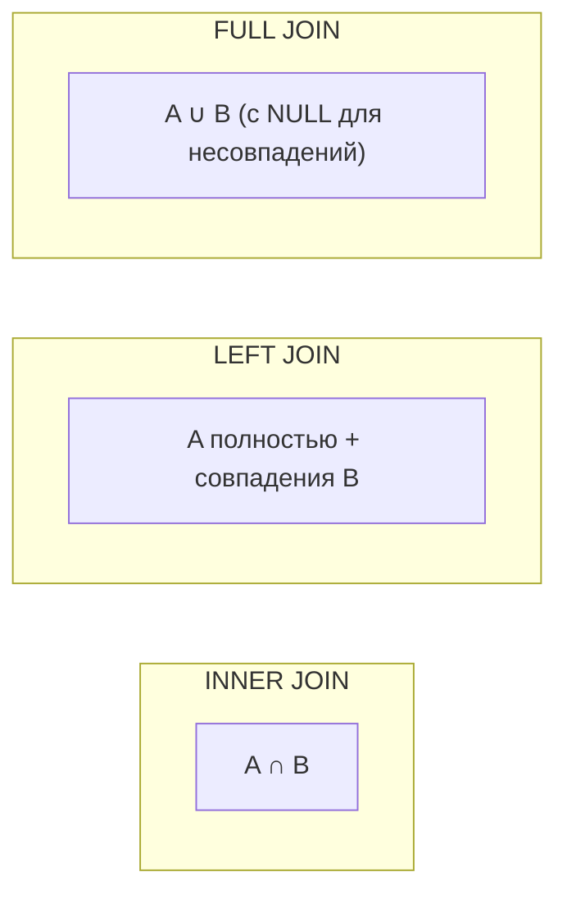

# SQL: полное и исчерпывающее руководство для Senior-разработчика (PHP 8.2 + Symfony 6.4)

> Это руководство — практический справочник по языку SQL для backend-разработчика уровня Senior, который при этом доступен Junior'у. Покрывает теорию реляционной модели, диалекты (ANSI SQL / PostgreSQL / MySQL), синтаксис от `SELECT` до оконных функций и `WITH RECURSIVE`, транзакции и уровни изоляции, индексы и планировщик, безопасность (SQL Injection), а также интеграцию в Symfony 6.4 / Doctrine ORM 2.17 / DBAL 3.8 на PHP 8.2+. Все примеры — реальные бизнес-сценарии: e-commerce, биллинг, логистика, аналитика, аудит.

---

## Оглавление

1. [[#1. Что такое SQL и зачем он нужен|Что такое SQL и зачем он нужен]]
2. [[#2. Стандарты SQL, диалекты и категории команд|Стандарты SQL, диалекты и категории команд]]
3. [[#3. Реляционная модель и теория множеств|Реляционная модель и теория множеств]]
4. [[#4. Базовый SELECT FROM WHERE ORDER BY LIMIT|Базовый SELECT/FROM/WHERE/ORDER BY/LIMIT]]
5. [[#5. JOIN — все виды соединений|JOIN — все виды соединений]]
6. [[#6. Агрегатные функции, GROUP BY, HAVING, FILTER, GROUPING SETS|Агрегаты, GROUP BY, HAVING, FILTER, GROUPING SETS]]
7. [[#7. Подзапросы scalar correlated EXISTS IN|Подзапросы: scalar, correlated, EXISTS, IN, ANY/ALL]]
8. [[#8. CTE (WITH) и WITH RECURSIVE|CTE (WITH) и WITH RECURSIVE]]
9. [[#9. Оконные функции (Window Functions)|Оконные функции (Window Functions)]]
10. [[#10. Работа с датой и временем|Работа с датой и временем]]
11. [[#11. Работа со строками и регулярными выражениями|Работа со строками и регулярными выражениями]]
12. [[#12. NULL и трёхзначная логика|NULL и трёхзначная логика]]
13. [[#13. UNION INTERSECT EXCEPT и операции над множествами|UNION, INTERSECT, EXCEPT и операции над множествами]]
14. [[#14. INSERT UPDATE DELETE UPSERT MERGE|INSERT, UPDATE, DELETE, UPSERT, MERGE]]
15. [[#15. Транзакции, ACID, уровни изоляции|Транзакции, ACID, уровни изоляции]]
16. [[#16. Блокировки SELECT FOR UPDATE deadlock|Блокировки, SELECT FOR UPDATE, deadlock]]
17. [[#17. Индексы и когда их использовать|Индексы и когда их использовать]]
18. [[#18. Планировщик и EXPLAIN ANALYZE|Планировщик и EXPLAIN/EXPLAIN ANALYZE]]
19. [[#19. Нормализация и денормализация|Нормализация и денормализация]]
20. [[#20. Ограничения целостности (CONSTRAINTS)|Ограничения целостности (CONSTRAINTS)]]
21. [[#21. Представления (VIEW) и Materialized Views|Представления (VIEW) и Materialized Views]]
22. [[#22. Хранимые процедуры, функции, триггеры|Хранимые процедуры, функции, триггеры]]
23. [[#23. Типы данных и моделирование|Типы данных и моделирование]]
24. [[#24. Безопасность SQL Injection и privileges|Безопасность: SQL Injection, RBAC, RLS]]
25. [[#25. Интеграция в Symfony 6.4 Doctrine DBAL ORM DQL|Интеграция в Symfony 6.4: Doctrine DBAL/ORM/DQL/QueryBuilder]]
26. [[#26. Миграции и zero-downtime изменения схемы|Миграции и zero-downtime изменения схемы]]
27. [[#27. Тестирование SQL-кода|Тестирование SQL-кода]]
28. [[#28. Производительность batch операции пагинация|Производительность: batch, пагинация, N+1]]
29. [[#29. Мониторинг медленных запросов в production|Мониторинг медленных запросов в production]]
30. [[#30. Типичные ошибки и анти-паттерны|Типичные ошибки и анти-паттерны]]
31. [[#31. Сравнение с альтернативами NoSQL ORM|Сравнение с альтернативами: NoSQL, ORM, query-builder'ы]]
32. [[#32. Проверочные вопросы с ответами|Проверочные вопросы с ответами]]
33. [[#33. Источники|Источники]]

---

## 1. Что такое SQL и зачем он нужен

**SQL (Structured Query Language)** — декларативный язык для работы с данными в реляционных СУБД. Стандартизирован ISO/IEC 9075 (последняя редакция — SQL:2023). «Декларативный» означает, что вы описываете **что** хотите получить, а не **как** именно это сделать — построением плана исполнения занимается оптимизатор СУБД.

**Бизнес-ценность:**
- Единый язык для PostgreSQL, MySQL, Oracle, SQL Server, SQLite, ClickHouse, Snowflake — знания переносятся между проектами и работодателями.
- 50+ лет в production: предсказуемое поведение, формальная теория (реляционная алгебра, теория множеств).
- Транзакции и ACID-гарантии — единственный надёжный способ хранить деньги, остатки на складе, заказы, медицинские карты.
- Декларативность: один и тот же `SELECT` оптимизатор может выполнить десятками способов в зависимости от данных, индексов, статистики — без изменения кода приложения.

**Где применяется в backend-разработке:**
- OLTP (онлайн-транзакции): корзины, заказы, платежи, аутентификация.
- OLAP / отчёты: агрегации по миллионам строк, оконные функции, кубы.
- Поиск: B-tree / GIN / full-text в PostgreSQL.
- Очереди и outbox-паттерн (`SELECT ... FOR UPDATE SKIP LOCKED`).
- Аудит (триггеры, темпоральные таблицы).

> **Junior-аналогия.** Представь Excel-файл с миллиардом строк. Прокрутить вручную невозможно, написать формулу `=ВПР(...)` — медленно. SQL — это формула, которую исполняет специализированный движок: «дай мне все заказы пользователя X за последний месяц, сгруппированные по статусу, отсортированные по сумме». Именно как ты это сказал словами — почти таким же текстом и пишется запрос.

---

## 2. Стандарты SQL, диалекты и категории команд

### Стандарты
- **SQL-86 / SQL-89** — первый ISO-стандарт (`SELECT`, `JOIN`, `GROUP BY`).
- **SQL-92** — большинство «классических» возможностей: `CASE`, `OUTER JOIN`, `UNION`, схемы, привилегии. До сих пор «базовый» уровень совместимости.
- **SQL:1999** — рекурсивные CTE, триггеры, OLAP, объектные расширения, регулярные выражения.
- **SQL:2003** — оконные функции, `MERGE`, XML, sequences, `WITH RECURSIVE`.
- **SQL:2008** — `TRUNCATE`, `INSTEAD OF` триггеры, partitioned `OVER`.
- **SQL:2011** — темпоральные таблицы (system-versioned, application-time periods).
- **SQL:2016** — JSON-функции, `LISTAGG`, polymorphic table functions, row pattern matching (`MATCH_RECOGNIZE`).
- **SQL:2023** — property graph queries (`GRAPH_TABLE`), улучшения JSON.

### Главные диалекты и их особенности

| Диалект | Сильные стороны | Особенности |
|---|---|---|
| **PostgreSQL** | Самый «правильный» по стандарту, JSONB, расширяемость, оконные, CTE, `RETURNING` | Стандарт — почти везде |
| **MySQL / MariaDB** | Простота, репликация, популярность | Раньше не было CTE/WINDOW (появились в 8.0), `LIMIT` вместо `FETCH FIRST` |
| **Oracle** | PL/SQL, материализованные view, hierarchical `CONNECT BY`, RAC | Платный, своя нотация |
| **SQL Server** | T-SQL, OLAP, тесная интеграция с .NET | `TOP n`, `OUTPUT` вместо `RETURNING` |
| **SQLite** | Embedded, zero-config | Динамическая типизация, нет `RIGHT JOIN` (до 3.39) |
| **ClickHouse** | Колоночная, аналитика, скорость | `SELECT` без `FROM` другой синтаксис, нет полноценных транзакций |

### Категории команд SQL

```text
SQL
├── DDL (Data Definition Language)        — структура: CREATE, ALTER, DROP, TRUNCATE, COMMENT, RENAME
├── DML (Data Manipulation Language)      — данные: SELECT, INSERT, UPDATE, DELETE, MERGE, UPSERT
├── DCL (Data Control Language)           — права: GRANT, REVOKE
├── TCL (Transaction Control Language)    — транзакции: BEGIN, COMMIT, ROLLBACK, SAVEPOINT
└── DQL                                   — частный случай DML (только SELECT, выделяют не всегда)
```

> **Почему это важно знать.** В одних СУБД (PostgreSQL, SQL Server) DDL — транзакционный: `CREATE TABLE` внутри `BEGIN ... ROLLBACK` откатывается. В MySQL InnoDB DDL **не** откатывается и неявно коммитит открытую транзакцию. Это меняет стратегию миграций: в MySQL нельзя «накатил половину — откатил всё».

---

## 3. Реляционная модель и теория множеств

В основе SQL — работы Эдгара Кодда (1970, IBM) и реляционная алгебра. Ключевые сущности:

- **Отношение (relation)** = таблица: множество кортежей (строк) одинаковой структуры.
- **Кортеж (tuple)** = строка: упорядоченный набор значений.
- **Атрибут** = столбец с типом и (возможно) ограничениями.
- **Домен** = тип данных + ограничения (`CHECK`, `NOT NULL`).
- **Ключ:**
  - *Суперключ* — любой набор атрибутов, уникально идентифицирующий строку.
  - *Кандидатный ключ* — минимальный суперключ.
  - *Первичный ключ (PK)* — выбранный кандидатный, `NOT NULL` + `UNIQUE`.
  - *Внешний ключ (FK)* — ссылка на PK/UK другой (или той же) таблицы.

**Базовые операции реляционной алгебры и их соответствие SQL:**

| Алгебра | Символ | SQL |
|---|---|---|
| Селекция (выбор) | σ_pred(R) | `SELECT * FROM R WHERE pred` |
| Проекция | π_cols(R) | `SELECT cols FROM R` |
| Объединение | R ∪ S | `R UNION S` |
| Пересечение | R ∩ S | `R INTERSECT S` |
| Разность | R − S | `R EXCEPT S` (`MINUS` в Oracle) |
| Декартово произведение | R × S | `R CROSS JOIN S` |
| θ-соединение | R ⋈θ S | `R JOIN S ON θ` |
| Естественное соединение | R ⋈ S | `R NATURAL JOIN S` |
| Деление | R ÷ S | через `NOT EXISTS / NOT EXISTS` |
| Переименование | ρ | `AS` |


> **Почему это важно для практики.** Понимание операторов как множеств помогает интуитивно отвечать на вопрос «почему мой `LEFT JOIN` вернул больше строк, чем в исходной таблице?» (декартов взрыв из-за неверного условия) и «почему `DISTINCT` тут не нужен?» (потому что `EXCEPT` уже даёт множество без дубликатов). Без множественного мышления SQL пишется через циклы воображения, что приводит к N+1 и cursor-style коду в хранимках.

---

## 4. Базовый SELECT FROM WHERE ORDER BY LIMIT

### Логический порядок выполнения SELECT

Самое важное, что должен запомнить любой SQL-разработчик: запрос **пишется** не в том порядке, в котором **выполняется**.

```text
Написано:                Выполняется:
1. SELECT cols           5. SELECT cols
2. FROM ...              1. FROM + JOIN
3. WHERE ...             2. WHERE
4. GROUP BY ...          3. GROUP BY
5. HAVING ...            4. HAVING
6. ORDER BY ...          6. DISTINCT
7. LIMIT ...             7. ORDER BY
                         8. LIMIT/OFFSET
```

> **Следствие из порядка.** Алиасы из `SELECT` нельзя использовать в `WHERE` (PostgreSQL), потому что `WHERE` отрабатывает **до** `SELECT`. В `ORDER BY` — можно, в `GROUP BY` — частично (PostgreSQL допускает, MySQL — да, стандарт — нет). Это не «причуда движка», а следствие модели вычисления.

### Пример: e-commerce, выбираем активные заказы

```sql
SELECT
    o.id,
    o.created_at,
    o.total_amount,
    c.email                                         AS customer_email
FROM orders o
INNER JOIN customers c ON c.id = o.customer_id
WHERE o.status      = 'paid'
  AND o.created_at >= NOW() - INTERVAL '30 days'
  AND c.is_blocked  = FALSE
ORDER BY o.total_amount DESC, o.id DESC
LIMIT 50;
```

**Что здесь важно:**
- Алиасы таблиц (`o`, `c`) — обязательны для читабельности и однозначности при `JOIN` нескольких таблиц.
- `INTERVAL '30 days'` — стандартный синтаксис (PostgreSQL); в MySQL — `INTERVAL 30 DAY`.
- Двойная сортировка по `(total_amount DESC, id DESC)` — детерминированный порядок при равных суммах (важно для пагинации).
- `LIMIT 50` без `OFFSET` — самый дешёвый случай.

### WHERE: операторы и их особенности

| Оператор | Пример | Нюанс |
|---|---|---|
| `=`, `<>`, `<`, `>`, `<=`, `>=` | `price >= 100` | `NULL` не сравнивается через `=` |
| `BETWEEN a AND b` | `price BETWEEN 100 AND 500` | Включительно с обеих сторон |
| `IN (...)` | `status IN ('paid','shipped')` | Эквивалент серии `OR`; для длинных списков — JOIN с временной таблицей |
| `LIKE 'abc%'` | `email LIKE '%@gmail.com'` | `%` в начале — индекс не используется (нужен trgm/reverse-индекс) |
| `ILIKE` (PG) | `name ILIKE 'иван%'` | Регистронезависимый |
| `IS NULL / IS NOT NULL` | — | Никогда `= NULL` |
| `IS DISTINCT FROM` (стандарт) | `a IS DISTINCT FROM b` | NULL-safe сравнение |

### ORDER BY: подводные камни

```sql
-- ❌ НЕ детерминированно: при равных created_at порядок не определён
SELECT * FROM orders ORDER BY created_at DESC LIMIT 20 OFFSET 100;

-- ✅ Детерминированно
SELECT * FROM orders ORDER BY created_at DESC, id DESC LIMIT 20 OFFSET 100;

-- ✅ Keyset-пагинация (см. раздел 28) — без OFFSET
SELECT * FROM orders
WHERE (created_at, id) < ('2026-05-09 12:00:00', 999999)
ORDER BY created_at DESC, id DESC
LIMIT 20;
```

`NULL`-ы по умолчанию сортируются: в PostgreSQL — в конце при `ASC`, в MySQL — в начале. Управлять можно через `NULLS FIRST` / `NULLS LAST` (стандарт SQL).

### LIMIT/OFFSET vs FETCH FIRST

```sql
-- Стандарт SQL:2008 (PostgreSQL, Oracle 12c+, SQL Server 2012+)
SELECT * FROM orders
ORDER BY id
OFFSET 100 ROWS FETCH NEXT 20 ROWS ONLY;

-- PostgreSQL/MySQL/SQLite shortcut
SELECT * FROM orders ORDER BY id LIMIT 20 OFFSET 100;
```

> **Анти-паттерн `OFFSET 1000000`.** СУБД обязана прочитать и отбросить миллион строк. На больших таблицах используйте keyset-пагинацию (см. [[#28. Производительность batch операции пагинация]]).

### DISTINCT и DISTINCT ON

```sql
-- Уникальные пары (city, country) среди клиентов
SELECT DISTINCT city, country FROM customers;

-- DISTINCT ON — только в PostgreSQL: «по одной строке на каждое значение customer_id»,
-- причём какой именно строке оставаться — определяется ORDER BY.
-- Реальный кейс: последний заказ каждого клиента.
SELECT DISTINCT ON (customer_id)
       customer_id, id AS order_id, created_at, total_amount
FROM orders
ORDER BY customer_id, created_at DESC;
```

В стандартном SQL то же делается через оконные функции (`ROW_NUMBER() OVER (PARTITION BY ... ORDER BY ...)` + фильтр `= 1`).

---

## 5. JOIN — все виды соединений

### Виды JOIN

```text
INNER JOIN          — только пересечение (есть в обеих таблицах)
LEFT  [OUTER] JOIN  — все из левой + совпавшие из правой (нет совпадения → NULL справа)
RIGHT [OUTER] JOIN  — зеркальное LEFT
FULL  [OUTER] JOIN  — все из обеих (нет совпадения → NULL с другой стороны)
CROSS JOIN          — декартово произведение (n × m строк)
SELF JOIN           — таблица на саму себя (через алиасы)
LATERAL JOIN        — правая часть «видит» столбцы левой; де-факто for-each
NATURAL JOIN        — соединяет по столбцам с одинаковыми именами (опасно — анти-паттерн)
```



### Условия: ON vs USING vs WHERE

```sql
-- ON: универсально, любое условие
SELECT * FROM orders o JOIN customers c ON c.id = o.customer_id;

-- USING: если столбцы называются одинаково (стандарт), результат содержит общий столбец один раз
SELECT * FROM orders JOIN customers USING (customer_id);

-- ❌ Анти-паттерн: «JOIN через WHERE» (старый Oracle-style)
SELECT * FROM orders o, customers c WHERE c.id = o.customer_id;
```

### Реальный кейс: отчёт по продажам с категориями товаров

```sql
SELECT
    cat.name                                         AS category,
    COUNT(DISTINCT o.id)                             AS orders_count,
    SUM(oi.quantity * oi.unit_price)                 AS revenue,
    SUM(oi.quantity * oi.unit_price)
        FILTER (WHERE o.status = 'refunded')         AS refunded_revenue
FROM categories cat
LEFT JOIN products    p   ON p.category_id  = cat.id
LEFT JOIN order_items oi  ON oi.product_id  = p.id
LEFT JOIN orders      o   ON o.id           = oi.order_id
                          AND o.created_at >= NOW() - INTERVAL '90 days'
GROUP BY cat.id, cat.name
ORDER BY revenue DESC NULLS LAST;
```

**Почему именно `LEFT JOIN`, а не `INNER`:** мы хотим увидеть **все** категории, включая те, в которых не было продаж за 90 дней (revenue = 0). Условие фильтра `created_at >= NOW() - INTERVAL '90 days'` стоит **в `ON`**, а не в `WHERE` — иначе `LEFT JOIN` вырождается в `INNER` (категории без заказов отфильтруются из-за NULL в `created_at`).

### LATERAL JOIN — для каждой строки слева вычисли подзапрос справа

Реальный кейс: для каждого пользователя — три его последних заказа.

```sql
SELECT u.id, u.email, recent.id AS order_id, recent.created_at, recent.total_amount
FROM users u
LEFT JOIN LATERAL (
    SELECT id, created_at, total_amount
    FROM orders o
    WHERE o.customer_id = u.id
    ORDER BY o.created_at DESC
    LIMIT 3
) recent ON TRUE
WHERE u.is_active = TRUE;
```

Без `LATERAL` это требует `ROW_NUMBER()` + фильтр или подзапроса с `IN` — и того и другого медленнее на больших таблицах.

### Алгоритмы JOIN (что выберет планировщик)

| Алгоритм | Когда выгоден |
|---|---|
| **Nested Loop** | Маленькая внешняя выборка + индекс на внутренней таблице |
| **Hash Join** | Большие выборки, equi-join, есть `work_mem` для хеш-таблицы |
| **Merge Join** | Обе стороны уже отсортированы (есть индекс на колонке join'а) |

См. [[#18. Планировщик и EXPLAIN ANALYZE]].

> **Анти-паттерн.** `JOIN` без условия → декартово произведение. На двух таблицах по миллиону строк — триллион строк в выводе и зависший прод. Всегда явно указывайте `ON`. Если действительно нужен декарт — пишите `CROSS JOIN`, чтобы код-ревью видел намерение.

---

## 6. Агрегатные функции, GROUP BY, HAVING, FILTER, GROUPING SETS

### Базовые агрегаты

| Функция | Что делает | Нюанс с NULL |
|---|---|---|
| `COUNT(*)` | Считает строки | `NULL` тоже считаются |
| `COUNT(col)` | Считает не-NULL значения | `NULL` пропускаются |
| `COUNT(DISTINCT col)` | Уникальные не-NULL | Дорого: требует сортировки/хеша |
| `SUM`, `AVG`, `MIN`, `MAX` | Стандартно | `NULL` пропускаются; `SUM` пустого набора = `NULL`, не `0` |
| `STRING_AGG(col, ',')` (PG) / `GROUP_CONCAT` (MySQL) / `LISTAGG` (стандарт) | Конкатенация |  |
| `ARRAY_AGG(col)` (PG) | Сборка в массив |  |
| `JSON_AGG`, `JSONB_AGG` (PG) | Сборка в JSON | Удобно для API-ответов |
| `bool_and`, `bool_or` (PG) | Логические агрегаты |  |

### GROUP BY и правило «всё или ничего»

В стандартном SQL: каждый столбец из `SELECT`, не входящий в агрегат, **обязан** присутствовать в `GROUP BY` (или быть функционально зависимым от PK группы — PostgreSQL это понимает).

```sql
-- ✅ Правильно
SELECT customer_id, COUNT(*) AS orders_cnt, SUM(total_amount) AS revenue
FROM orders
GROUP BY customer_id;

-- ❌ В стандарте/PG ошибка: created_at не в GROUP BY и не агрегирован
SELECT customer_id, created_at, COUNT(*) FROM orders GROUP BY customer_id;
-- В MySQL (без ONLY_FULL_GROUP_BY) выполнится — вернёт случайный created_at. Анти-паттерн.
```

### HAVING vs WHERE

- `WHERE` — фильтр строк **до** группировки.
- `HAVING` — фильтр групп **после** агрегации.

```sql
-- Клиенты, у которых > 10 заказов на сумму > 100 000 ₽ за год
SELECT customer_id, COUNT(*) AS cnt, SUM(total_amount) AS revenue
FROM orders
WHERE created_at >= NOW() - INTERVAL '1 year'   -- фильтр СТРОК
GROUP BY customer_id
HAVING COUNT(*) > 10 AND SUM(total_amount) > 100000;  -- фильтр ГРУПП
```

> **Подвох.** `WHERE COUNT(*) > 10` — синтаксическая ошибка: на момент `WHERE` групп ещё нет.

### FILTER (clause) — стандарт SQL:2003, работает в PostgreSQL

Заменяет «`SUM(CASE WHEN ... THEN ... END)`», читается лучше:

```sql
SELECT
    DATE_TRUNC('day', created_at) AS day,
    COUNT(*)                                      AS total_orders,
    COUNT(*) FILTER (WHERE status = 'paid')       AS paid,
    COUNT(*) FILTER (WHERE status = 'cancelled')  AS cancelled,
    SUM(total_amount) FILTER (WHERE status = 'paid') AS gmv
FROM orders
WHERE created_at >= NOW() - INTERVAL '30 days'
GROUP BY 1
ORDER BY 1;
```

### GROUPING SETS, ROLLUP, CUBE — многомерная агрегация

```sql
-- Продажи по (страна, город), по (страна), и в целом — за один проход.
SELECT country, city, SUM(total_amount) AS revenue
FROM orders o JOIN customers c ON c.id = o.customer_id
GROUP BY ROLLUP (country, city);

-- GROUPING() — индикатор «эта строка — итог по этой колонке»
SELECT
    country, city, SUM(total_amount),
    GROUPING(country) AS is_country_total,
    GROUPING(city)    AS is_city_total
FROM orders o JOIN customers c ON c.id = o.customer_id
GROUP BY GROUPING SETS ((country, city), (country), ());
```

Заменяет N отдельных запросов с `UNION ALL`. В колоночных СУБД (ClickHouse, BigQuery) — основной способ строить отчёты.

> **Junior-аналогия.** `ROLLUP(country, city)` ≈ `(country, city) + (country) + (общий итог)`. `CUBE(a, b)` — все возможные подмножества: `(a,b) + (a) + (b) + ()`.

---

## 7. Подзапросы scalar correlated EXISTS IN

### Виды подзапросов

1. **Скалярный** — возвращает одну строку и один столбец, используется как значение.
2. **Строчный (row)** — возвращает одну строку из нескольких столбцов.
3. **Табличный (derived table / inline view)** — `FROM (SELECT ...) sub`.
4. **Коррелированный** — ссылается на столбцы внешнего запроса; выполняется (логически) для каждой строки внешнего.
5. **`EXISTS` / `NOT EXISTS`** — проверка наличия хотя бы одной строки.
6. **`IN` / `NOT IN`** — проверка вхождения значения в результат.

### Скалярный

```sql
-- Цена товара относительно средней по категории
SELECT
    p.id, p.name, p.price,
    (SELECT AVG(p2.price) FROM products p2 WHERE p2.category_id = p.category_id) AS avg_in_category
FROM products p;
```

Это коррелированный скалярный подзапрос — для каждой строки `p` пересчитывается `AVG`. На практике лучше переписать через оконную функцию `AVG(price) OVER (PARTITION BY category_id)` (один проход).

### EXISTS vs IN vs JOIN

```sql
-- Клиенты, у которых был хоть один paid-заказ
-- Вариант 1: EXISTS (рекомендуется)
SELECT c.* FROM customers c
WHERE EXISTS (
    SELECT 1 FROM orders o
    WHERE o.customer_id = c.id AND o.status = 'paid'
);

-- Вариант 2: IN с подзапросом
SELECT c.* FROM customers c
WHERE c.id IN (SELECT o.customer_id FROM orders o WHERE o.status = 'paid');

-- Вариант 3: JOIN + DISTINCT
SELECT DISTINCT c.* FROM customers c
JOIN orders o ON o.customer_id = c.id AND o.status = 'paid';
```

**Какой выбрать:**
- `EXISTS` — самый предсказуемый: останавливается на первом найденном совпадении, корректно работает с `NULL`.
- `IN` — короче, но опасен: `WHERE x NOT IN (subq)` вернёт **пустой набор**, если в `subq` есть хотя бы один `NULL` (трёхзначная логика). См. [[#12. NULL и трёхзначная логика]].
- `JOIN + DISTINCT` — может быть быстрее в некоторых случаях, но `DISTINCT` дорогой; подходит, если нужны столбцы из обеих таблиц.

Современные планировщики PostgreSQL и MySQL 8 часто переписывают `IN` в semi-join, делая разницу с `EXISTS` минимальной. Но **`NOT EXISTS` всегда безопаснее `NOT IN`**.

### ANY / ALL

```sql
-- Заказы, чья сумма больше любого (хотя бы одного) заказа клиента из чёрного списка
SELECT * FROM orders
WHERE total_amount > ANY (SELECT total_amount FROM orders WHERE customer_id IN (...));

-- Больше всех (т.е. больше максимума)
SELECT * FROM orders
WHERE total_amount > ALL (SELECT total_amount FROM orders WHERE customer_id IN (...));
```

`> ANY` ≡ `> MIN`, `> ALL` ≡ `> MAX`. Часто читается хуже агрегатов — использовать только когда подзапрос «тяжелее» рассчитать через `MAX/MIN`.

### Derived table (FROM-подзапрос)

```sql
-- Топ-10 клиентов и их доля в общей выручке
SELECT
    sub.customer_id,
    sub.revenue,
    ROUND(100.0 * sub.revenue / SUM(sub.revenue) OVER (), 2) AS share_pct
FROM (
    SELECT customer_id, SUM(total_amount) AS revenue
    FROM orders
    WHERE status = 'paid'
    GROUP BY customer_id
    ORDER BY revenue DESC
    LIMIT 10
) sub;
```

> **Когда подзапрос — анти-паттерн.** Если один и тот же подзапрос встречается в `SELECT` несколько раз, он, вероятно, выполняется N раз. Замена на CTE (см. ниже) или JOIN однократна и понятна.

---

## 8. CTE (WITH) и WITH RECURSIVE

**Common Table Expression (CTE)** — именованный временный результат, существующий только в рамках одного запроса. Введён в SQL:1999. Синтаксис:

```sql
WITH cte_name [(col1, col2, ...)] AS (
    -- произвольный SELECT/INSERT/UPDATE/DELETE (в PG)
)
SELECT ... FROM cte_name;
```

### Зачем нужен CTE

- **Читабельность.** Сложный запрос разбивается на «шаги», каждый с осмысленным именем.
- **Повторное использование.** На один CTE можно ссылаться несколько раз внутри запроса.
- **Рекурсия.** Единственный стандартный способ обойти иерархию (дерево комментариев, оргструктуру, BOM).
- **Модификация данных в `WITH`** (PostgreSQL): `WITH deleted AS (DELETE ... RETURNING *) INSERT INTO archive SELECT * FROM deleted`.

### Реальный кейс: сегментация клиентов RFM (упрощённо)

```sql
WITH last_orders AS (
    SELECT customer_id,
           MAX(created_at) AS last_order_at,
           COUNT(*)        AS orders_cnt,
           SUM(total_amount) AS revenue
    FROM orders
    WHERE status = 'paid'
    GROUP BY customer_id
),
scored AS (
    SELECT
        customer_id,
        NTILE(5) OVER (ORDER BY last_order_at DESC) AS recency,
        NTILE(5) OVER (ORDER BY orders_cnt   DESC) AS frequency,
        NTILE(5) OVER (ORDER BY revenue      DESC) AS monetary
    FROM last_orders
)
SELECT
    customer_id,
    recency, frequency, monetary,
    CASE
        WHEN recency = 1 AND frequency = 1 AND monetary = 1 THEN 'champion'
        WHEN recency = 1 AND frequency >= 4               THEN 'new'
        WHEN recency >= 4                                  THEN 'churn_risk'
        ELSE 'regular'
    END AS segment
FROM scored;
```

### Materialized vs Non-materialized CTE

В PostgreSQL до версии 12 CTE всегда был «оптимизационным забором» (materialized) — выполнялся отдельно и помещался в память. С PG 12+ оптимизатор инлайнит CTE, если он не модифицирует данные и не используется несколько раз. Принудительное управление:

```sql
WITH q AS MATERIALIZED     (...) SELECT * FROM q;   -- форсировать материализацию
WITH q AS NOT MATERIALIZED (...) SELECT * FROM q;   -- форсировать инлайнинг
```

В MySQL 8 CTE всегда материализуется (хотя оптимизатор иногда переписывает в derived table).

### WITH RECURSIVE

Состоит из **anchor-части** (база рекурсии) и **recursive-части**, объединённых `UNION ALL` (или `UNION` для устранения дублей):

```sql
WITH RECURSIVE cte AS (
    SELECT ...           -- anchor: первое поколение
    UNION ALL
    SELECT ...           -- recursive: использует cte
    FROM cte JOIN ...    -- условие останова: когда JOIN не находит новых строк
)
SELECT * FROM cte;
```

### Кейс 1: иерархия категорий товаров (parent_id → id)

```sql
-- Все потомки категории "Электроника" вместе с уровнем вложенности и путём
WITH RECURSIVE category_tree AS (
    SELECT
        id, parent_id, name,
        1                              AS depth,
        ARRAY[id]                      AS path,           -- PG: массив для защиты от циклов
        name::text                     AS full_path
    FROM categories
    WHERE id = 42                                          -- корень: "Электроника"

    UNION ALL

    SELECT
        c.id, c.parent_id, c.name,
        ct.depth + 1,
        ct.path || c.id,
        ct.full_path || ' > ' || c.name
    FROM categories c
    INNER JOIN category_tree ct ON c.parent_id = ct.id
    WHERE NOT c.id = ANY(ct.path)                          -- защита от циклов
)
SELECT id, full_path, depth FROM category_tree ORDER BY path;
```

### Кейс 2: генерация числового ряда (для отчётов с пробелами в датах)

```sql
WITH RECURSIVE days(d) AS (
    SELECT DATE '2026-01-01'
    UNION ALL
    SELECT d + 1 FROM days WHERE d < DATE '2026-01-31'
)
SELECT d.d, COALESCE(SUM(o.total_amount), 0) AS revenue
FROM days d
LEFT JOIN orders o ON DATE(o.created_at) = d.d AND o.status = 'paid'
GROUP BY d.d
ORDER BY d.d;
```

В PostgreSQL для этого есть встроенный `generate_series(date '2026-01-01', date '2026-01-31', interval '1 day')` — короче и быстрее.

### Подводные камни рекурсии

- **Без условия останова — бесконечный цикл** (зацикленные данные `parent_id` указывают друг на друга). Защита — массив пройденных id.
- В PostgreSQL `UNION` (без `ALL`) делает дедупликацию на каждой итерации — медленно. Используйте `UNION ALL` + явная защита.
- Глубина в реальных деревьях обычно ≤ 10–20. На глубине 1000+ растёт стек и время.
- В PG 14+ появилось `SEARCH BREADTH/DEPTH FIRST BY ... SET ...` и `CYCLE ... SET ... USING ...` — стандартный синтаксис для упорядочения и детектирования циклов.

```sql
WITH RECURSIVE t AS (
    SELECT id, parent_id, name FROM categories WHERE id = 42
    UNION ALL
    SELECT c.id, c.parent_id, c.name FROM categories c JOIN t ON c.parent_id = t.id
)
SEARCH DEPTH FIRST BY id SET ord
CYCLE id SET is_cycle USING cycle_path
SELECT * FROM t;
```

> **Когда CTE — антипаттерн.** Когда вы кладёте в CTE результат на 10 млн строк только чтобы потом отфильтровать его на тысячу — фильтр не пропихнётся внутрь (особенно при `MATERIALIZED`). Лучше — подзапрос или прямой `JOIN`.

---

## 9. Оконные функции (Window Functions)

Оконные функции считают значение **по группе строк, связанной с текущей строкой**, но, в отличие от `GROUP BY`, **не сворачивают** результат — каждая исходная строка остаётся в выводе.

### Синтаксис

```sql
function([args]) OVER (
    [PARTITION BY col, ...]    -- разбиение на группы (опц.)
    [ORDER BY col, ...]        -- порядок внутри группы (опц., нужен большинству фукций)
    [ROWS|RANGE|GROUPS frame]  -- рамка окна (опц.)
)
```

### Категории функций

| Категория | Функции |
|---|---|
| **Ранжирующие** | `ROW_NUMBER`, `RANK`, `DENSE_RANK`, `NTILE(n)`, `PERCENT_RANK`, `CUME_DIST` |
| **Смещения** | `LAG`, `LEAD`, `FIRST_VALUE`, `LAST_VALUE`, `NTH_VALUE` |
| **Агрегаты как окна** | `SUM`, `AVG`, `COUNT`, `MIN`, `MAX`, `STRING_AGG`, `ARRAY_AGG` (с `OVER`) |
| **Статистика** (PG) | `corr`, `regr_slope`, `percentile_cont`, `percentile_disc` |

### ROW_NUMBER vs RANK vs DENSE_RANK

| Сумма | ROW_NUMBER | RANK | DENSE_RANK |
|---|---|---|---|
| 100 | 1 | 1 | 1 |
| 100 | 2 | 1 | 1 |
| 90 | 3 | 3 | 2 |
| 80 | 4 | 4 | 3 |

`ROW_NUMBER` — уникален всегда; `RANK` — пропускает места после ничьих; `DENSE_RANK` — не пропускает.

### Кейс 1: последний заказ каждого клиента

```sql
SELECT *
FROM (
    SELECT o.*,
           ROW_NUMBER() OVER (PARTITION BY customer_id ORDER BY created_at DESC, id DESC) AS rn
    FROM orders o
    WHERE status IN ('paid', 'shipped', 'delivered')
) t
WHERE rn = 1;
```

### Кейс 2: накопительная выручка (running total) по дням

```sql
SELECT
    day,
    daily_revenue,
    SUM(daily_revenue) OVER (ORDER BY day
        ROWS BETWEEN UNBOUNDED PRECEDING AND CURRENT ROW) AS cumulative_revenue,
    AVG(daily_revenue) OVER (ORDER BY day
        ROWS BETWEEN 6 PRECEDING AND CURRENT ROW) AS rolling_7d_avg
FROM (
    SELECT DATE_TRUNC('day', created_at)::date AS day,
           SUM(total_amount) AS daily_revenue
    FROM orders WHERE status = 'paid' GROUP BY 1
) d
ORDER BY day;
```

### Кейс 3: разница с предыдущим заказом клиента (LAG)

```sql
SELECT
    customer_id,
    id,
    created_at,
    total_amount,
    LAG(created_at)    OVER w AS prev_order_at,
    created_at - LAG(created_at) OVER w AS interval_since_prev,
    total_amount - LAG(total_amount) OVER w AS amount_diff
FROM orders
WHERE status = 'paid'
WINDOW w AS (PARTITION BY customer_id ORDER BY created_at, id)
ORDER BY customer_id, created_at;
```

`WINDOW w AS (...)` — именованное окно, чтобы не дублировать `OVER (...)` в каждой функции.

### Рамки: ROWS vs RANGE vs GROUPS

- `ROWS BETWEEN N PRECEDING AND M FOLLOWING` — физические строки.
- `RANGE BETWEEN ...` — по значению `ORDER BY` колонки (полезно для дат: `RANGE BETWEEN INTERVAL '7 days' PRECEDING AND CURRENT ROW`).
- `GROUPS` (SQL:2011, PG 11+) — по группам пиров (равных по `ORDER BY`).

### Подводные камни

- `LAST_VALUE(x) OVER (ORDER BY ...)` без явной рамки даст текущую строку, не последнюю в окне. Решение: `ROWS BETWEEN UNBOUNDED PRECEDING AND UNBOUNDED FOLLOWING`.
- Оконные функции **выполняются после `WHERE`** и **до `ORDER BY` основного запроса**. Чтобы отфильтровать по результату окна — оборачивайте в подзапрос/CTE.
- В MySQL до 8.0 оконных функций не было — частая причина «легаси-портации».

> **Производительность.** Оконные функции — обычно один проход по уже отсортированному набору данных. Индекс на `(PARTITION BY ..., ORDER BY ...)` устраняет sort. Это в разы быстрее, чем эмуляция через коррелированные подзапросы.

---

## 10. Работа с датой и временем

Дата/время — самая проблемная область SQL: разные типы, часовые пояса, диалекты, DST, leap seconds.

### Типы данных

| Тип | Что хранит | Размер |
|---|---|---|
| `DATE` | Дата без времени | 4 байта |
| `TIME [(p)] [WITHOUT TIME ZONE]` | Время без даты | 8 байт |
| `TIME WITH TIME ZONE` (`TIMETZ`) | Время + смещение | 12 байт; **анти-паттерн**, плохо определён |
| `TIMESTAMP` (без TZ) | Дата + время **без** TZ | 8 байт |
| `TIMESTAMPTZ` (с TZ, PostgreSQL) | Хранится в UTC, при чтении конвертируется | 8 байт |
| `INTERVAL` | Разница / длительность | 16 байт |

> **Главное правило:** для бизнес-данных используйте `TIMESTAMPTZ` (PG) или `DATETIME` + всегда UTC (MySQL — там `TIMESTAMP` хранится в UTC, но `DATETIME` — нет, это частая причина багов с TZ). На уровне приложения время передаётся в UTC и преобразуется в TZ пользователя только в момент рендера.

### Получение текущего времени

```sql
SELECT NOW();                          -- timestamptz, начало транзакции (PG)
SELECT CURRENT_TIMESTAMP;              -- стандарт, синоним NOW() в PG
SELECT CLOCK_TIMESTAMP();              -- реальный «сейчас», меняется внутри транзакции (PG)
SELECT STATEMENT_TIMESTAMP();          -- начало текущего statement (PG)
SELECT CURRENT_DATE;                   -- сегодня
```

В MySQL: `NOW()`, `CURRENT_TIMESTAMP`, `UTC_TIMESTAMP()`, `SYSDATE()` (отличается от `NOW`!).

### Арифметика и интервалы

```sql
-- PG:
SELECT NOW() + INTERVAL '1 day';
SELECT NOW() - INTERVAL '1 hour 30 minutes';
SELECT (DATE '2026-12-31' - DATE '2026-01-01');     -- 364 (integer days)
SELECT AGE(NOW(), '1990-01-01'::date);              -- 36 years X mons Y days

-- MySQL:
SELECT NOW() + INTERVAL 1 DAY;
SELECT DATE_ADD(NOW(), INTERVAL 1 DAY);
SELECT DATEDIFF('2026-12-31', '2026-01-01');        -- 364
SELECT TIMESTAMPDIFF(MONTH, '2025-01-01', '2026-05-09');
```

### Извлечение частей и усечение

```sql
-- Стандарт SQL, поддерживается в PG/MySQL
SELECT EXTRACT(YEAR    FROM created_at) AS y,
       EXTRACT(QUARTER FROM created_at) AS q,
       EXTRACT(MONTH   FROM created_at) AS m,
       EXTRACT(WEEK    FROM created_at) AS w,
       EXTRACT(DOW     FROM created_at) AS dow,   -- день недели (0=вс в PG)
       EXTRACT(EPOCH   FROM created_at) AS unix
FROM orders;

-- Усечение к началу периода (PG)
SELECT DATE_TRUNC('hour', created_at),
       DATE_TRUNC('day',  created_at),
       DATE_TRUNC('week', created_at),    -- неделя начинается с понедельника
       DATE_TRUNC('month', created_at),
       DATE_TRUNC('quarter', created_at),
       DATE_TRUNC('year', created_at)
FROM orders;
```

### Часовые пояса

```sql
-- В PG:
SET TIME ZONE 'Europe/Moscow';
SELECT NOW();                                       -- покажет в Москве
SELECT NOW() AT TIME ZONE 'UTC';                    -- сконвертировать в UTC
SELECT created_at AT TIME ZONE 'UTC' AT TIME ZONE 'Europe/Moscow' FROM orders;

-- ❌ Анти-паттерн: TIMESTAMP (без tz) для бизнес-данных
-- Сегодня сервер в UTC, завтра — в MSK, и все timestamp поедут на 3 часа.
```

### Кейс: продажи по часам с учётом TZ пользователя

```sql
-- created_at: timestamptz (UTC). Пользователь хочет видеть в своём TZ.
SELECT
    DATE_TRUNC('hour', created_at AT TIME ZONE 'Europe/Moscow') AS hour_msk,
    COUNT(*),
    SUM(total_amount)
FROM orders
WHERE created_at >= NOW() - INTERVAL '24 hours'
GROUP BY 1
ORDER BY 1;
```

### Тонкости

- **Нельзя индексировать функции от колонок** без functional/expression index. `WHERE DATE(created_at) = '2026-05-09'` не использует индекс на `created_at`. Решение: `WHERE created_at >= '2026-05-09' AND created_at < '2026-05-10'`.
- **DST.** В TZ с переходом на летнее время `INTERVAL '1 day'` ≠ `INTERVAL '24 hours'` в момент перехода. Используйте `INTERVAL '1 day'` для «такого же времени следующего дня» и `'24 hours'` для «ровно 24 часа».
- **`AGE()` vs `-`.** `AGE` возвращает «человекочитаемый» интервал (год/месяц/день), а `-` — простую разницу. Для расчётов выбирайте `EXTRACT(EPOCH FROM ...)`.

---

## 11. Работа со строками и регулярными выражениями

### Базовые функции (стандарт SQL и PG/MySQL)

| Функция | Назначение |
|---|---|
| `LENGTH(s)` / `CHAR_LENGTH(s)` | Длина в символах |
| `OCTET_LENGTH(s)` | Длина в байтах |
| `UPPER(s)`, `LOWER(s)` | Регистр |
| `INITCAP(s)` (PG) | Каждое слово с заглавной |
| `TRIM([leading/trailing/both] [chars] FROM s)` | Обрезка |
| `LTRIM`, `RTRIM` | Обрезка слева/справа |
| `LPAD(s, n, ch)`, `RPAD(s, n, ch)` | Дополнение до длины |
| `SUBSTRING(s FROM n FOR len)` | Подстрока |
| `POSITION(sub IN s)` / `STRPOS(s, sub)` | Поиск позиции |
| `REPLACE(s, from, to)` | Замена подстроки |
| `s \|\| s2` (стандарт), `CONCAT(s, s2)` | Конкатенация |
| `CONCAT_WS(sep, ...)` | Конкатенация с разделителем (NULL пропускаются) |
| `SPLIT_PART(s, sep, n)` (PG) | Разбить и взять N-ю часть |
| `STRING_TO_ARRAY(s, sep)` (PG) | Разбить в массив |
| `MD5(s)`, `SHA256` (через `digest`) | Хеши |

### LIKE, ILIKE, SIMILAR TO, регулярные выражения

```sql
-- LIKE: % и _, регистрозависимое
SELECT * FROM products WHERE name LIKE 'iPhone%';

-- ILIKE: регистронезависимое (PG); в MySQL — LIKE с case-insensitive collation
SELECT * FROM products WHERE name ILIKE '%pro%';

-- SIMILAR TO: SQL-стандартный синтаксис regex (редко используют)
SELECT * FROM products WHERE name SIMILAR TO 'iPhone (12|13|14)%';

-- POSIX-regex (PG): ~ (match), ~* (case-insensitive), !~, !~*
SELECT email FROM users WHERE email ~* '^[a-z0-9._%+-]+@[a-z0-9.-]+\.[a-z]{2,}$';

-- Извлечь фрагмент
SELECT REGEXP_REPLACE(phone, '[^0-9]', '', 'g') AS digits FROM contacts;
SELECT (REGEXP_MATCH(url, 'utm_source=([^&]+)'))[1] AS utm FROM events;

-- MySQL 8: REGEXP / RLIKE
SELECT * FROM users WHERE email REGEXP '^[a-z0-9._%+-]+@';
```

### Производительность поиска по тексту

- `LIKE 'abc%'` — может использовать B-tree индекс (префиксный поиск). Требует C/POSIX collation или `text_pattern_ops` в PG.
- `LIKE '%abc%'` или `LIKE '%abc'` — индекс **не работает**. Решения:
  - **PostgreSQL:** `pg_trgm` + GIN/GIST индекс: `CREATE INDEX ON products USING gin (name gin_trgm_ops);`
  - Полнотекстовый поиск: `tsvector` + `tsquery`.
  - В MySQL — `FULLTEXT INDEX` + `MATCH ... AGAINST`.

### Сборка и разборка JSON-подобных строк

```sql
-- В PG предпочитайте jsonb типы. Но если строка пришла в виде CSV:
SELECT UNNEST(STRING_TO_ARRAY('1,2,3,4', ',')::int[]) AS id;

-- Агрегация в строку
SELECT customer_id, STRING_AGG(product_name, ', ' ORDER BY product_name) AS items
FROM order_items
GROUP BY customer_id;
```

### Collation (правила сравнения и сортировки)

- `ORDER BY name COLLATE "ru_RU.UTF-8"` — корректно для русских букв.
- `WHERE name ILIKE '%Иван%' COLLATE "ru_RU.UTF-8"` — case-insensitive по правилам RU.
- В PG доступен `citext` (case-insensitive text), удобен для emails/usernames.
- Несовместимые collation между колонками → ошибка `ERROR: collation mismatch` или silent slow path.

> **Анти-паттерн.** Хранить email в смешанном регистре, потом везде писать `LOWER(email) = LOWER(:input)`. Лучше — `citext` или нормализация при `INSERT` + `UNIQUE` индекс.

---

## 12. NULL и трёхзначная логика

`NULL` в SQL — это **«неизвестное значение»**, а не «пусто» и не «ноль». Любая арифметика и сравнение с `NULL` даёт `NULL` (не `TRUE`, не `FALSE`).

### Трёхзначная логика

| A | B | A AND B | A OR B | NOT A |
|---|---|---|---|---|
| TRUE  | TRUE  | TRUE  | TRUE  | FALSE |
| TRUE  | FALSE | FALSE | TRUE  |       |
| TRUE  | NULL  | NULL  | TRUE  |       |
| FALSE | NULL  | FALSE | NULL  | TRUE  |
| NULL  | NULL  | NULL  | NULL  | NULL  |

`WHERE` отбирает только строки, где условие = `TRUE`. `NULL` (как и `FALSE`) отбрасывается.

### Главные грабли

```sql
-- ❌ Не работает: x = NULL всегда NULL
SELECT * FROM orders WHERE deleted_at = NULL;

-- ✅
SELECT * FROM orders WHERE deleted_at IS NULL;

-- ❌ "Не равно" с NULL — тоже NULL, строки с NULL отфильтруются
SELECT * FROM orders WHERE status <> 'paid';
-- ✅ NULL-safe (стандарт)
SELECT * FROM orders WHERE status IS DISTINCT FROM 'paid';
-- В MySQL: WHERE NOT (status <=> 'paid')

-- ❌❌ NOT IN с NULL — пустой результат!
SELECT * FROM users WHERE id NOT IN (SELECT excluded_user_id FROM blacklist);
-- Если в blacklist есть NULL → запрос вернёт пустоту.
-- ✅ Используйте NOT EXISTS:
SELECT * FROM users u WHERE NOT EXISTS (
    SELECT 1 FROM blacklist b WHERE b.excluded_user_id = u.id
);
```

### Полезные функции

| Функция | Описание |
|---|---|
| `COALESCE(a, b, c)` | Первое не-NULL значение |
| `NULLIF(a, b)` | `NULL`, если `a = b`; иначе `a` (защита от деления на 0) |
| `IS NULL / IS NOT NULL` | Единственный корректный тест |
| `IS [NOT] DISTINCT FROM` | NULL-safe `=` / `<>` |
| `GREATEST(a, b, ...)`, `LEAST(...)` | Игнорируют NULL (PG); в MySQL — нет |

```sql
-- Защита от деления на 0
SELECT revenue / NULLIF(orders_count, 0) AS avg_check FROM stats;

-- Дефолтные значения
SELECT COALESCE(nickname, first_name || ' ' || last_name, email) AS display_name FROM users;
```

### NULL и UNIQUE

В стандарте SQL `UNIQUE` допускает несколько `NULL` (т.к. они «не равны друг другу»). PG и MySQL так и делают. Если нужно «один NULL» — используйте partial index:

```sql
-- Только один пользователь может иметь NULL referral_code (или вообще запретить):
CREATE UNIQUE INDEX users_referral_unique
    ON users (referral_code) WHERE referral_code IS NOT NULL;
```

### NULL и агрегаты

`COUNT(*) ` — все строки. `COUNT(col)` — только не-NULL. `SUM`/`AVG`/`MIN`/`MAX` пропускают `NULL`. `SUM` на пустом наборе → `NULL` (а не 0). Для отчётов оборачивайте: `COALESCE(SUM(x), 0)`.

> **Дискуссия.** Многие senior-разработчики считают `NULL` «дизайн-ошибкой SQL». Альтернатива — sentinel-значения (`''`, `0`, `'1970-01-01'`) — ещё хуже: они теряют семантику «значение неизвестно». Правильный путь — осознанная политика: `NOT NULL` по умолчанию, `NULL` только там, где это бизнес-семантика «ещё не задано».

---

## 13. UNION INTERSECT EXCEPT и операции над множествами

| Операция | Результат | Дубликаты |
|---|---|---|
| `UNION` | A ∪ B | удаляются |
| `UNION ALL` | A + B (бэг — мультимножество) | сохраняются |
| `INTERSECT` | A ∩ B | удаляются |
| `INTERSECT ALL` | A ∩ B по мультимножествам | по числу пересечений |
| `EXCEPT` (Oracle: `MINUS`) | A − B | удаляются |
| `EXCEPT ALL` | A − B по мультимножествам | по разнице вхождений |

### Правила

- Все ветки должны иметь **одинаковое число столбцов и совместимые типы**.
- Имена результата берутся из **первой** ветки.
- `ORDER BY` и `LIMIT` применяются к итоговому объединённому результату (не к веткам), либо нужно оборачивать ветки в подзапрос.
- Без `ALL` СУБД делает дедупликацию (sort/hash) — дороже. **`UNION ALL` всегда быстрее `UNION`**, используйте его, если знаете, что дубликатов нет.

### Кейс: «горячие» товары — пересечение топа продаж и топа просмотров

```sql
-- Товары, которые одновременно в топ-100 по продажам и в топ-100 по просмотрам
(
    SELECT product_id FROM order_items
    GROUP BY product_id ORDER BY SUM(quantity) DESC LIMIT 100
)
INTERSECT
(
    SELECT product_id FROM product_views
    GROUP BY product_id ORDER BY COUNT(*) DESC LIMIT 100
);
```

### Кейс: события из двух источников (UNION ALL)

```sql
SELECT 'order'   AS source, id, created_at, amount  FROM orders   WHERE created_at > NOW() - INTERVAL '1 day'
UNION ALL
SELECT 'refund'  AS source, id, created_at, amount  FROM refunds  WHERE created_at > NOW() - INTERVAL '1 day'
UNION ALL
SELECT 'payout'  AS source, id, created_at, amount  FROM payouts  WHERE created_at > NOW() - INTERVAL '1 day'
ORDER BY created_at DESC;
```

> **Анти-паттерн.** `UNION` для построения ленты, где дубликатов быть не может, — лишний sort на миллионах строк. Используйте `UNION ALL`.

---

## 14. INSERT UPDATE DELETE UPSERT MERGE

### INSERT

```sql
-- Простая вставка
INSERT INTO products (sku, name, price) VALUES ('SKU-001', 'iPhone 15', 89990);

-- Bulk insert
INSERT INTO products (sku, name, price) VALUES
    ('SKU-001', 'iPhone 15', 89990),
    ('SKU-002', 'Galaxy S24', 79990),
    ('SKU-003', 'Pixel 8', 69990);

-- INSERT ... SELECT (ETL-перекачка)
INSERT INTO archive_orders (id, customer_id, total_amount, archived_at)
SELECT id, customer_id, total_amount, NOW() FROM orders WHERE created_at < NOW() - INTERVAL '2 years';

-- RETURNING — забрать сгенерированные значения за один RTT (PG, MySQL 8.0.21+ для RETURNING-like в RETURNING)
INSERT INTO orders (customer_id, total_amount) VALUES (42, 5000)
RETURNING id, created_at;
```

### UPSERT — INSERT ... ON CONFLICT (PostgreSQL)

```sql
-- Идемпотентная вставка/обновление: классический UPSERT по уникальному ключу
INSERT INTO products (sku, name, price)
VALUES ('SKU-001', 'iPhone 15 Pro', 99990)
ON CONFLICT (sku) DO UPDATE
    SET name  = EXCLUDED.name,
        price = EXCLUDED.price,
        updated_at = NOW()
WHERE products.price IS DISTINCT FROM EXCLUDED.price;  -- защита от пустого UPDATE
```

`EXCLUDED` — псевдо-таблица с «новыми» значениями, которые пытались вставить.

В **MySQL** аналог — `INSERT ... ON DUPLICATE KEY UPDATE`:

```sql
INSERT INTO products (sku, name, price) VALUES ('SKU-001', 'iPhone 15 Pro', 99990)
ON DUPLICATE KEY UPDATE name = VALUES(name), price = VALUES(price);
```

### MERGE (стандарт SQL, PG 15+, Oracle, SQL Server)

```sql
MERGE INTO products AS p
USING (VALUES ('SKU-001', 'iPhone 15 Pro', 99990)) AS s(sku, name, price)
ON p.sku = s.sku
WHEN MATCHED AND p.price <> s.price THEN
    UPDATE SET name = s.name, price = s.price, updated_at = NOW()
WHEN NOT MATCHED THEN
    INSERT (sku, name, price) VALUES (s.sku, s.name, s.price);
```

`MERGE` мощнее `ON CONFLICT`: позволяет `WHEN NOT MATCHED BY SOURCE THEN DELETE` (удалить целевые, которых нет в источнике) — основа для синхронизации справочников. Минусы: в PG до 17 не поддерживался `RETURNING`, есть тонкости с concurrent insertion (race condition без проверки уникальных constraint).

### UPDATE

```sql
-- Простой
UPDATE orders SET status = 'shipped', shipped_at = NOW() WHERE id = 42;

-- UPDATE ... FROM (PG): обновление с join'ом
UPDATE order_items oi
SET unit_price_with_discount = oi.unit_price * (1 - p.discount_pct / 100.0)
FROM promotions p
WHERE p.product_id = oi.product_id
  AND p.is_active = TRUE
  AND oi.order_id = 1234;

-- В MySQL — multi-table UPDATE:
UPDATE order_items oi JOIN promotions p ON p.product_id = oi.product_id
SET oi.unit_price_with_discount = oi.unit_price * (1 - p.discount_pct / 100.0)
WHERE p.is_active = TRUE AND oi.order_id = 1234;

-- UPDATE с RETURNING — увидеть, что реально изменилось
UPDATE orders SET status = 'cancelled', cancelled_at = NOW()
WHERE id = ANY(:ids::int[]) AND status = 'pending'
RETURNING id, customer_id;
```

### DELETE

```sql
-- Защитный шаблон: всегда WHERE
DELETE FROM orders WHERE id = 42;

-- DELETE ... USING (PG)
DELETE FROM order_items oi USING orders o
WHERE oi.order_id = o.id AND o.status = 'cancelled';

-- В MySQL:
DELETE oi FROM order_items oi JOIN orders o ON o.id = oi.order_id WHERE o.status = 'cancelled';

-- TRUNCATE — мгновенная очистка таблицы (DDL, минимальный WAL, сбрасывает sequence в PG только с RESTART IDENTITY)
TRUNCATE TABLE temp_imports RESTART IDENTITY CASCADE;
```

### Soft delete vs hard delete

| Подход | Плюсы | Минусы |
|---|---|---|
| **Hard delete** (`DELETE FROM ...`) | Быстро, чисто, FK работают | Невозможно «восстановить», нужны audit-tables |
| **Soft delete** (`deleted_at IS NOT NULL`) | Reversible, audit | Нужно везде в `WHERE deleted_at IS NULL`, `UNIQUE` индексы становятся partial, FK сложнее |

В Doctrine — пакет `gedmo/doctrine-extensions` (`SoftDeleteable`) или собственный фильтр (`SQLFilter`).

> **Производительность массовых DML.** `DELETE 10M строк` за один statement — долгая транзакция, раздувание WAL, блокировки. Делайте чанками (см. [[#28. Производительность batch операции пагинация]]).

---

## 15. Транзакции, ACID, уровни изоляции

### ACID

- **A**tomicity — транзакция либо вся, либо никак (`COMMIT` / `ROLLBACK`).
- **C**onsistency — не нарушаются ограничения (FK, CHECK, UNIQUE) и инварианты приложения.
- **I**solation — параллельные транзакции «не мешают» друг другу (степень — уровень изоляции).
- **D**urability — после `COMMIT` данные сохранены даже при сбое (WAL/redo log + fsync).

### TCL: BEGIN/COMMIT/ROLLBACK/SAVEPOINT

```sql
BEGIN;                              -- или START TRANSACTION
    UPDATE accounts SET balance = balance - 100 WHERE id = 1;

    SAVEPOINT before_credit;
    UPDATE accounts SET balance = balance + 100 WHERE id = 2;
    -- что-то пошло не так:
    ROLLBACK TO SAVEPOINT before_credit;

    UPDATE accounts SET balance = balance + 100 WHERE id = 3;
COMMIT;
```

### Уровни изоляции (стандарт SQL)

| Уровень | Dirty read | Non-repeatable | Phantom | Serialization anomaly |
|---|---|---|---|---|
| READ UNCOMMITTED | возможен | возможен | возможен | возможен |
| **READ COMMITTED** | нет | возможен | возможен | возможен |
| **REPEATABLE READ** | нет | нет | возможен (стандарт) / нет (PG/MySQL InnoDB) | возможен |
| **SERIALIZABLE** | нет | нет | нет | нет |

**Дефолты:**
- PostgreSQL — `READ COMMITTED`.
- MySQL InnoDB — `REPEATABLE READ` (с фантомами решает через gap-locks).
- SQL Server — `READ COMMITTED`.
- Oracle — `READ COMMITTED` (изоляция через MVCC).

```sql
SET TRANSACTION ISOLATION LEVEL SERIALIZABLE;
-- или
BEGIN ISOLATION LEVEL REPEATABLE READ;
```

### Аномалии — мини-шпаргалка

- **Dirty read** — читаем данные, не закомиченные другой транзакцией.
- **Non-repeatable read** — повторный `SELECT WHERE id=1` вернул другое значение (кто-то закоммитил `UPDATE`).
- **Phantom read** — повторный `SELECT WHERE status='new'` вернул **другой набор строк** (кто-то `INSERT`/`DELETE`).
- **Lost update** — две транзакции прочли значение, обе обновили; одно обновление потеряно.
- **Write skew** — две транзакции читают непересекающиеся данные, пишут так, что итоговое состояние нарушает инвариант (классика: «дежурят минимум 2 врача» — оба отпрашиваются одновременно).
- **Serialization anomaly** — write skew и иже с ним; устраняется только `SERIALIZABLE`.

### Optimistic vs pessimistic locking

- **Pessimistic:** `SELECT ... FOR UPDATE` — блокировка строк до конца транзакции. Гарантирует, но снижает параллелизм.
- **Optimistic:** колонка `version`/`updated_at`, в `UPDATE` `WHERE version = :v`. Если 0 строк обновилось — конфликт, повторяем. Doctrine ORM поддерживает через `#[Version]`.

```sql
-- Pessimistic
BEGIN;
SELECT balance FROM accounts WHERE id = 1 FOR UPDATE;
UPDATE accounts SET balance = balance - 100 WHERE id = 1;
COMMIT;

-- Optimistic
UPDATE accounts SET balance = balance - 100, version = version + 1
WHERE id = 1 AND version = 7;
-- если RETURNING / affected rows = 0 → конфликт, ретрай
```

### Retry для SERIALIZABLE/deadlock

При `SERIALIZABLE` PG может отказать с `40001 serialization_failure`; MySQL — с `1213 deadlock`. **Это нормально** и обязано быть обработано в коде: ловим ошибку, ретраим транзакцию (с экспоненциальной задержкой и максимумом попыток).

> **Junior-аналогия.** READ COMMITTED — «вижу только то, что уже подтверждено». REPEATABLE READ — «весь свой запрос вижу один и тот же снимок БД, как будто мир замер в момент `BEGIN`». SERIALIZABLE — «всё происходит как будто транзакции выполняются по очереди».

---

## 16. Блокировки SELECT FOR UPDATE deadlock

### Виды блокировок

- **Row-level locks** — строки. `FOR UPDATE`, `FOR NO KEY UPDATE`, `FOR SHARE`, `FOR KEY SHARE` (PG).
- **Table-level locks** — таблицы. `LOCK TABLE ... IN ... MODE`. Ставятся неявно при `ALTER TABLE`, `TRUNCATE`, `VACUUM FULL`, `CREATE INDEX` (без `CONCURRENTLY`).
- **Page locks** — страницы (внутреннее, не управляется пользователем).
- **Advisory locks** (PG) — пользовательские, не привязаны к данным: `pg_advisory_lock(key)`. Удобны для распределённых критических секций.
- **Predicate / gap locks** (MySQL InnoDB) — блокируют диапазон, чтобы не было фантомов.

### `FOR UPDATE` варианты

```sql
SELECT * FROM jobs WHERE status = 'pending'
ORDER BY priority DESC, id
LIMIT 10
FOR UPDATE SKIP LOCKED;       -- пропустить уже залоченные другими воркерами

SELECT * FROM jobs WHERE id = :id FOR UPDATE NOWAIT;  -- упасть с ошибкой, если занято
```

`SKIP LOCKED` — основа для очередей в БД (см. Symfony Messenger Doctrine transport). `NOWAIT` — для немедленной реакции «сейчас занято».

### Deadlock

Возникает, когда транзакция A ждёт блокировку, занятую B, а B ждёт блокировку, занятую A. СУБД детектит цикл и принудительно убивает одну из транзакций (PG: `40P01 deadlock_detected`, MySQL: `1213`).

**Профилактика:**
1. **Один и тот же порядок захвата** ресурсов во всех транзакциях. Если разные транзакции апдейтят `accounts`, делайте `ORDER BY id FOR UPDATE` — все берут блокировки в одном порядке.
2. Короткие транзакции, минимальная работа в приложении после `BEGIN`.
3. Подходящие индексы — иначе блокируется больше строк, чем нужно (особенно в InnoDB с gap-locks).
4. Retry-цикл на `40P01`/`1213`.

### Реальный кейс: Outbox + worker через SKIP LOCKED

```sql
-- Воркер забирает следующую задачу
BEGIN;
WITH next AS (
    SELECT id FROM outbox
    WHERE processed_at IS NULL AND scheduled_at <= NOW()
    ORDER BY scheduled_at, id
    LIMIT 1
    FOR UPDATE SKIP LOCKED
)
UPDATE outbox o
SET locked_at = NOW(), locked_by = :worker_id
FROM next
WHERE o.id = next.id
RETURNING o.*;
-- бизнес-логика...
COMMIT;
```

`SKIP LOCKED` гарантирует, что 100 параллельных воркеров не дерутся за одну строку и не сериализуются на ней.

### Длинные транзакции — главное зло

- В PG — блокируют `VACUUM` (накопление мёртвых tuples → bloat).
- В MySQL — раздувают undo log, блокируют purge.
- Долгие `SELECT` в репликах с hot_standby_feedback — блокируют WAL apply.

**Симптомы:** растёт `pg_stat_activity` с `state = idle in transaction`. Решение: `idle_in_transaction_session_timeout = '5min'`, в Symfony — `commit/rollback` сразу после бизнес-операции.

---

## 17. Индексы и когда их использовать

Индекс — **отдельная структура данных**, которая позволяет находить строки без полного сканирования таблицы. Имеет цену: занимает диск, замедляет `INSERT/UPDATE/DELETE`.

### Виды индексов (PostgreSQL — как самый богатый)

| Тип | Применение |
|---|---|
| **B-tree** | Универсальный: `=`, `<`, `>`, `BETWEEN`, `IN`, `ORDER BY`, `LIKE 'abc%'` |
| **Hash** | Только `=`, обычно проигрывает B-tree, редко нужен |
| **GIN** | Массивы, `jsonb`, full-text (`tsvector`), trigram (`pg_trgm`) |
| **GiST** | Гео (PostGIS), ranges, similarity |
| **SP-GiST** | Несбалансированные структуры (квадродеревья, тернарные) |
| **BRIN** | Очень большие таблицы с естественной упорядоченностью (логи по времени) |
| **Bloom** | Многоколоночный фильтр по равенству |

В **MySQL InnoDB** — практически только B-tree (плюс FULLTEXT и SPATIAL).

### Кластерный (clustered) vs некластерный

- **MySQL InnoDB:** PK-индекс кластерный — данные физически хранятся в листьях B-tree PK. Все вторичные индексы хранят PK как «указатель».
- **PostgreSQL:** все индексы вторичные, данные — в heap. `CLUSTER` — однократная физическая сортировка.

Следствие: в InnoDB `UUIDv4` PK — катастрофа (случайные вставки → splits страниц). Используйте `BIGINT AUTO_INCREMENT` или **UUIDv7** (timestamp-prefixed). См. Symfony UID.

### Композитные индексы и порядок колонок

Индекс `(a, b, c)` эффективен для условий по `a`, `(a, b)`, `(a, b, c)`, но **не** для `(b)` или `(c)` — это правило **«leftmost prefix»**.

```sql
CREATE INDEX ix_orders_customer_status_date ON orders (customer_id, status, created_at DESC);

-- использует индекс полностью
SELECT * FROM orders WHERE customer_id = 1 AND status = 'paid' ORDER BY created_at DESC;

-- использует частично (только customer_id)
SELECT * FROM orders WHERE customer_id = 1 AND created_at > NOW() - INTERVAL '1 day';

-- не использует
SELECT * FROM orders WHERE status = 'paid';
```

### Покрывающий (covering) индекс

PG 11+: `INCLUDE`. Дополнительные колонки хранятся в листе, но не участвуют в дереве — `Index Only Scan` не идёт в heap.

```sql
CREATE INDEX ix_orders_cover
    ON orders (customer_id, created_at DESC)
    INCLUDE (status, total_amount);
```

### Partial index

Индексировать только подмножество строк — экономия места и времени:

```sql
-- Активные заказы — обычно их меньше 1% от всей таблицы
CREATE INDEX ix_orders_active ON orders (created_at DESC) WHERE status IN ('new','paid','shipped');
```

### Functional / expression index

```sql
CREATE INDEX ix_users_email_lower ON users (LOWER(email));
SELECT * FROM users WHERE LOWER(email) = LOWER('Ivan@Example.com');
```

Без такого индекса фильтр по `LOWER(email)` приведёт к Seq Scan.

### Когда индекс **не** нужен

- Маленькие таблицы (< 10K строк) — Seq Scan быстрее.
- Колонка с низкой селективностью (`gender = 'M'/'F'`) — без `WHERE` дополнительно. Но partial index на «редкое» значение полезен.
- Колонка, по которой никогда не фильтруют/не сортируют.
- Таблицы, в которых на 1 чтение приходится 100 записей (write-heavy логи).

### Cost индексов

- Каждый индекс замедляет `INSERT/UPDATE`, потому что нужно обновить дерево.
- При `UPDATE` колонки, входящей в индекс, в PG — write amplification (новая версия + new index entry).
- **HOT update** (PG): если обновляемая колонка не в индексе **и** на странице есть место, индекс не трогается. Это ключевая оптимизация — поддержка fillfactor < 100 на write-heavy таблицах.

### Анализ использования (PG)

```sql
-- Неиспользуемые индексы
SELECT schemaname, relname, indexrelname, idx_scan, pg_size_pretty(pg_relation_size(indexrelid))
FROM pg_stat_user_indexes WHERE idx_scan = 0 ORDER BY pg_relation_size(indexrelid) DESC;

-- Дублирующиеся
SELECT a.indrelid::regclass, a.indexrelid::regclass, b.indexrelid::regclass
FROM pg_index a JOIN pg_index b USING (indrelid)
WHERE a.indexrelid < b.indexrelid AND a.indkey = b.indkey;
```

> **Анти-паттерн.** «На всякий случай создадим индексы на все колонки». Это удваивает время записи и место. Создавайте по реальным запросам, проверяйте `pg_stat_user_indexes` через 1–2 недели после деплоя.

---

## 18. Планировщик и EXPLAIN ANALYZE

### Почему два запроса с одинаковым результатом могут отличаться по скорости в 1000×

`SELECT` декларативен: оптимизатор строит **план выполнения** на основе:
1. **Статистики** распределения данных (PG: `pg_stats`, `ANALYZE`).
2. **Доступных индексов**.
3. **Стоимости** операций (`seq_page_cost`, `random_page_cost`, `cpu_tuple_cost`, ...).
4. Доступной памяти (`work_mem`).

### EXPLAIN

```sql
EXPLAIN SELECT * FROM orders WHERE customer_id = 42;
-- Index Scan using ix_orders_customer on orders  (cost=0.43..123.45 rows=20 width=128)

EXPLAIN ANALYZE SELECT * FROM orders WHERE customer_id = 42;
-- + actual time, rows, loops
```

В PG используйте расширенный формат:

```sql
EXPLAIN (ANALYZE, BUFFERS, SETTINGS, VERBOSE, FORMAT TEXT)
SELECT ...;
```

`BUFFERS` показывает чтения из shared buffers и из диска — главный источник задержек.

### Узлы плана и что они значат

| Узел | Что делает |
|---|---|
| **Seq Scan** | Полный проход по таблице |
| **Index Scan** | Идёт по индексу, потом в heap |
| **Index Only Scan** | Только индекс (covering / VM-bit) |
| **Bitmap Heap Scan** + **Bitmap Index Scan** | Собирает bitmap страниц, потом одно сканирование heap (для нескольких индексов или большого % строк) |
| **Nested Loop** | Для каждой строки внешней — поиск во внутренней |
| **Hash Join** + **Hash** | Строит hash-таблицу, прогоняет вторую сторону |
| **Merge Join** + **Sort** | Обе стороны отсортированы, сливаются |
| **Sort** | Сортировка (требует `work_mem` либо disk spill) |
| **Hash Aggregate / GroupAggregate** | `GROUP BY` через hash или sort |
| **Limit** | Останавливает upstream после N строк |
| **Gather / Parallel Seq Scan** | Параллельные воркеры |

### Чтение плана

```text
EXPLAIN ANALYZE
SELECT c.email, COUNT(*) FROM orders o JOIN customers c ON c.id = o.customer_id
WHERE o.created_at > NOW() - INTERVAL '7 days'
GROUP BY c.email ORDER BY COUNT(*) DESC LIMIT 10;

Limit  (cost=1234.56..1234.59 rows=10)  (actual time=42.123..42.130 rows=10 loops=1)
  -> Sort  (...)  (actual time=42.121..42.125 rows=10 loops=1)
       Sort Method: top-N heapsort  Memory: 25kB
       -> HashAggregate  (...)
            -> Hash Join  (...)
                 Hash Cond: (o.customer_id = c.id)
                 -> Index Scan using ix_orders_created_at on orders o
                       Index Cond: (created_at > now() - '7 days'::interval)
                 -> Hash
                       -> Seq Scan on customers c
Planning Time: 0.456 ms
Execution Time: 42.234 ms
```

**Что искать:**
- **`rows` estimated vs actual** — расхождение в 10× → плохая статистика, делать `ANALYZE`, увеличивать `default_statistics_target`.
- **`Sort Method: external merge Disk: ...kB`** — `work_mem` мал, sort на диск.
- **`Rows Removed by Filter: ...`** — много читаем, мало используем; нужен индекс или partial.
- **`Buffers: shared read=...`** — холодный кеш / нет нужного индекса.
- **Параллельные воркеры** работают только при `parallel_setup_cost`/`min_table_size` — на маленьких таблицах не запустятся.

### MySQL EXPLAIN

```sql
EXPLAIN FORMAT=TREE SELECT ...;       -- 8.0+, читаемо как PG
EXPLAIN ANALYZE SELECT ...;           -- 8.0.18+
```

Колонки старого `EXPLAIN`: `type` (`const` / `eq_ref` / `ref` / `range` / `index` / `ALL`), `key`, `rows`, `Extra` (`Using filesort`, `Using temporary`).

### Инструменты визуализации

- https://explain.dalibo.com/ (PG, drag-n-drop план)
- https://explain.depesz.com/ (PG)
- pgMustard, pganalyze (коммерческие SaaS)
- MySQL Workbench Visual Explain

> **Ключевое.** Никогда не оптимизируйте «на глаз». Делайте `EXPLAIN ANALYZE BUFFERS`, копируйте в depesz, ищите узел с самым большим `actual time` — именно его и переписывайте/индексируйте.

---

## 19. Нормализация и денормализация

### Нормальные формы (упрощённо)

| Форма | Условие |
|---|---|
| **1НФ** | Атомарные значения (нет «коллекций» в одной ячейке) |
| **2НФ** | 1НФ + каждый не-ключ зависит от **всего** PK (для составных PK) |
| **3НФ** | 2НФ + не-ключи не зависят от других не-ключей (нет транзитивных зависимостей) |
| **BCNF** | Усиленная 3НФ (каждый детерминант — суперключ) |
| **4НФ** | Нет нетривиальных multi-valued зависимостей |
| **5НФ / 6НФ** | Декомпозиция по join'ам, темпоральные данные |

На практике 90% бизнес-схем нормализуют **до 3НФ/BCNF** и потом **точечно денормализуют** там, где это даёт измеримый выигрыш.

### Пример: денормализация

Таблица `orders` хранит `customer_id`. Для отображения списка заказов в админке нужна `email`. Варианты:

1. **JOIN при каждом запросе** (нормализованно).
2. **Дублировать `customer_email` в `orders`** при `INSERT` (денормализация). Плюсы: один Index Scan вместо JOIN. Минусы: при изменении email — нужно обновить 1000 строк или принять историчность.

Часто это **правильное решение**: order должен сохранить email на момент покупки (для счёта/чека). Это уже не «денормализация», а корректная **темпоральная** модель.

### Star schema vs snowflake (для DWH)

- **Star** — фактовая таблица + плоские справочники-измерения. Простые JOIN.
- **Snowflake** — измерения сами нормализованы. Меньше места, больше JOIN.
- **Wide tables (one big table)** — всё в одну таблицу. Подход колоночных СУБД (ClickHouse, BigQuery).

> **Правило большого пальца.** Нормализуйте, пока не докажете замером, что денормализация нужна. Денормализованные данные требуют дисциплины в их синхронизации (триггеры, транзакции, события).

---

## 20. Ограничения целостности (CONSTRAINTS)

| Constraint | Что гарантирует |
|---|---|
| `NOT NULL` | Колонка не принимает NULL |
| `UNIQUE` | Уникальность значения (NULL допускаются — несколько) |
| `PRIMARY KEY` | `NOT NULL` + `UNIQUE`, обычно кластерный (InnoDB) |
| `FOREIGN KEY` | Ссылочная целостность |
| `CHECK (expr)` | Произвольное логическое условие |
| `EXCLUDE USING gist (...)` (PG) | Обобщение UNIQUE: «не должно быть пересечений ranges» — для бронирований |
| `DEFAULT expr` | Значение по умолчанию (это не constraint в строгом смысле) |

```sql
CREATE TABLE orders (
    id              BIGSERIAL PRIMARY KEY,
    customer_id     BIGINT NOT NULL REFERENCES customers(id) ON DELETE RESTRICT,
    status          TEXT NOT NULL CHECK (status IN ('new','paid','shipped','delivered','cancelled','refunded')),
    total_amount    NUMERIC(12,2) NOT NULL CHECK (total_amount >= 0),
    currency        CHAR(3) NOT NULL DEFAULT 'RUB',
    created_at      TIMESTAMPTZ NOT NULL DEFAULT NOW(),
    updated_at      TIMESTAMPTZ NOT NULL DEFAULT NOW(),
    CONSTRAINT order_amount_currency CHECK ((currency = 'RUB' AND total_amount <= 10000000) OR currency <> 'RUB')
);
```

### FOREIGN KEY: ON DELETE / ON UPDATE

| Действие | Поведение при удалении/обновлении родителя |
|---|---|
| `NO ACTION` (стандарт) | Проверка в конце statement; ошибка, если есть ссылки |
| `RESTRICT` | Проверка немедленно; ошибка |
| `CASCADE` | Дочерние удаляются/обновляются |
| `SET NULL` | Ссылка обнуляется (FK-колонка должна допускать NULL) |
| `SET DEFAULT` | Ставится default |

> **Анти-паттерн.** Удалить FK «чтобы было быстрее писать». Целостность данных стоит этих 5% оверхеда. Если FK тормозит на массовых импортах — `ALTER TABLE ... DISABLE/VALIDATE` (или временное `SET CONSTRAINTS ALL DEFERRED`), а не их полное отсутствие.

### DEFERRABLE constraints (стандарт SQL, PG)

```sql
-- Проверка FK откладывается до COMMIT — позволяет циклические INSERT
ALTER TABLE orders
    ADD CONSTRAINT fk_customer FOREIGN KEY (customer_id) REFERENCES customers(id)
    DEFERRABLE INITIALLY DEFERRED;
```

### EXCLUDE — мощнее UNIQUE

```sql
-- Не должно быть двух пересекающихся бронирований одной комнаты
CREATE EXTENSION btree_gist;
ALTER TABLE bookings
    ADD CONSTRAINT no_room_overlap
    EXCLUDE USING gist (room_id WITH =, period WITH &&);
```

`period` — `tstzrange`. `&&` — оператор «пересекаются».

---

## 21. Представления (VIEW) и Materialized Views

### VIEW — сохранённый именованный SELECT

```sql
CREATE OR REPLACE VIEW v_active_customers AS
SELECT id, email, created_at,
       (SELECT MAX(created_at) FROM orders o WHERE o.customer_id = c.id) AS last_order_at
FROM customers c
WHERE deleted_at IS NULL;

SELECT * FROM v_active_customers WHERE last_order_at >= NOW() - INTERVAL '30 days';
```

VIEW **не хранит данные** — это макрос-подстановка SELECT. Плюсы: безопасность (можно дать `GRANT SELECT ON v_...`, скрыв колонки), DRY, абстракция.

**Updatable view** — простые VIEW (один FROM, без агрегатов/DISTINCT/UNION) можно `INSERT/UPDATE/DELETE` напрямую. Сложные требуют `INSTEAD OF` триггеров.

### Materialized View — кеш в БД

```sql
CREATE MATERIALIZED VIEW mv_daily_revenue AS
SELECT DATE_TRUNC('day', created_at)::date AS day,
       SUM(total_amount) AS revenue,
       COUNT(*)          AS orders_cnt
FROM orders WHERE status = 'paid'
GROUP BY 1
WITH DATA;

CREATE UNIQUE INDEX ON mv_daily_revenue (day);

-- Обновление: блокирующее
REFRESH MATERIALIZED VIEW mv_daily_revenue;

-- Неблокирующее (требует UNIQUE индекс)
REFRESH MATERIALIZED VIEW CONCURRENTLY mv_daily_revenue;
```

Применение: предрасчёт отчётов, дашбордов, поисковых индексов. Минус: данные не realtime — нужен scheduler (cron, Symfony Scheduler).

В **MySQL Materialized View нет**, эмулируется обычной таблицей + `INSERT INTO ... SELECT` по cron.

---

## 22. Хранимые процедуры, функции, триггеры

### Функции (PG)

```sql
CREATE OR REPLACE FUNCTION calculate_order_total(p_order_id BIGINT)
RETURNS NUMERIC(12,2)
LANGUAGE plpgsql
STABLE
AS $$
DECLARE
    v_total NUMERIC(12,2);
BEGIN
    SELECT COALESCE(SUM(quantity * unit_price), 0)
        INTO v_total
        FROM order_items WHERE order_id = p_order_id;
    RETURN v_total;
END;
$$;
```

`STABLE` — для оптимизатора (функция не изменяет БД, при одинаковых аргументах в одном statement даёт одинаковый результат). `IMMUTABLE` — ещё строже (детерминирована всегда). `VOLATILE` — по умолчанию.

### Процедуры (PG 11+, стандарт SQL)

Отличие от функций: могут управлять транзакциями (`COMMIT`/`ROLLBACK` внутри).

```sql
CREATE PROCEDURE archive_old_orders(p_before DATE)
LANGUAGE plpgsql AS $$
BEGIN
    LOOP
        WITH chunk AS (
            DELETE FROM orders WHERE created_at < p_before LIMIT 10000 RETURNING *
        )
        INSERT INTO orders_archive SELECT * FROM chunk;
        EXIT WHEN NOT FOUND;
        COMMIT;
    END LOOP;
END;
$$;

CALL archive_old_orders(DATE '2024-01-01');
```

### Триггеры

```sql
-- Автоматическое обновление updated_at
CREATE OR REPLACE FUNCTION trg_set_updated_at() RETURNS trigger
LANGUAGE plpgsql AS $$
BEGIN NEW.updated_at = NOW(); RETURN NEW; END;
$$;

CREATE TRIGGER orders_updated_at
BEFORE UPDATE ON orders FOR EACH ROW
EXECUTE FUNCTION trg_set_updated_at();
```

**Виды:** `BEFORE/AFTER`, `INSERT/UPDATE/DELETE/TRUNCATE`, `FOR EACH ROW / STATEMENT`, `WHEN (cond)`.

**Применения:** `updated_at`, soft delete cascade, audit-таблицы, денормализация, кеш-инвалидация (`pg_notify`).

> **Подводный камень.** Бизнес-логика в триггерах быстро превращается в «чёрный ящик»: разработчик меняет колонку, ломается невидимый триггер. Используйте триггеры для **технических** инвариантов (`updated_at`, audit), а **бизнес-правила** — в коде приложения.

---

## 23. Типы данных и моделирование

### Числовые

| Тип | Размер | Применение |
|---|---|---|
| `SMALLINT` (`int2`) | 2 | Малые счётчики |
| `INTEGER` (`int4`) | 4 | PK малых таблиц, обычные числа |
| `BIGINT` (`int8`) | 8 | PK, deri-id, timestamps в ms |
| `NUMERIC(p, s)` / `DECIMAL` | переменный | **Деньги, точные расчёты** |
| `REAL` (`float4`), `DOUBLE PRECISION` (`float8`) | 4 / 8 | Научные расчёты, **никогда не деньги** |
| `SERIAL` / `BIGSERIAL` (PG) / `AUTO_INCREMENT` (MySQL) | — | Авто-инкремент. В PG 10+ предпочтительнее `GENERATED ALWAYS AS IDENTITY` |

### Строковые

| Тип | Применение |
|---|---|
| `CHAR(n)` | Фиксированной длины (страны: `CHAR(3)`) |
| `VARCHAR(n)` | Переменной с ограничением. В PG `VARCHAR(n)` ≡ `TEXT` + check |
| `TEXT` | Без ограничения. **В PG предпочтительный** |
| `CITEXT` (PG, ext) | Регистронезависимый |
| `BYTEA` / `BLOB` | Бинарные данные |

В MySQL — отличие важное: `VARCHAR(255)` помещается в один байт длины, `VARCHAR(256)+` — в два. И `TEXT` хранится отдельно, что замедляет SELECT *.

### Date/time — см. раздел 10.

### UUID

`UUID` — 16 байт, 128 бит. Сравните: `BIGINT` — 8 байт. Минусы UUIDv4: случайность плохо подходит для кластерного PK (InnoDB). UUIDv7 (timestamp + random) решает это — используйте Symfony UID:

```php
use Symfony\Component\Uid\Uuid;
$id = Uuid::v7();
```

### JSON / JSONB

- `JSON` (PG) — хранит как текст, валидирует синтаксис.
- `JSONB` (PG) — бинарный формат, **используйте всегда** (быстрее, индексируется).
- В MySQL 5.7+ есть `JSON` (бинарный, аналог JSONB).

```sql
CREATE TABLE events (
    id BIGSERIAL PRIMARY KEY,
    type TEXT NOT NULL,
    payload JSONB NOT NULL,
    created_at TIMESTAMPTZ NOT NULL DEFAULT NOW()
);

CREATE INDEX ix_events_payload ON events USING GIN (payload jsonb_path_ops);

-- Запросы
SELECT * FROM events WHERE payload @> '{"user_id": 42}';
SELECT * FROM events WHERE payload->>'type' = 'click';
SELECT payload #>> '{user, email}' FROM events;
```

> **Когда JSONB, когда колонки.** JSONB — для **полу-структурированных** данных (внешний webhook, динамические атрибуты товара). Для стабильной модели с FK, индексами, агрегатами — нормальные колонки. Анти-паттерн — хранить ВСЁ в `data jsonb`.

### ENUM

- PG: `CREATE TYPE status AS ENUM (...)`. Минусы: добавление значений требует `ALTER TYPE`, удаление — пересоздание.
- MySQL: ENUM на уровне колонки.
- На практике часто проще `TEXT` + `CHECK (status IN (...))` или таблица-справочник с FK.

### Массивы (PG)

```sql
CREATE TABLE products (id ..., tags TEXT[]);
SELECT * FROM products WHERE 'sale' = ANY(tags);
CREATE INDEX ix_products_tags ON products USING GIN (tags);
```

Удобно для тэгов; для сложных связей лучше M:N таблица.

---

## 24. Безопасность SQL Injection и privileges

### SQL Injection — главная угроза

Происходит, когда **пользовательский ввод склеивается в SQL-строку**:

```php
// ❌ КЛАССИЧЕСКАЯ УЯЗВИМОСТЬ
$pdo->query("SELECT * FROM users WHERE email = '" . $_GET['email'] . "'");
// Атака: ?email=' OR 1=1 OR ''='
// Получается: SELECT * FROM users WHERE email = '' OR 1=1 OR ''=''  → дамп всех пользователей
```

**Защита — параметризованные запросы (prepared statements):**

```php
// ✅ Безопасно
$stmt = $pdo->prepare('SELECT * FROM users WHERE email = :email');
$stmt->execute(['email' => $request->query->get('email')]);
$user = $stmt->fetch(\PDO::FETCH_ASSOC);
```

Параметры передаются в СУБД отдельно от текста запроса — нет способа «вырваться» из строки.

### Что нельзя параметризовать

Параметры — **только для значений**. Имена таблиц, колонок, направлений `ORDER BY`, `LIMIT` (в некоторых драйверах) — **не параметризуются**. Их нужно валидировать через **whitelist**:

```php
// ✅
$allowedSortFields = ['created_at', 'total_amount', 'id'];
$sortField = in_array($request->query->get('sort'), $allowedSortFields, true)
    ? $request->query->get('sort')
    : 'created_at';
$direction = $request->query->get('dir') === 'asc' ? 'ASC' : 'DESC';

$sql = "SELECT * FROM orders ORDER BY {$sortField} {$direction} LIMIT :limit";
```

### Doctrine: безопасность по умолчанию

```php
// DBAL — параметризуется автоматически
$conn->fetchAllAssociative(
    'SELECT * FROM orders WHERE customer_id = ? AND status = ?',
    [$customerId, $status]
);

// QueryBuilder — параметры через setParameter
$qb = $em->createQueryBuilder()
    ->select('o')->from(Order::class, 'o')
    ->where('o.customerId = :cid')
    ->setParameter('cid', $customerId);

// ❌ Анти-паттерн в Doctrine — конкатенация в DQL/SQL:
$qb->where("o.email = '$email'");   // SQLi даже в Doctrine
```

### Прочие классы атак

- **Second-order SQLi** — данные сохраняются (через параметры, безопасно), но позже подставляются в новый запрос конкатенацией. Защита: всегда параметризовать **на каждой границе**.
- **Blind SQLi** — атакующий не видит вывод, но определяет успех по таймингам/ошибкам. Защита та же.
- **NoSQL injection** — для DocumentDB; в SQL не применима, но осторожно с `jsonb` фильтрами через сырой ввод.

### Privileges (DCL)

```sql
CREATE USER app_rw  WITH PASSWORD '...';
CREATE USER app_ro  WITH PASSWORD '...';

GRANT CONNECT ON DATABASE shop TO app_rw, app_ro;
GRANT USAGE ON SCHEMA public TO app_rw, app_ro;

GRANT SELECT, INSERT, UPDATE, DELETE ON ALL TABLES IN SCHEMA public TO app_rw;
GRANT SELECT                          ON ALL TABLES IN SCHEMA public TO app_ro;

ALTER DEFAULT PRIVILEGES IN SCHEMA public
    GRANT SELECT, INSERT, UPDATE, DELETE ON TABLES TO app_rw;
```

Принцип наименьших привилегий: приложение никогда не работает под `postgres`/`root`. Read-only реплика — отдельный пользователь.

### Row-Level Security (PG)

```sql
ALTER TABLE invoices ENABLE ROW LEVEL SECURITY;

CREATE POLICY tenant_isolation ON invoices
    USING (tenant_id = current_setting('app.tenant_id')::int);

-- В приложении:
SET app.tenant_id = 42;
SELECT * FROM invoices;   -- автоматически фильтруется по tenant_id = 42
```

Идеально для multi-tenant SaaS: невозможно случайно «утечь» данные арендатора.

### Шифрование

- **At rest:** диск (LUKS), TDE в Enterprise-СУБД, `pgcrypto` для отдельных колонок.
- **In transit:** TLS (`sslmode=verify-full`).
- **Application-level:** для PII — шифрование на стороне приложения, БД хранит шифротекст.

---

## 25. Интеграция в Symfony 6.4 Doctrine DBAL ORM DQL

### Слои Doctrine

```text
PHP App
   │
   ▼
Doctrine ORM (entities, EntityManager, DQL)   ──── для CRUD доменных объектов
   │
   ▼
Doctrine DBAL (Connection, QueryBuilder, prepare/execute, типы)  ──── для произвольного SQL
   │
   ▼
PDO / pgsql / mysqli driver
   │
   ▼
PostgreSQL / MySQL
```

### Конфигурация (config/packages/doctrine.yaml)

```yaml
doctrine:
    dbal:
        url: '%env(resolve:DATABASE_URL)%'
        server_version: '16'
        charset: utf8mb4
        # Тонкие настройки:
        options:
            # PostgreSQL: применяется к каждой новой коннекции
            1002: "SET TIME ZONE 'UTC'; SET statement_timeout = '30s'; SET lock_timeout = '5s'; SET idle_in_transaction_session_timeout = '60s';"
        types:
            uuid: Symfony\Bridge\Doctrine\Types\UuidType
            jsonb: App\Doctrine\Type\JsonbType        # для PG
        mapping_types:
            jsonb: jsonb
    orm:
        auto_generate_proxy_classes: '%kernel.debug%'
        enable_lazy_ghost_objects: true              # Symfony 6.4 + ORM 2.17+, ускоряет hydration
        naming_strategy: doctrine.orm.naming_strategy.underscore_number_aware
        auto_mapping: true
```

### Сущность (PHP 8.2+)

```php
<?php
declare(strict_types=1);

namespace App\Entity;

use App\Repository\OrderRepository;
use Doctrine\Common\Collections\ArrayCollection;
use Doctrine\Common\Collections\Collection;
use Doctrine\DBAL\Types\Types;
use Doctrine\ORM\Mapping as ORM;
use Symfony\Component\Uid\Uuid;

#[ORM\Entity(repositoryClass: OrderRepository::class)]
#[ORM\Table(name: 'orders')]
#[ORM\Index(columns: ['customer_id', 'status', 'created_at'], name: 'ix_orders_cust_status_at')]
#[ORM\HasLifecycleCallbacks]
class Order
{
    #[ORM\Id]
    #[ORM\Column(type: 'uuid', unique: true)]
    private Uuid $id;

    #[ORM\ManyToOne(targetEntity: Customer::class, inversedBy: 'orders')]
    #[ORM\JoinColumn(nullable: false, onDelete: 'RESTRICT')]
    private Customer $customer;

    #[ORM\Column(length: 32, options: ['default' => 'new'])]
    private string $status = 'new';

    /** Деньги — всегда NUMERIC/DECIMAL, никогда float. */
    #[ORM\Column(type: Types::DECIMAL, precision: 12, scale: 2)]
    private string $totalAmount = '0.00';

    #[ORM\Column(type: Types::DATETIMETZ_IMMUTABLE)]
    private readonly \DateTimeImmutable $createdAt;

    #[ORM\Column(type: Types::DATETIMETZ_IMMUTABLE)]
    private \DateTimeImmutable $updatedAt;

    /** Optimistic locking. */
    #[ORM\Version]
    #[ORM\Column(type: Types::INTEGER)]
    private int $version = 1;

    /** @var Collection<int, OrderItem> */
    #[ORM\OneToMany(mappedBy: 'order', targetEntity: OrderItem::class, cascade: ['persist'], orphanRemoval: true)]
    private Collection $items;

    public function __construct(Customer $customer)
    {
        $this->id        = Uuid::v7();              // timestamp-prefixed → дружелюбно к B-tree
        $this->customer  = $customer;
        $this->createdAt = new \DateTimeImmutable();
        $this->updatedAt = $this->createdAt;
        $this->items     = new ArrayCollection();
    }

    #[ORM\PreUpdate]
    public function touch(): void { $this->updatedAt = new \DateTimeImmutable(); }

    // геттеры опущены...
}
```

**Что важно:**
- `Uuid::v7()` — sortable UUID, не «убивает» индекс.
- `DECIMAL` для денег.
- `DATETIMETZ_IMMUTABLE` → `timestamptz` в PG, гарантирует UTC.
- `#[ORM\Version]` — оптимистическая блокировка из коробки.
- Готовые `ORM\Index` для самых частых запросов задаются прямо рядом с моделью.

### Репозиторий с QueryBuilder

```php
<?php
declare(strict_types=1);

namespace App\Repository;

use App\Entity\Customer;
use App\Entity\Order;
use Doctrine\Bundle\DoctrineBundle\Repository\ServiceEntityRepository;
use Doctrine\Persistence\ManagerRegistry;

/**
 * @extends ServiceEntityRepository<Order>
 */
final class OrderRepository extends ServiceEntityRepository
{
    public function __construct(ManagerRegistry $registry)
    {
        parent::__construct($registry, Order::class);
    }

    /**
     * Возвращает заказы клиента с пагинацией keyset (быстрее OFFSET).
     *
     * @return Order[]
     */
    public function findRecentForCustomer(
        Customer $customer,
        ?\DateTimeImmutable $beforeCreatedAt = null,
        ?string $beforeId = null,
        int $limit = 20,
    ): array {
        $qb = $this->createQueryBuilder('o')
            ->andWhere('o.customer = :customer')->setParameter('customer', $customer)
            ->orderBy('o.createdAt', 'DESC')->addOrderBy('o.id', 'DESC')
            ->setMaxResults($limit);

        if ($beforeCreatedAt !== null && $beforeId !== null) {
            $qb->andWhere('(o.createdAt, o.id) < (:bca, :bid)')
               ->setParameter('bca', $beforeCreatedAt)
               ->setParameter('bid', $beforeId);
        }

        return $qb->getQuery()->getResult();
    }
}
```

### DQL и нативный SQL

```php
// DQL — объектный SQL Doctrine
$dql = <<<'DQL'
    SELECT NEW App\Dto\CustomerStats(
        c.id, c.email, COUNT(o.id), SUM(o.totalAmount)
    )
    FROM App\Entity\Customer c
    LEFT JOIN c.orders o WITH o.status = :paid
    GROUP BY c.id, c.email
    HAVING COUNT(o.id) > 0
    ORDER BY SUM(o.totalAmount) DESC
DQL;

$result = $em->createQuery($dql)
    ->setParameter('paid', 'paid')
    ->setMaxResults(100)
    ->getResult();

// Нативный SQL — для оконных функций, CTE, JSONB операторов, EXPLAIN
$sql = <<<'SQL'
    SELECT
        DATE_TRUNC('day', created_at)::date AS day,
        SUM(total_amount) FILTER (WHERE status = 'paid') AS paid_revenue,
        COUNT(*) FILTER (WHERE status = 'cancelled')      AS cancelled_cnt
    FROM orders
    WHERE created_at >= :from
    GROUP BY 1
    ORDER BY 1
SQL;

$rows = $conn->fetchAllAssociative($sql, ['from' => $from], ['from' => Types::DATETIMETZ_IMMUTABLE]);
```

### Hydration modes

- `getResult()` — массив объектов (тяжело).
- `getArrayResult()` — массив массивов.
- `getScalarResult()` — плоские строки.
- `toIterable()` — генератор для batch-обработки (см. ниже).

### N+1: identifying & fixing

```php
// ❌ N+1: на каждого клиента — отдельный SELECT для orders
foreach ($em->getRepository(Customer::class)->findAll() as $c) {
    foreach ($c->getOrders() as $o) { /* ... */ }
}

// ✅ Fetch join
$customers = $em->createQuery(
    'SELECT c, o FROM App\Entity\Customer c LEFT JOIN c.orders o WHERE c.isActive = true'
)->getResult();
```

Доктринальные стратегии: `EAGER`, `LAZY`, `EXTRA_LAZY` для коллекций (`Collection::count()` без загрузки всех элементов).

### Symfony Messenger через Doctrine transport

Очередь поверх таблицы `messenger_messages` использует именно `SELECT ... FOR UPDATE SKIP LOCKED`:

```yaml
framework:
    messenger:
        transports:
            async: 'doctrine://default?queue_name=high'
```

> **Главный совет.** Doctrine ORM — отлично для CRUD доменных объектов. Для отчётов, миграций данных, оконных функций — **прямой SQL через DBAL**. Не пытайтесь выразить «топ-10 клиентов с долей в общей выручке» на DQL — будет уродливо и медленно.

---

## 26. Миграции и zero-downtime изменения схемы

### Doctrine Migrations

```bash
php bin/console doctrine:migrations:diff      # сгенерировать миграцию из изменений сущностей
php bin/console doctrine:migrations:migrate   # накатить
```

```php
<?php
declare(strict_types=1);

namespace DoctrineMigrations;

use Doctrine\DBAL\Schema\Schema;
use Doctrine\Migrations\AbstractMigration;

final class Version20260509120000 extends AbstractMigration
{
    public function getDescription(): string
    {
        return 'Add ix_orders_customer_status_created index, online';
    }

    /** В PG: CREATE INDEX CONCURRENTLY нельзя в транзакции. */
    public function isTransactional(): bool { return false; }

    public function up(Schema $schema): void
    {
        $this->addSql(
            'CREATE INDEX CONCURRENTLY IF NOT EXISTS ix_orders_cust_status_created
             ON orders (customer_id, status, created_at DESC)'
        );
    }

    public function down(Schema $schema): void
    {
        $this->addSql('DROP INDEX CONCURRENTLY IF EXISTS ix_orders_cust_status_created');
    }
}
```

### Правила zero-downtime изменений

| Изменение | Безопасно? | Как делать |
|---|---|---|
| `ADD COLUMN ... NULL` | да (PG/MySQL 8) | мгновенно (метаданные) |
| `ADD COLUMN ... NOT NULL DEFAULT x` | PG 11+ — да; MySQL — да в 8.0 | без переписывания таблицы |
| `DROP COLUMN` | да (быстро) | но клиенты не должны больше читать; **expand-contract** |
| `RENAME COLUMN` | мгновенно, но ломает старый код | сначала добавить новую, дублировать запись, deploy, удалить старую |
| `ALTER TYPE` (расширение) | обычно требует переписывания | использовать `USING expr`; для больших таблиц — pg_repack/pg-osc |
| `CREATE INDEX` | блокирует запись | `CREATE INDEX CONCURRENTLY` |
| `ADD FOREIGN KEY` | блокирует обе таблицы | `NOT VALID` + потом `VALIDATE CONSTRAINT` |
| `ADD CHECK` | блокирует таблицу | `NOT VALID` + `VALIDATE` |

**Паттерн expand-contract:**

1. **Expand:** добавляем новую структуру, дублируем запись (приложение пишет и в старое, и в новое).
2. **Migrate:** бэкфилл данных в новую структуру (батчами).
3. **Contract:** переключаем чтение на новое, удаляем старое.

Все три шага — отдельные деплои.

> **Анти-паттерн.** `ALTER TABLE huge_table ADD COLUMN x ... NOT NULL DEFAULT 'value'` в MySQL до 8.0 / PG до 11 переписывает всю таблицу с эксклюзивной блокировкой. На таблице 100 ГБ — несколько часов даунтайма.

### Инструменты

- **pg_repack** — переписать таблицу/индекс без блокировок.
- **pgroll** (Xata) — декларативные zero-downtime миграции для PG.
- **pt-online-schema-change** (Percona) / **gh-ost** (GitHub) — для MySQL.

---

## 27. Тестирование SQL-кода

### Уровни тестов

1. **Unit** — без БД, мокаем репозитории. Быстро, но не проверяет SQL.
2. **Integration** — реальная БД (Docker/testcontainers). Проверяет миграции, индексы, констрейнты.
3. **End-to-end** — через HTTP, с базой и очередью.

**Правило:** SQL-код **обязан** покрываться integration-тестами против той же СУБД, что в проде. SQLite-в-тестах вместо PostgreSQL — частая причина «у меня работало».

### Symfony + DAMA Doctrine Test Bundle

Каждый тест оборачивается в транзакцию, которая откатывается в `tearDown()` — изоляция тестов без `TRUNCATE`.

```yaml
# config/packages/dama_doctrine_test_bundle.yaml
when@test:
    dama_doctrine_test:
        enable_static_connection: true
        enable_static_meta_data_cache: true
        enable_static_query_cache: true
```

```php
<?php
declare(strict_types=1);

namespace App\Tests\Integration\Repository;

use App\Entity\Customer;
use App\Entity\Order;
use App\Repository\OrderRepository;
use Doctrine\ORM\EntityManagerInterface;
use Symfony\Bundle\FrameworkBundle\Test\KernelTestCase;

final class OrderRepositoryTest extends KernelTestCase
{
    private EntityManagerInterface $em;
    private OrderRepository $repo;

    protected function setUp(): void
    {
        self::bootKernel();
        $container = static::getContainer();
        $this->em   = $container->get(EntityManagerInterface::class);
        $this->repo = $container->get(OrderRepository::class);
    }

    public function testFindRecentForCustomerReturnsKeysetPage(): void
    {
        $customer = new Customer('test@example.com');
        $this->em->persist($customer);

        for ($i = 0; $i < 30; $i++) {
            $this->em->persist(new Order($customer));
        }
        $this->em->flush();

        $first = $this->repo->findRecentForCustomer($customer, limit: 10);
        self::assertCount(10, $first);

        $last  = end($first);
        $next  = $this->repo->findRecentForCustomer(
            $customer,
            beforeCreatedAt: $last->getCreatedAt(),
            beforeId:        $last->getId()->toString(),
            limit:           10,
        );
        self::assertCount(10, $next);
        self::assertNotSame($first[0]->getId(), $next[0]->getId());
    }
}
```

### Фикстуры

`doctrine/doctrine-fixtures-bundle` + `Foundry` для удобной генерации:

```php
OrderFactory::createMany(100, ['customer' => $customer, 'status' => 'paid']);
```

### testcontainers

Поднять реальный PostgreSQL в Docker для CI:

```yaml
# docker-compose.test.yaml
services:
  postgres:
    image: postgres:16-alpine
    environment:
      POSTGRES_PASSWORD: test
    tmpfs: /var/lib/postgresql/data    # ускоряет в 5-10×
```

### Тестирование производительности

`EXPLAIN (ANALYZE, BUFFERS)` в тесте + assert: «использован Index Scan, не Seq Scan», «buffers shared read = 0».

```php
$plan = $this->conn->fetchAllAssociative('EXPLAIN (FORMAT JSON, ANALYZE, BUFFERS) SELECT ...');
self::assertStringContainsString('Index Scan', json_encode($plan));
```

---

## 28. Производительность batch операции пагинация

### Bulk INSERT

```sql
-- ❌ Медленно: 10000 INSERT
INSERT INTO products (...) VALUES (...);  -- × 10000

-- ✅ Multi-row INSERT
INSERT INTO products (...) VALUES (...), (...), ...;  -- по 500-1000 строк за раз

-- ✅✅ COPY (PG) — самый быстрый путь
COPY products (sku, name, price) FROM STDIN WITH (FORMAT csv);
```

В Doctrine для bulk-вставки **не используйте ORM** — используйте DBAL:

```php
$conn->beginTransaction();
$stmt = $conn->prepare(
    'INSERT INTO product_views (product_id, viewed_at, user_id) VALUES (?, ?, ?)'
);
foreach ($batch as $row) {
    $stmt->executeStatement([$row['product_id'], $row['viewed_at'], $row['user_id']]);
}
$conn->commit();
```

### Batch UPDATE/DELETE

Удаление миллионов строк за один statement раздувает WAL, держит блокировки. Чанками:

```sql
DO $$
DECLARE
    deleted_cnt INT;
BEGIN
    LOOP
        WITH chunk AS (
            SELECT id FROM events WHERE created_at < NOW() - INTERVAL '1 year' LIMIT 10000
        )
        DELETE FROM events e USING chunk WHERE e.id = chunk.id;
        GET DIAGNOSTICS deleted_cnt = ROW_COUNT;
        EXIT WHEN deleted_cnt = 0;
        COMMIT;
        PERFORM pg_sleep(0.1);     -- даём autovacuum/реплике перевести дух
    END LOOP;
END $$;
```

### Пагинация: OFFSET vs Keyset

| Метод | Сложность | Когда |
|---|---|---|
| **OFFSET/LIMIT** | O(offset + limit) | Маленькие страницы, < 1000 строк назад |
| **Keyset (seek)** | O(log n + limit) | Большие наборы, бесконечный scroll, экспорт |

Keyset — продолжаем с того места, где закончились на предыдущей странице:

```sql
SELECT id, created_at, total_amount
FROM orders
WHERE customer_id = 42
  AND (created_at, id) < (:last_created_at, :last_id)
ORDER BY created_at DESC, id DESC
LIMIT 20;
```

Для этого нужен индекс `(customer_id, created_at DESC, id DESC)`.

### Streaming больших выборок

```php
// Doctrine ORM
$query = $em->createQuery('SELECT o FROM App\Entity\Order o WHERE o.status = :s')->setParameter('s', 'paid');
foreach ($query->toIterable() as $order) {
    process($order);
    $em->detach($order);             // не накапливаем в Identity Map
}

// DBAL — server-side cursor (PG)
$result = $conn->executeQuery('SELECT * FROM orders WHERE status = ?', ['paid']);
while (false !== ($row = $result->fetchAssociative())) {
    process($row);
}
```

Для PG критично, чтобы `pdo_pgsql` использовал unbuffered fetch — настраивается в DSN.

### Кеширование

- **Result cache** в Doctrine ORM — по ключу запроса, инвалидация ручная.
- **Query cache** — план запроса (DQL → SQL), бесплатный кеш.
- **Application cache** (Symfony Cache) — для тяжёлых отчётов с TTL.
- **Materialized views** — кеш в самой БД, обновляется по расписанию.

---

## 29. Мониторинг медленных запросов в production

### PostgreSQL

#### `pg_stat_statements`

Главный инструмент. Включается через `shared_preload_libraries = 'pg_stat_statements'`.

```sql
SELECT
    queryid,
    calls,
    total_exec_time,
    mean_exec_time,
    rows,
    100.0 * shared_blks_hit / NULLIF(shared_blks_hit + shared_blks_read, 0) AS hit_ratio,
    query
FROM pg_stat_statements
ORDER BY total_exec_time DESC
LIMIT 20;
```

«Топ-20 запросов, которые суммарно съели больше всего CPU». Часто оказывается, что 3 запроса = 80% нагрузки.

#### `auto_explain`

Логирует план для запросов медленнее N мс:

```ini
# postgresql.conf
shared_preload_libraries = 'auto_explain'
auto_explain.log_min_duration = '500ms'
auto_explain.log_analyze = on
auto_explain.log_buffers = on
```

#### `pg_stat_activity`

Текущие коннекты, что они делают:

```sql
SELECT pid, state, wait_event_type, wait_event,
       NOW() - xact_start AS xact_age,
       NOW() - query_start AS query_age,
       query
FROM pg_stat_activity
WHERE state <> 'idle'
ORDER BY xact_age DESC NULLS LAST;
```

Длинные `idle in transaction` — предмет первого расследования.

#### `pg_locks`

Кто кого блокирует:

```sql
SELECT blocked.pid AS blocked_pid, blocking.pid AS blocking_pid,
       blocked.query AS blocked_query, blocking.query AS blocking_query
FROM pg_stat_activity blocked
JOIN pg_stat_activity blocking ON blocking.pid = ANY(pg_blocking_pids(blocked.pid));
```

### MySQL

- `slow_query_log = 1`, `long_query_time = 0.5`.
- `performance_schema.events_statements_summary_by_digest` — аналог `pg_stat_statements`.
- `SHOW PROCESSLIST` / `SHOW ENGINE INNODB STATUS`.

### Метрики в Prometheus / Grafana

- `postgres_exporter` / `mysqld_exporter` — Prometheus.
- pganalyze, Datadog, Percona PMM — SaaS/self-hosted готовые решения.
- Symfony Profiler в dev — для каждого запроса показывает SQL и время.

### Что мониторить

- TPS (commit/rollback ratio).
- p95/p99 latency запросов.
- Buffer cache hit ratio (`> 99%` норма для OLTP).
- Replication lag.
- Размер базы и темп роста.
- Bloat (PG): `pg_stat_user_tables.n_dead_tup / n_live_tup`.

---

## 30. Типичные ошибки и анти-паттерны

| Анти-паттерн | Почему плохо | Правильно |
|---|---|---|
| `SELECT *` в production коде | Лишний трафик, ломается при добавлении колонки, не работает Index Only Scan | Перечислять колонки явно |
| Конкатенация строк в SQL | SQL Injection | Параметризованные запросы |
| `OFFSET 1000000` | Сканирует и отбрасывает миллион строк | Keyset-пагинация |
| `WHERE DATE(col) = '2026-01-01'` | Не использует индекс на `col` | `WHERE col >= '...' AND col < '...'` |
| `WHERE x NOT IN (subq с NULL)` | Возвращает пусто | `NOT EXISTS` |
| Хранение денег в `float`/`double` | Потеря точности (`0.1+0.2 != 0.3`) | `NUMERIC(p,s)` / `DECIMAL` |
| `TIMESTAMP` без TZ для бизнес-данных | Поедет при смене TZ сервера | `TIMESTAMPTZ` (PG) или всегда UTC |
| Бизнес-логика в триггерах | «Чёрный ящик», ломает дебаг | Логика — в коде, триггеры — для аудита/updated_at |
| Нет индекса на FK-колонку | `DELETE` родителя — Seq Scan по дочерней | Создавать индекс на FK-колонке |
| `n+1` запросы | 100 SELECT вместо одного JOIN | `JOIN`, fetch-join, `EXTRA_LAZY` |
| Длинные транзакции | Bloat, блокировки, idle in transaction | `idle_in_transaction_session_timeout`, короткие транзакции |
| `CREATE INDEX` без `CONCURRENTLY` | Блокирует таблицу на запись | `CREATE INDEX CONCURRENTLY` |
| `ALTER TABLE ... ADD COLUMN ... NOT NULL DEFAULT x` (старые версии) | Полное переписывание таблицы | PG 11+/MySQL 8 — мгновенно; иначе expand-contract |
| `ENUM` для часто меняющихся значений | `ALTER TYPE` на проде | Справочная таблица + FK |
| Хранить JSON блобом и фильтровать `json_extract` без индекса | Seq Scan | `jsonb` + GIN |
| `UUIDv4` PK в InnoDB | Случайные вставки → page splits → 3-5× медленнее | `UUIDv7` или `BIGINT AUTO_INCREMENT` |
| Хранение паролей в открытом виде или с MD5 | Утечка → катастрофа | `password_hash(..., PASSWORD_ARGON2ID)` |
| Один пользователь БД для всех приложений | Невозможно дать read-only, аудит | Свой пользователь на каждое приложение/роль |
| `SELECT COUNT(*) FROM huge_table` для пагинации | Полное сканирование | Аппроксимация (`reltuples`), keyset |

---

## 31. Сравнение с альтернативами NoSQL ORM

### SQL vs NoSQL

| Критерий | SQL (РСУБД) | NoSQL (Mongo/DynamoDB/Redis/Cassandra) |
|---|---|---|
| Модель данных | Таблицы, отношения | Документы / KV / wide-column / graph |
| Схема | Жёсткая | Гибкая (документы) |
| Транзакции | ACID | Часто eventual consistency, ограниченные multi-doc transactions |
| Запросы | SQL — мощный, JOIN | Свой API, JOIN либо нет, либо ограничен |
| Масштаб записи | Vertical + read replicas; шардирование сложно | Horizontal (шардирование нативно) |
| Сложность операций | Низкая (десятки лет инструментов) | Зависит |
| Когда выбрать | Финансы, заказы, отчёты, любая бизнес-логика с инвариантами | Логи, IoT-телеметрия, кеш, очереди, граф социальной сети, поиск |

**Полиглот persistence:** одна реальная архитектура часто использует **PostgreSQL + Redis + ClickHouse + Elasticsearch**, каждый — для своего класса задач.

### Чистый SQL vs ORM (Doctrine)

| | Чистый SQL / DBAL | Doctrine ORM |
|---|---|---|
| Контроль над запросом | 100% | Ограниченный (DQL покрывает не всё) |
| Время разработки CRUD | Долго | Быстро |
| Производительность hydration | Высокая (массивы) | Ниже (объекты, identity map) |
| Связи, каскады, версии | Руками | Из коробки |
| Сложные отчёты | Удобно | Громоздко (часто всё равно нативный SQL) |
| Тестируемость доменной логики | Низкая | Высокая (mockable repos) |

**На практике** — оба:
- ORM для CRUD доменных агрегатов, где важны инварианты (`Order` с `OrderItem`).
- DBAL/нативный SQL — для отчётов, миграций данных, оконных функций, импортов.

### Query-builders vs ORM

- **Doctrine DBAL QueryBuilder** — typesafe, параметризация автоматом, но сами строите.
- **Cycle ORM**, **Eloquent** (Laravel), **TypeORM** (TS) — альтернативные ORM с другими trade-off.

### Сравнение PostgreSQL и MySQL для SQL-разработчика

| | PostgreSQL | MySQL (InnoDB) |
|---|---|---|
| Стандарт SQL | Высокая полнота | Местами лагает (только в 8.0 появились WINDOW/CTE) |
| Транзакционный DDL | Да | Нет (DDL коммитит) |
| Уровень изоляции по умолчанию | RC | RR |
| `RETURNING` | Да, везде | Только в 8.0.21+ для INSERT |
| `MERGE` | PG 15+ | Нет (`ON DUPLICATE KEY UPDATE`) |
| Оконные | Да, с PG 8.4 | С 8.0 |
| JSON | `jsonb`, мощная индексация | `JSON`, индексировать сложнее |
| FULLTEXT | `tsvector` | Встроенный FULLTEXT |
| Партиционирование | Декларативное (PG 10+) | Декларативное |
| Репликация | Streaming + logical | Statement/Row/Mixed + GTID |
| Расширения | Богатые (PostGIS, TimescaleDB, Citus) | Меньше |

> **Вывод.** Если бизнес-логика — выбирайте PostgreSQL. Если экосистема диктует (legacy, продукт на MySQL) — MySQL 8 уже близок по возможностям, главное — InnoDB и `utf8mb4`.

---

## 32. Проверочные вопросы с ответами

> [!question]- Что такое SQL и чем декларативный язык отличается от императивного?
> SQL — декларативный язык запросов к реляционным СУБД, стандартизированный ISO/IEC 9075. В декларативном языке вы описываете **что** нужно получить (множество строк, удовлетворяющих условиям), а **как** именно — решает оптимизатор СУБД, выбирая план исполнения на основе статистики и индексов. В императивном (Python, PHP) вы пошагово прописываете алгоритм. Поэтому один и тот же `SELECT` может исполняться десятками способов в зависимости от данных без изменения кода.
>
> 🔗 [[#1. Что такое SQL и зачем он нужен]]

> [!question]- В чём разница DDL, DML, DCL, TCL?
> DDL — структура (`CREATE`, `ALTER`, `DROP`, `TRUNCATE`); DML — данные (`SELECT`, `INSERT`, `UPDATE`, `DELETE`, `MERGE`); DCL — права (`GRANT`, `REVOKE`); TCL — транзакции (`BEGIN`, `COMMIT`, `ROLLBACK`, `SAVEPOINT`). Важно: в PostgreSQL DDL транзакционный, в MySQL — нет, DDL неявно коммитит.
>
> 🔗 [[#2. Стандарты SQL, диалекты и категории команд]]

> [!question]- В каком порядке логически выполняется SELECT?
> `FROM/JOIN → WHERE → GROUP BY → HAVING → SELECT → DISTINCT → ORDER BY → LIMIT/OFFSET`. Поэтому алиасы из `SELECT` нельзя использовать в `WHERE`, но можно в `ORDER BY`. Это объясняет, почему в `WHERE` нельзя писать `WHERE COUNT(*) > 10` — групп ещё не существует.
>
> 🔗 [[#4. Базовый SELECT FROM WHERE ORDER BY LIMIT]]

> [!question]- Чем `INNER JOIN` отличается от `LEFT JOIN`?
> `INNER` оставляет только строки, где совпадение нашлось в обеих таблицах. `LEFT JOIN` оставляет **все** строки левой таблицы, дополняя `NULL`-ами из правой при отсутствии совпадения. Если фильтр на правую таблицу поставить в `WHERE`, а не в `ON`, `LEFT JOIN` вырождается в `INNER`.
>
> 🔗 [[#5. JOIN — все виды соединений]]

> [!question]- Зачем нужен `LATERAL JOIN`?
> Подзапрос справа может ссылаться на колонки слева — это «for-each»-семантика. Классический кейс: «для каждого пользователя — три его последних заказа». Без `LATERAL` это требует `ROW_NUMBER()` или коррелированных подзапросов, что медленнее.
>
> 🔗 [[#5. JOIN — все виды соединений]]

> [!question]- В чём разница `WHERE` и `HAVING`?
> `WHERE` фильтрует строки **до** группировки, `HAVING` — группы **после** агрегации. `WHERE` может использовать индексы; `HAVING` — почти никогда. По возможности фильтр переносим в `WHERE`.
>
> 🔗 [[#6. Агрегатные функции, GROUP BY, HAVING, FILTER, GROUPING SETS]]

> [!question]- Что делает `FILTER (WHERE ...)`?
> Это стандарт SQL:2003: `COUNT(*) FILTER (WHERE status='paid')` считает только подходящие строки. Заменяет менее читаемое `COUNT(CASE WHEN status='paid' THEN 1 END)` и быстрее, чем несколько отдельных `SUM(CASE...)`.
>
> 🔗 [[#6. Агрегатные функции, GROUP BY, HAVING, FILTER, GROUPING SETS]]

> [!question]- Что лучше: `IN (subquery)` или `EXISTS`?
> Современные оптимизаторы часто переписывают `IN` в semi-join, и разница в скорости обычно небольшая. Но `NOT IN` опасен — при наличии хотя бы одного `NULL` в подзапросе результат становится пустым (трёхзначная логика). `NOT EXISTS` всегда безопасно. Поэтому правило: `EXISTS`/`NOT EXISTS` — по умолчанию.
>
> 🔗 [[#7. Подзапросы scalar correlated EXISTS IN]]

> [!question]- Зачем нужен CTE и в чём отличие `MATERIALIZED` от `NOT MATERIALIZED`?
> CTE — именованный временный результат внутри запроса, повышает читаемость и позволяет рекурсию. В PG 12+ CTE по умолчанию инлайнится оптимизатором. `MATERIALIZED` форсирует выполнение CTE отдельно (барьер оптимизации), `NOT MATERIALIZED` — гарантирует инлайнинг. До PG 12 CTE всегда был барьером.
>
> 🔗 [[#8. CTE (WITH) и WITH RECURSIVE]]

> [!question]- Как работает `WITH RECURSIVE` и где её применяют?
> Анкорная часть + рекурсивная часть, объединённые `UNION ALL`; рекурсивная ссылается на сам CTE. Применяют для иерархий (дерево комментариев, оргструктура, BOM), генерации числовых рядов, обхода графа с защитой от циклов через массив пройденных id. В PG 14+ есть стандартные `SEARCH` и `CYCLE`.
>
> 🔗 [[#8. CTE (WITH) и WITH RECURSIVE]]

> [!question]- Чем оконная функция отличается от агрегатной?
> Оконная функция считает значение по группе строк (PARTITION BY/ORDER BY), но **не сворачивает** результат — каждая исходная строка остаётся в выводе с дополнительными колонками. Агрегатная с `GROUP BY` оставляет одну строку на группу. `ROW_NUMBER()`, `LAG`/`LEAD`, скользящие средние — это всё оконные функции.
>
> 🔗 [[#9. Оконные функции (Window Functions)]]

> [!question]- В чём разница `ROW_NUMBER`, `RANK`, `DENSE_RANK`?
> `ROW_NUMBER` — уникален всегда (1, 2, 3, 4). `RANK` — при ничьих повторяет номер и пропускает следующий (1, 1, 3, 4). `DENSE_RANK` — повторяет, но не пропускает (1, 1, 2, 3).
>
> 🔗 [[#9. Оконные функции (Window Functions)]]

> [!question]- Какой тип использовать для timestamp в PG?
> `TIMESTAMPTZ` (timestamp with time zone). Хранится в UTC, при чтении конвертируется в TZ сессии. `TIMESTAMP` без TZ — анти-паттерн для бизнес-данных: «поедет» при смене TZ сервера.
>
> 🔗 [[#10. Работа с датой и временем]]

> [!question]- Почему `WHERE DATE(created_at) = '2026-01-01'` тормозит?
> Функция от колонки делает её выражением — обычный B-tree индекс на `created_at` не используется. Решение: либо переписать как `WHERE created_at >= '2026-01-01' AND created_at < '2026-01-02'`, либо создать functional index `CREATE INDEX ON t (DATE(created_at))`.
>
> 🔗 [[#10. Работа с датой и временем]]

> [!question]- Чему равно `NULL = NULL` и почему это важно?
> Не `TRUE`, а `NULL` — это трёхзначная логика. `WHERE` отбрасывает строки с `NULL`-условием. Поэтому `WHERE deleted_at = NULL` всегда пусто; нужно `IS NULL`. NULL-safe сравнение — `IS DISTINCT FROM` (стандарт) или `<=>` (MySQL).
>
> 🔗 [[#12. NULL и трёхзначная логика]]

> [!question]- В чём отличие `UNION` и `UNION ALL`?
> `UNION` дедуплицирует результат (требует sort/hash) — медленнее. `UNION ALL` просто объединяет — быстрее. Если знаете, что дубликатов нет — всегда `UNION ALL`.
>
> 🔗 [[#13. UNION INTERSECT EXCEPT и операции над множествами]]

> [!question]- Как сделать UPSERT?
> PG: `INSERT ... ON CONFLICT (col) DO UPDATE SET ... = EXCLUDED. ...`. MySQL: `INSERT ... ON DUPLICATE KEY UPDATE ...`. Стандарт SQL: `MERGE` (PG 15+, Oracle, SQL Server). `EXCLUDED` — псевдо-таблица «новых» значений.
>
> 🔗 [[#14. INSERT UPDATE DELETE UPSERT MERGE]]

> [!question]- Расшифруй ACID.
> Atomicity — всё или ничего; Consistency — соблюдаются ограничения и инварианты; Isolation — параллельные транзакции изолированы; Durability — после COMMIT данные сохранены даже при сбое (WAL/redo log + fsync).
>
> 🔗 [[#15. Транзакции, ACID, уровни изоляции]]

> [!question]- Какие уровни изоляции есть и какие аномалии они допускают?
> READ UNCOMMITTED (dirty read), READ COMMITTED (non-repeatable + phantom), REPEATABLE READ (phantom — по стандарту, в PG/MySQL InnoDB снимается snapshot и фантомов нет), SERIALIZABLE (никаких аномалий). PG по умолчанию RC, MySQL InnoDB — RR.
>
> 🔗 [[#15. Транзакции, ACID, уровни изоляции]]

> [!question]- Что такое write skew и почему RR его не ловит?
> Две транзакции читают непересекающиеся данные и пишут так, что нарушают инвариант (например, «дежурят минимум 2 врача» — оба отпрашиваются одновременно). RR/snapshot isolation не видит конфликта, потому что они не пишут в одни строки. Лечится только `SERIALIZABLE` или явной блокировкой строк (`SELECT ... FOR UPDATE` + ретрай).
>
> 🔗 [[#15. Транзакции, ACID, уровни изоляции]]

> [!question]- В чём разница `FOR UPDATE` и `FOR SHARE`? Что такое `SKIP LOCKED`?
> `FOR UPDATE` — эксклюзивная блокировка строк (никто не сможет читать `FOR SHARE`/писать). `FOR SHARE` — разделяемая (другие могут читать `FOR SHARE`, но не `FOR UPDATE`). `SKIP LOCKED` пропускает уже заблокированные строки — основа для очередей в БД (Symfony Messenger Doctrine transport, outbox-воркеры). `NOWAIT` — упасть с ошибкой, если занято.
>
> 🔗 [[#16. Блокировки SELECT FOR UPDATE deadlock]]

> [!question]- Как избежать deadlock'ов?
> Один и тот же порядок захвата блокировок во всех транзакциях (например, всегда `ORDER BY id FOR UPDATE`); короткие транзакции; правильные индексы (иначе блокируется больше, чем нужно); ретрай при `40P01`/`1213`.
>
> 🔗 [[#16. Блокировки SELECT FOR UPDATE deadlock]]

> [!question]- Какие типы индексов знаешь и когда какой выбрать?
> B-tree — универсальный (`=`, `<`, `>`, `BETWEEN`, `ORDER BY`, `LIKE 'abc%'`). GIN — массивы, jsonb, full-text, trigram. GiST — гео, ranges. BRIN — гигантские таблицы с естественной упорядоченностью (логи). Hash — почти не нужен. В MySQL InnoDB — почти только B-tree + FULLTEXT.
>
> 🔗 [[#17. Индексы и когда их использовать]]

> [!question]- Что такое leftmost prefix в композитных индексах?
> Индекс `(a, b, c)` эффективен для `WHERE a=`, `WHERE a= AND b=`, `WHERE a= AND b= AND c=`. Не эффективен для `WHERE b=` или `WHERE c=` — нужен ведущий префикс. Поэтому порядок колонок в композитном индексе подбирается под самые частые запросы.
>
> 🔗 [[#17. Индексы и когда их использовать]]

> [!question]- Что такое covering index и Index Only Scan?
> Индекс с `INCLUDE (extra_cols)` хранит дополнительные колонки в листьях. Запрос, выбирающий только колонки из индекса, может выполниться без обращения к heap — это `Index Only Scan`, в разы быстрее.
>
> 🔗 [[#17. Индексы и когда их использовать]]

> [!question]- Как читать `EXPLAIN ANALYZE`?
> Сверху вниз — иерархия операторов. Смотрим: estimated vs actual rows (расхождение в 10× → плохая статистика, делаем ANALYZE); время отдельных узлов; `Buffers: shared read=` — холодные чтения; `Sort Method: external merge Disk:` — мало `work_mem`. Самый дорогой узел — целевой для оптимизации.
>
> 🔗 [[#18. Планировщик и EXPLAIN ANALYZE]]

> [!question]- Что такое нормализация и до какой формы нормализуют на практике?
> Декомпозиция таблиц для устранения избыточности и аномалий обновления. На практике 90% бизнес-схем идут до 3НФ/BCNF (3НФ + каждый детерминант — суперключ), а потом точечно денормализуют под производительность. Полная 5НФ/6НФ — обычно overkill.
>
> 🔗 [[#19. Нормализация и денормализация]]

> [!question]- Когда денормализация оправдана?
> Когда нормализованный JOIN стабильно тормозит, и измерение это подтверждает. Также корректно «сохранять историю»: например, в `orders` хранить `customer_email` на момент покупки — это не денормализация, а темпоральная модель (email пользователя может измениться, но в чеке должен остаться оригинал).
>
> 🔗 [[#19. Нормализация и денормализация]]

> [!question]- Какие действия `ON DELETE` есть у FOREIGN KEY?
> `NO ACTION` (стандарт, проверка в конце), `RESTRICT` (немедленно), `CASCADE` (удалить дочерние), `SET NULL` (обнулить ссылку), `SET DEFAULT` (поставить default). Большинство случаев — `RESTRICT`/`CASCADE`.
>
> 🔗 [[#20. Ограничения целостности (CONSTRAINTS)]]

> [!question]- В чём разница VIEW и Materialized View?
> VIEW — это сохранённый SELECT, который раскрывается при использовании; данные не хранятся, всегда свежие, но каждый запрос пересчитывается. Materialized View хранит результат как таблицу; нужен `REFRESH MATERIALIZED VIEW [CONCURRENTLY]`. Использование: VIEW — для абстракции/прав, MV — для предрасчёта тяжёлых отчётов.
>
> 🔗 [[#21. Представления (VIEW) и Materialized Views]]

> [!question]- Чем функция отличается от процедуры в PG?
> Функция возвращает значение и не может управлять транзакциями. Процедура (`CREATE PROCEDURE`, PG 11+) может делать `COMMIT`/`ROLLBACK` — подходит для длинных операций обслуживания (архивация чанками).
>
> 🔗 [[#22. Хранимые процедуры, функции, триггеры]]

> [!question]- Когда триггер — анти-паттерн?
> Когда в нём бизнес-логика. Триггеры — «невидимый» код: разработчик меняет колонку, ломается неочевидное поведение. Использовать триггеры можно для технических инвариантов (`updated_at`, audit-таблицы), но бизнес-правила должны быть в коде приложения.
>
> 🔗 [[#22. Хранимые процедуры, функции, триггеры]]

> [!question]- Какой тип хранить деньги?
> `NUMERIC(p, s)` (`DECIMAL` в Doctrine). Никогда `float`/`double` — потеря точности (`0.1 + 0.2 != 0.3`).
>
> 🔗 [[#23. Типы данных и моделирование]]

> [!question]- Чем UUIDv7 лучше UUIDv4 для PK?
> UUIDv4 — полностью случайный, в InnoDB (где PK кластерный) каждая вставка идёт в случайное место → splits страниц, фрагментация, в 3-5× медленнее `BIGINT AUTO_INCREMENT`. UUIDv7 — timestamp-prefixed, сортируем по времени, B-tree вставляет в конец как auto-increment. В Symfony — `Uuid::v7()`.
>
> 🔗 [[#23. Типы данных и моделирование]]

> [!question]- Что такое SQL Injection и как защититься?
> Инъекция SQL-кода через пользовательский ввод, склеенный в строку. Защита — параметризованные запросы (prepared statements): значения передаются в СУБД отдельно от текста. Имена таблиц/колонок параметризовать нельзя — валидируйте через whitelist.
>
> 🔗 [[#24. Безопасность SQL Injection и privileges]]

> [!question]- Что такое Row-Level Security и где применяется?
> RLS (PG) — политики, прозрачно фильтрующие строки по условию (например, `tenant_id = current_setting('app.tenant_id')`). Идеально для multi-tenant SaaS: невозможно случайно «утечь» данные другого арендатора, даже при ошибке в коде.
>
> 🔗 [[#24. Безопасность SQL Injection и privileges]]

> [!question]- Когда использовать DBAL, а когда ORM в Symfony?
> ORM — для CRUD доменных агрегатов с инвариантами (`Order` + `OrderItem`, `#[Version]`, каскады). DBAL/нативный SQL — для отчётов, оконных функций, импортов, миграций данных, EXPLAIN. Не пытайтесь выразить сложную аналитику на DQL.
>
> 🔗 [[#25. Интеграция в Symfony 6.4 Doctrine DBAL ORM DQL]]

> [!question]- Как делать оптимистическую блокировку в Doctrine?
> Колонка `#[ORM\Version]` (тип `INTEGER` или `DATETIMETZ`). Doctrine при `flush()` добавляет `WHERE version = :v` и инкрементирует. При конфликте бросает `OptimisticLockException` — приложение должно поймать и сделать ретрай или показать пользователю «данные были изменены».
>
> 🔗 [[#25. Интеграция в Symfony 6.4 Doctrine DBAL ORM DQL]]

> [!question]- Как безопасно создать индекс в проде?
> `CREATE INDEX CONCURRENTLY` — не блокирует запись, но идёт дольше и не работает в транзакции. В Doctrine Migrations: переопределить `isTransactional(): false` и использовать ручной SQL.
>
> 🔗 [[#26. Миграции и zero-downtime изменения схемы]]

> [!question]- Что такое expand-contract pattern?
> Стратегия zero-downtime изменений схемы: 1) добавить новое (expand), писать в обе версии; 2) бэкфилл данных батчами; 3) переключить чтение на новое; 4) удалить старое (contract). Каждый этап — отдельный деплой. Так избегают «убить прод» переименованием колонки.
>
> 🔗 [[#26. Миграции и zero-downtime изменения схемы]]

> [!question]- Зачем нужен DAMA Doctrine Test Bundle?
> Оборачивает каждый интеграционный тест в транзакцию, которая откатывается в `tearDown`. Тесты изолированы без `TRUNCATE`, прогон в разы быстрее. Но нужно осознавать: код, явно использующий `COMMIT`, в этом окружении ведёт себя иначе, и ловить deadlock'и сложно.
>
> 🔗 [[#27. Тестирование SQL-кода]]

> [!question]- Как сделать пагинацию по миллиону строк?
> Не `OFFSET 1000000` (СУБД должна прочитать и отбросить миллион строк). Keyset-пагинация: `WHERE (created_at, id) < (:last_at, :last_id) ORDER BY created_at DESC, id DESC LIMIT 20`. Требует индекса `(created_at, id)` и сохранения «курсора» между страницами.
>
> 🔗 [[#28. Производительность batch операции пагинация]]

> [!question]- Как ловить медленные запросы в проде PostgreSQL?
> `pg_stat_statements` — топ запросов по `total_exec_time`. `auto_explain` с `log_min_duration` — план для каждого медленного. `pg_stat_activity` — что сейчас выполняется и кто блокирует. Поверх — `postgres_exporter` + Grafana, либо pganalyze.
>
> 🔗 [[#29. Мониторинг медленных запросов в production]]

> [!question]- Главные SQL анти-паттерны в production?
> `SELECT *`, `OFFSET` на больших страницах, конкатенация в SQL (SQLi), `float` для денег, `TIMESTAMP` без TZ, `NOT IN` с подзапросом, бизнес-логика в триггерах, отсутствие индекса на FK, `n+1` в ORM, длинные транзакции, `CREATE INDEX` без `CONCURRENTLY`, UUIDv4 в InnoDB.
>
> 🔗 [[#30. Типичные ошибки и анти-паттерны]]

> [!question]- Когда выбирать NoSQL вместо SQL?
> Когда инварианты данных не критичны и нужно горизонтальное масштабирование записи: логи, телеметрия IoT, кеш, очереди, поиск, граф соцсети. Финансы, заказы, билинг, отчёты с JOIN — это SQL. На практике один проект использует и то и другое (PG + Redis + ClickHouse + Elasticsearch).
>
> 🔗 [[#31. Сравнение с альтернативами NoSQL ORM]]

---

## 33. Источники

### Стандарты и официальная документация
- ISO/IEC 9075 (SQL standard, на платной основе): https://www.iso.org/standard/76583.html
- PostgreSQL 16: https://www.postgresql.org/docs/16/
- PostgreSQL 17 (актуальная ветка): https://www.postgresql.org/docs/17/
- PostgreSQL — SQL Commands: https://www.postgresql.org/docs/current/sql-commands.html
- PostgreSQL — Indexes: https://www.postgresql.org/docs/current/indexes.html
- PostgreSQL — EXPLAIN: https://www.postgresql.org/docs/current/using-explain.html
- PostgreSQL — MVCC и уровни изоляции: https://www.postgresql.org/docs/current/mvcc.html
- PostgreSQL — Window Functions: https://www.postgresql.org/docs/current/functions-window.html
- PostgreSQL — WITH Queries (CTE): https://www.postgresql.org/docs/current/queries-with.html
- PostgreSQL — Row Security: https://www.postgresql.org/docs/current/ddl-rowsecurity.html
- PostgreSQL — `pg_stat_statements`: https://www.postgresql.org/docs/current/pgstatstatements.html
- PostgreSQL — `auto_explain`: https://www.postgresql.org/docs/current/auto-explain.html
- MySQL 8.0 Reference: https://dev.mysql.com/doc/refman/8.0/en/
- MySQL — CTE: https://dev.mysql.com/doc/refman/8.0/en/with.html
- MySQL — Window Functions: https://dev.mysql.com/doc/refman/8.0/en/window-functions.html
- MySQL — Optimization: https://dev.mysql.com/doc/refman/8.0/en/optimization.html
- SQLite — Query Optimizer Overview: https://www.sqlite.org/optoverview.html

### PHP и Symfony / Doctrine
- PHP 8.2 — What's New: https://www.php.net/releases/8.2/en.php
- PHP — PDO: https://www.php.net/manual/en/book.pdo.php
- Symfony 6.4 — Doctrine: https://symfony.com/doc/6.4/doctrine.html
- Symfony 6.4 — Messenger: https://symfony.com/doc/6.4/messenger.html
- Symfony 6.4 — Database transactions: https://symfony.com/doc/6.4/doctrine.html#querying-with-the-query-builder
- Symfony — UID component (UUID v7): https://symfony.com/doc/current/components/uid.html
- Doctrine ORM 2.17: https://www.doctrine-project.org/projects/doctrine-orm/en/2.17/
- Doctrine ORM — DQL: https://www.doctrine-project.org/projects/doctrine-orm/en/2.17/reference/dql-doctrine-query-language.html
- Doctrine ORM — Native SQL: https://www.doctrine-project.org/projects/doctrine-orm/en/2.17/reference/native-sql.html
- Doctrine DBAL 3.8: https://www.doctrine-project.org/projects/doctrine-dbal/en/3.8/
- Doctrine DBAL — Types: https://www.doctrine-project.org/projects/doctrine-dbal/en/3.8/reference/types.html
- Doctrine DBAL — Exceptions / SQLSTATE: https://www.doctrine-project.org/projects/doctrine-dbal/en/3.8/reference/exceptions.html
- Doctrine Migrations: https://www.doctrine-project.org/projects/doctrine-migrations/en/3.8/index.html
- DAMA Doctrine Test Bundle: https://github.com/dmaicher/doctrine-test-bundle

### Безопасность
- OWASP — SQL Injection: https://owasp.org/www-community/attacks/SQL_Injection
- OWASP Cheat Sheet — SQL Injection Prevention: https://cheatsheetseries.owasp.org/cheatsheets/SQL_Injection_Prevention_Cheat_Sheet.html
- OWASP Cheat Sheet — Database Security: https://cheatsheetseries.owasp.org/cheatsheets/Database_Security_Cheat_Sheet.html

### Книги и материалы
- Joe Celko — "SQL for Smarties: Advanced SQL Programming"
- Markus Winand — "SQL Performance Explained" (https://sql-performance-explained.com/)
- Markus Winand — Use The Index, Luke! (https://use-the-index-luke.com/)
- Designing Data-Intensive Applications, Martin Kleppmann
- Database System Concepts, Silberschatz et al.

### Инструменты
- pg_repack: https://github.com/reorg/pg_repack
- pgroll (Xata): https://github.com/xataio/pgroll
- pt-online-schema-change (Percona Toolkit): https://docs.percona.com/percona-toolkit/pt-online-schema-change.html
- gh-ost (GitHub Online Schema Migration): https://github.com/github/gh-ost
- explain.dalibo.com: https://explain.dalibo.com/
- explain.depesz.com: https://explain.depesz.com/

### Сравнения и обзоры
- PostgreSQL vs MySQL — официальное сравнение: https://www.postgresql.org/about/featurematrix/
- The Internals of PostgreSQL: https://www.interdb.jp/pg/

---

> Этот файл — живой справочник по SQL. Дополняйте его примерами из практики: запросы, которые выиграли от индекса, инциденты с deadlock, нестандартные SQL-функции из вашей СУБД, PR-замечания коллег. Лучшее знание SQL — то, которое прошло через `EXPLAIN ANALYZE` на ваших данных.
