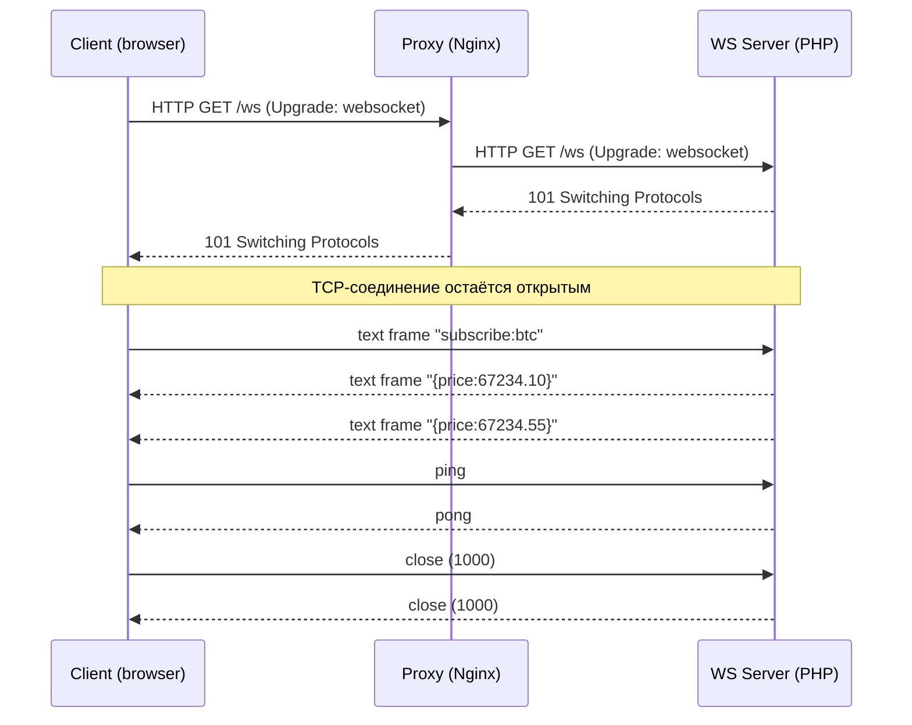

# WebSocket в PHP: полное и исчерпывающее руководство для Senior-разработчика (PHP 8.2 + Symfony 6.4)

> Это руководство — практический справочник по WebSocket для PHP/Symfony-разработчика уровня Senior. Оно покрывает протокол RFC 6455 и его расширения, архитектуру асинхронных PHP-серверов (Ratchet/ReactPHP, Workerman, OpenSwoole, RoadRunner), интеграцию с Symfony 6.4 через Mercure и Centrifugo, аутентификацию, безопасность (WSS, CSWSH, Origin), масштабирование, sticky sessions, Redis Pub/Sub, мониторинг, тестирование и сравнение с альтернативами (SSE, long-polling, HTTP/2, gRPC streaming, MQTT). Все примеры работоспособны и решают конкретные бизнес-задачи: live-нотификации, чаты, биржевые тикеры, collaborative editing, мониторинг.

---

## Оглавление

1. [[#1. Что такое WebSocket и зачем он нужен|Что такое WebSocket и зачем он нужен]]
2. [[#2. Протокол WebSocket (RFC 6455) изнутри|Протокол WebSocket (RFC 6455) изнутри]]
3. [[#3. Жизненный цикл соединения и состояния|Жизненный цикл соединения и состояния]]
4. [[#4. WebSocket vs SSE vs Long-polling vs HTTP/2 vs gRPC streaming|WebSocket vs SSE vs Long-polling vs HTTP/2 vs gRPC streaming]]
5. [[#5. Почему классический PHP-FPM не подходит и как это решить|Почему классический PHP-FPM не подходит и как это решить]]
6. [[#6. Обзор PHP-стека для WebSocket|Обзор PHP-стека для WebSocket]]
7. [[#7. Ratchet + ReactPHP: базовый сервер|Ratchet + ReactPHP: базовый сервер]]
8. [[#8. Event loop, неблокирующий I/O и подводные камни|Event loop, неблокирующий I/O и подводные камни]]
9. [[#9. OpenSwoole / Workerman / RoadRunner|OpenSwoole / Workerman / RoadRunner]]
10. [[#10. Symfony 6.4: интеграция с Mercure (рекомендованный путь)|Symfony 6.4: интеграция с Mercure (рекомендованный путь)]]
11. [[#11. Centrifugo как production-сервер для PHP-приложений|Centrifugo как production-сервер для PHP-приложений]]
12. [[#12. Аутентификация и авторизация в WebSocket|Аутентификация и авторизация в WebSocket]]
13. [[#13. Безопасность: WSS, CSWSH, Origin, rate limit|Безопасность: WSS, CSWSH, Origin, rate limit]]
14. [[#14. Heartbeat, idle-таймауты, обнаружение разрывов|Heartbeat, idle-таймауты, обнаружение разрывов]]
15. [[#15. Backpressure и flow control|Backpressure и flow control]]
16. [[#16. Масштабирование: sticky sessions, Pub/Sub, шардирование|Масштабирование: sticky sessions, Pub/Sub, шардирование]]
17. [[#17. Reverse proxy: Nginx и HAProxy для WebSocket|Reverse proxy: Nginx и HAProxy для WebSocket]]
18. [[#18. Развёртывание: systemd, supervisord, Docker, K8s|Развёртывание: systemd, supervisord, Docker, K8s]]
19. [[#19. Мониторинг и метрики|Мониторинг и метрики]]
20. [[#20. Тестирование WebSocket-кода|Тестирование WebSocket-кода]]
21. [[#21. Subprotocols, extensions и permessage-deflate|Subprotocols, extensions и permessage-deflate]]
22. [[#22. Бизнес-сценарии и архитектурные паттерны|Бизнес-сценарии и архитектурные паттерны]]
23. [[#23. Типичные ошибки и анти-паттерны|Типичные ошибки и анти-паттерны]]
24. [[#24. Сравнение библиотек и решений|Сравнение библиотек и решений]]
25. [[#25. Проверочные вопросы с ответами|Проверочные вопросы с ответами]]
26. [[#26. Источники|Источники]]

---

## 1. Что такое WebSocket и зачем он нужен

**WebSocket** (RFC 6455, 2011) — прикладной протокол поверх TCP, обеспечивающий **двунаправленный полнодуплексный** канал связи между клиентом и сервером по одному соединению. Стартует как обычный HTTP-запрос с заголовком `Upgrade: websocket`, после чего соединение «переключается» в собственный фрейм-протокол и больше не использует HTTP-семантику.

**Бизнес-ценность:**
- Низкая задержка (нет накладных расходов HTTP-запроса на каждое сообщение).
- Сервер может **сам инициировать** отправку — критично для живых уведомлений, тикеров, чатов, коллаборации.
- Меньше трафика и CPU при частых обменах: handshake один раз, дальше — лёгкие фреймы (2–14 байт оверхеда).

**Где применяется на практике:**
- **Финтех/трейдинг**: котировки, стакан, сделки в реальном времени (Binance, Bybit отдают данные через WS).
- **Чаты и мессенджеры**: WhatsApp Web, Slack, Discord.
- **Collaborative editing**: Google Docs, Figma, Notion (в связке с CRDT/OT).
- **Live-уведомления и dashboards**: админки SaaS, антифрод, мониторинг.
- **Игры**: realtime-мультиплеер, лобби, матчмейкинг.
- **IoT-шлюзы** (хотя для устройств чаще MQTT).

**Когда WebSocket НЕ нужен:**
- Если сервер только отправляет данные клиенту (новости, лента) — достаточно **Server-Sent Events (SSE)**: проще, работает поверх обычного HTTP, переподключается автоматически.
- Если обновления редкие (раз в минуту и реже) — обычный polling или ETag-кеш дешевле.
- Если нужна гарантированная доставка с очередями и retry — берите **брокер сообщений** (RabbitMQ/Kafka), а WS — только как «последняя миля» к браузеру.

> **Аналогия для новичка.** Обычный HTTP — это телеграмма: написал → отправил → ждёшь ответ → канал закрыт. WebSocket — это телефонный разговор: дозвонился один раз и дальше говорите оба, пока кто-то не положит трубку. Звонок дороже одной телеграммы установить, но если вы обмениваетесь сотнями реплик — суммарно выгоднее.

---

## 2. Протокол WebSocket (RFC 6455) изнутри

### 2.1. Handshake (рукопожатие)

Клиент отправляет **обычный HTTP/1.1-запрос** со специальными заголовками:

```http
GET /ws/notifications HTTP/1.1
Host: api.example.com
Upgrade: websocket
Connection: Upgrade
Sec-WebSocket-Key: dGhlIHNhbXBsZSBub25jZQ==
Sec-WebSocket-Version: 13
Origin: https://app.example.com
Sec-WebSocket-Protocol: notifications.v1
```

Сервер, если согласен, отвечает `101 Switching Protocols`:

```http
HTTP/1.1 101 Switching Protocols
Upgrade: websocket
Connection: Upgrade
Sec-WebSocket-Accept: s3pPLMBiTxaQ9kYGzzhZRbK+xOo=
Sec-WebSocket-Protocol: notifications.v1
```

`Sec-WebSocket-Accept` — это `base64(sha1(Sec-WebSocket-Key + "258EAFA5-E914-47DA-95CA-C5AB0DC85B11"))`. GUID фиксирован в RFC. Это защита от того, чтобы случайный кеш или прокси не приняли произвольный ответ за валидный WS-handshake.

После `101` соединение TCP **остаётся открытым**, но HTTP больше не используется — стороны обмениваются **фреймами**.

### 2.2. Формат фрейма

```text
 0                   1                   2                   3
 0 1 2 3 4 5 6 7 8 9 0 1 2 3 4 5 6 7 8 9 0 1 2 3 4 5 6 7 8 9 0 1
+-+-+-+-+-------+-+-------------+-------------------------------+
|F|R|R|R| opcode|M| Payload len |    Extended payload length    |
|I|S|S|S|  (4)  |A|     (7)     |             (16/64)           |
|N|V|V|V|       |S|             |                               |
| |1|2|3|       |K|             |                               |
+-+-+-+-+-------+-+-------------+- - - - - - - - - - - - - - - -+
|     Extended payload length continued, if payload len == 127  |
+ - - - - - - - - - - - - - - - +-------------------------------+
|                               |Masking-key, if MASK set       |
+-------------------------------+-------------------------------+
|             Payload Data continued ...                        |
+---------------------------------------------------------------+
```

Ключевые поля:
- **FIN** — последний фрейм сообщения (одно сообщение может быть нарезано на несколько фреймов).
- **opcode** (4 бита):
  - `0x0` continuation, `0x1` text (UTF-8), `0x2` binary,
  - `0x8` close, `0x9` ping, `0xA` pong.
- **MASK** — клиент **ОБЯЗАН** маскировать payload (XOR со случайным 4-байтным ключом). Сервер маскировать не должен. Маскирование — защита от cache poisoning через прокси, которые могли бы интерпретировать специально подобранные payload как HTTP-запрос.
- **Payload length** — 7 бит, если ≤125; иначе 7+16 бит (если 126), либо 7+64 (если 127). Максимум — 2^63 байт, но на практике сервер обязан ограничивать.

### 2.3. Контрольные фреймы (control frames)

`close`, `ping`, `pong` — control frames. Они **не могут быть фрагментированы** и их payload **не больше 125 байт**. Это сделано, чтобы их можно было обработать «между» большими сообщениями.

Закрытие соединения — это обмен `close`-фреймами с кодом причины (`1000` нормально, `1001` уход, `1006` abnormal — никогда не отправляется по сети, только генерируется библиотекой при разрыве, `1008` policy violation, `1011` server error и т.д., см. RFC 6455 §7.4).

> **Подводный камень.** Бинарные фреймы с opcode `0x2` приходят как сырые байты — текст внутри них **не обязан** быть UTF-8. Если вы шлёте JSON — используйте text frames (`0x1`). Если шлёте protobuf/MsgPack — binary. Не путать: невалидный UTF-8 в text frame — это причина закрытия с кодом `1007`.



---

## 3. Жизненный цикл соединения и состояния

```text
[OPENING] --handshake OK--> [OPEN] --close frame--> [CLOSING] --TCP FIN--> [CLOSED]
                                |
                                +--TCP error--> [CLOSED] (code 1006)
```

В браузерном API эти состояния доступны как `WebSocket.readyState`: `CONNECTING (0)`, `OPEN (1)`, `CLOSING (2)`, `CLOSED (3)`.

**Что важно для PHP-сервера:**
- На **OPEN** — регистрируем соединение в реестре (memory map `connectionId → user`), подписываем на нужные каналы, шлём начальный snapshot.
- На каждое **сообщение** — НЕ блокируем обработку. Если работа тяжёлая (запрос в БД, внешний API), уносим в очередь (Symfony Messenger) и отдаём ответ позже.
- На **CLOSING/CLOSED** — освобождаем ресурсы, отписываемся от каналов, обновляем «онлайн» статус пользователя.

> **Аналогия.** Соединение — это арендованный стол в ресторане. Вы не можете под одним столом обслужить тысячу клиентов: либо стол занят надолго (WS), либо это «фастфуд» (HTTP — пришёл, забрал, ушёл). Поэтому WS-сервер всегда выглядит как **долгоживущий процесс с реестром столов**.

---

## 4. WebSocket vs SSE vs Long-polling vs HTTP/2 vs gRPC streaming

| Критерий | WebSocket | SSE (EventSource) | Long-polling | HTTP/2 push | gRPC streaming |
|---|---|---|---|---|---|
| Направление | bidirectional | server→client only | client→server (с задержкой) | server→client | bidirectional |
| Поверх HTTP | upgrade | да (text/event-stream) | да | да | да (HTTP/2) |
| Авто-reconnect | нет (вручную) | да (`Last-Event-ID`) | вручную | — | вручную |
| Бинарные данные | да | нет (только UTF-8) | да | да | да (protobuf) |
| Поддержка прокси | требует настройки | работает «из коробки» | да | требует HTTP/2 e2e | требует HTTP/2 e2e |
| Браузер | да | да (кроме старого IE) | да | устаревшее | через grpc-web |
| Сложность сервера | высокая (stateful) | низкая | низкая | средняя | средняя |
| Когда выбирать | чаты, игры, торговля | live-feed, нотификации, прогресс задач | legacy/совместимость | (не рекомендуется) | межсервисное API |

**Эвристика выбора:**
- Сервер только пушит обновления → **SSE**. Это самый недооценённый инструмент. Mercure (Symfony) построен на SSE именно поэтому.
- Клиент и сервер одинаково активны → **WebSocket**.
- Микросервис ↔ микросервис → **gRPC streaming** (или Kafka), не WebSocket.
- Нет HTTP/2 в инфраструктуре или нужна мобильная батареесберегающая реализация → **MQTT** (но это не браузерный протокол).

---

## 5. Почему классический PHP-FPM не подходит и как это решить

PHP-FPM — это «request-per-process» модель: воркер живёт **только** на время одного HTTP-запроса. После ответа — `cleanup`, освобождение памяти, ожидание следующего запроса. Долгоживущее TCP-соединение в такую модель не вписывается:

1. Воркер был бы занят одним пользователем неограниченное время → пул быстро исчерпан.
2. У FPM нет event loop — `fread()` на сокете блокирует процесс.
3. Нет общей памяти между воркерами для реестра соединений.

**Решения (по порядку популярности):**

1. **Внешний WebSocket-сервер**, общающийся с PHP-приложением через HTTP/Pub-Sub:
   - **Mercure Hub** (SSE-based, Symfony first-class).
   - **Centrifugo** (WS/SSE/HTTP-stream, бэкенд может оставаться FPM).
   - **Soketi** (Pusher-протокол, drop-in для Laravel Echo).
2. **Долгоживущий PHP-процесс** на event loop:
   - **Ratchet** (поверх ReactPHP, чистый PHP).
   - **Workerman** (свой event loop, libevent/event).
   - **OpenSwoole / Swoole** (C-расширение, корутины).
   - **RoadRunner** (Go-сервер + PHP-воркеры через goridge).
3. **Гибрид**: Symfony-приложение остаётся на FPM, отдельный WS-демон (Ratchet/Centrifugo) обслуживает соединения и принимает команды от FPM по Redis Pub/Sub или HTTP.

> **Совет.** Для 95% задач в Symfony 6.4 правильный ответ — **Mercure** (если хватает SSE) или **Centrifugo** (если нужен полноценный WS с подпиской/историей/RPC). Писать свой WS-сервер на Ratchet оправдано только если у вас нестандартный бинарный subprotocol или жёсткие требования к latency и контролю над event loop.

---

## 6. Обзор PHP-стека для WebSocket

| Инструмент | Тип | PHP | Кейсы | Сильные стороны | Слабые стороны |
|---|---|---|---|---|---|
| Ratchet (`cboden/ratchet`) | библиотека на ReactPHP | 7.4+ (работает на 8.2) | свой WS-сервер на чистом PHP | низкий порог входа, чистый PHP | развитие медленное, без корутин |
| ReactPHP | event loop фреймворк | 8.1+ | основа для Ratchet, async HTTP | зрелая, без расширений | нужно мыслить в Promise/coroutine |
| Workerman | свой event loop | 7.0+ | масштабные WS, gateway/worker модель | свой Gateway-Worker для масштаба | другой стиль, не Symfony-friendly |
| OpenSwoole | C-расширение | 8.0+ | высоконагруженные сервисы, корутины | производительность, корутины | требует ext, отдельная экосистема |
| RoadRunner v3 | Go-сервер + PHP | 8.1+ | Symfony as long-running service | прод-готовый, plugins | плагин WS требует настройки |
| Mercure Hub | сервер на Go | — (HTTP API) | live updates, SSE, Symfony | официальная интеграция, простота | только server→client (SSE) |
| Centrifugo | сервер на Go | — (HTTP/GRPC API) | чаты, нотификации, presence | history, presence, RPC, scale | внешняя зависимость на Go |
| Soketi | сервер на Node.js | — (Pusher API) | drop-in Pusher для Laravel/Echo | совместимость Pusher | Node, не PHP-нативно |
| ApiPlatform Mercure | надстройка | 8.2+ | автоматический CRUD + live | zero-config Live updates | только GET-обновления ресурсов |

В этом руководстве мы детально рассмотрим: **Ratchet** (как ввод в тему), **Mercure** и **Centrifugo** (как основные production-инструменты для Symfony), а также **OpenSwoole** (для high-load).

---

## 7. Ratchet + ReactPHP: базовый сервер

**Ratchet** — самая известная PHP-библиотека для WebSocket-серверов. Под капотом — `ReactPHP` (event loop) + `Guzzle PSR-7` (HTTP-handshake) + собственный фрейм-парсер.

### 7.1. Установка и структура

```bash
composer require cboden/ratchet:^0.4.4 react/event-loop:^1.5
```

`composer.json` (фрагмент):
```json
{
    "require": {
        "php": ">=8.2",
        "cboden/ratchet": "^0.4.4",
        "react/event-loop": "^1.5",
        "monolog/monolog": "^3.5",
        "predis/predis": "^2.2"
    }
}
```

### 7.2. Реальный пример: live-нотификации для админки SaaS

Бизнес-задача: каждый менеджер видит в реальном времени новые заявки клиентов своей компании. Backend на Symfony публикует событие, а WS-сервер рассылает его подписчикам только из той же `tenant_id`.

```php
<?php
declare(strict_types=1);

namespace App\WebSocket;

use Ratchet\ConnectionInterface;
use Ratchet\MessageComponentInterface;
use Psr\Log\LoggerInterface;

/**
 * Реестр соединений и маршрутизация сообщений.
 * Хранит соединения сгруппированными по tenant_id, чтобы рассылать только «своим».
 */
final class NotificationServer implements MessageComponentInterface
{
    /** @var \SplObjectStorage<ConnectionInterface, array{userId:int, tenantId:int}> */
    private \SplObjectStorage $clients;

    /** @var array<int, \SplObjectStorage<ConnectionInterface, null>> tenantId => set of conns */
    private array $byTenant = [];

    public function __construct(
        private readonly AuthService $auth,           // Проверяет JWT из query/cookie/subprotocol
        private readonly LoggerInterface $logger,
    ) {
        $this->clients = new \SplObjectStorage();
    }

    public function onOpen(ConnectionInterface $conn): void
    {
        try {
            // Аутентификация по JWT, переданному в Sec-WebSocket-Protocol или ?token=
            $session = $this->auth->authenticate($conn);
        } catch (\Throwable $e) {
            // Закрываем сразу с кодом 1008 Policy Violation
            $conn->close(1008);
            $this->logger->warning('WS auth failed', ['error' => $e->getMessage()]);
            return;
        }

        $this->clients->attach($conn, ['userId' => $session->userId, 'tenantId' => $session->tenantId]);
        $this->byTenant[$session->tenantId] ??= new \SplObjectStorage();
        $this->byTenant[$session->tenantId]->attach($conn);

        $this->logger->info('WS connected', [
            'connId'  => spl_object_id($conn),
            'userId'  => $session->userId,
            'tenant'  => $session->tenantId,
            'online'  => count($this->clients),
        ]);
    }

    public function onMessage(ConnectionInterface $from, $msg): void
    {
        // Клиент может отправлять только команды управления (subscribe/unsubscribe/ack).
        // Бизнес-данные он не порождает.
        $payload = json_decode((string) $msg, true, 8, JSON_THROW_ON_ERROR);
        match ($payload['type'] ?? null) {
            'ping'  => $from->send(json_encode(['type' => 'pong'], JSON_THROW_ON_ERROR)),
            'ack'   => $this->handleAck($from, $payload),
            default => $from->send(json_encode(['type' => 'error', 'msg' => 'unknown'], JSON_THROW_ON_ERROR)),
        };
    }

    public function onClose(ConnectionInterface $conn): void
    {
        if (!$this->clients->contains($conn)) {
            return;
        }
        ['tenantId' => $tenantId] = $this->clients[$conn];
        $this->clients->detach($conn);
        $this->byTenant[$tenantId]?->detach($conn);
        if (isset($this->byTenant[$tenantId]) && count($this->byTenant[$tenantId]) === 0) {
            unset($this->byTenant[$tenantId]);
        }
    }

    public function onError(ConnectionInterface $conn, \Exception $e): void
    {
        $this->logger->error('WS error', ['error' => $e->getMessage(), 'connId' => spl_object_id($conn)]);
        $conn->close(1011); // Internal error
    }

    /**
     * Точка входа для broadcast от внешнего источника (Redis Pub/Sub, см. ниже).
     * @param array<string,mixed> $payload
     */
    public function broadcastToTenant(int $tenantId, array $payload): void
    {
        if (!isset($this->byTenant[$tenantId])) {
            return;
        }
        $json = json_encode($payload, JSON_THROW_ON_ERROR);
        foreach ($this->byTenant[$tenantId] as $conn) {
            /** @var ConnectionInterface $conn */
            $conn->send($json);
        }
    }

    /** @param array<string,mixed> $payload */
    private function handleAck(ConnectionInterface $conn, array $payload): void
    {
        // Подтверждение доставки нотификации, чтобы перестать ретраить из БД.
        // ...
    }
}
```

### 7.3. `bin/ws-server.php` — точка запуска

```php
#!/usr/bin/env php
<?php
declare(strict_types=1);

use App\WebSocket\NotificationServer;
use App\WebSocket\AuthService;
use App\WebSocket\RedisBridge;
use Monolog\Handler\StreamHandler;
use Monolog\Logger;
use Ratchet\Http\HttpServer;
use Ratchet\Server\IoServer;
use Ratchet\WebSocket\WsServer;
use React\EventLoop\Loop;
use React\Socket\SocketServer;

require __DIR__ . '/../vendor/autoload.php';

$logger = new Logger('ws');
$logger->pushHandler(new StreamHandler('php://stderr', Logger::INFO));

$loop   = Loop::get(); // ReactPHP — singleton event loop
$auth   = new AuthService(getenv('JWT_PUBLIC_KEY') ?: throw new RuntimeException('JWT_PUBLIC_KEY env required'));
$server = new NotificationServer($auth, $logger);

// Мост в Redis: подписываемся на канал, при сообщении вызываем broadcastToTenant().
$bridge = new RedisBridge($loop, getenv('REDIS_DSN') ?: 'redis://redis:6379', $server, $logger);
$bridge->start();

// Слушаем 0.0.0.0:8080. ОБЯЗАТЕЛЬНО за reverse-proxy с TLS, см. раздел 17.
$socket = new SocketServer('0.0.0.0:8080', [], $loop);
$ioServer = new IoServer(
    new HttpServer(new WsServer($server)),
    $socket,
    $loop
);

// Корректное завершение по SIGTERM (graceful shutdown — критично для k8s rolling deploy).
$shutdown = function () use ($loop, $logger, $server) {
    $logger->info('Shutting down: closing WS connections...');
    // Здесь можно отправить close(1001 Going Away) всем клиентам, чтобы они переподключились на другую реплику.
    $loop->stop();
};
$loop->addSignal(SIGTERM, $shutdown);
$loop->addSignal(SIGINT,  $shutdown);

$logger->info('WS server listening on :8080');
$ioServer->run();
```

### 7.4. Мост Redis Pub/Sub → WS

Symfony публикует событие в Redis, WS-демон его получает и рассылает подписчикам. Это **обязательный паттерн** для масштабирования (см. [[#16. Масштабирование: sticky sessions, Pub/Sub, шардирование]]).

```php
<?php
declare(strict_types=1);

namespace App\WebSocket;

use App\WebSocket\NotificationServer;
use Clue\React\Redis\Factory as RedisFactory;
use Clue\React\Redis\Client as RedisClient;
use Psr\Log\LoggerInterface;
use React\EventLoop\LoopInterface;

final class RedisBridge
{
    public function __construct(
        private readonly LoopInterface $loop,
        private readonly string $dsn,
        private readonly NotificationServer $server,
        private readonly LoggerInterface $logger,
    ) {}

    public function start(): void
    {
        $factory = new RedisFactory($this->loop);
        $factory->createClient($this->dsn)->then(
            function (RedisClient $client) {
                // Подписка через PSUBSCRIBE на шаблон 'tenant:*:notifications'
                $client->psubscribe('tenant:*:notifications');
                $client->on('pmessage', function (string $pattern, string $channel, string $payload) {
                    if (preg_match('/^tenant:(\d+):notifications$/', $channel, $m) !== 1) {
                        return;
                    }
                    $tenantId = (int) $m[1];
                    try {
                        $data = json_decode($payload, true, 16, JSON_THROW_ON_ERROR);
                        $this->server->broadcastToTenant($tenantId, $data);
                    } catch (\JsonException $e) {
                        $this->logger->warning('Invalid Redis payload', ['err' => $e->getMessage()]);
                    }
                });
                $this->logger->info('Redis bridge ready');
            },
            function (\Throwable $e) {
                $this->logger->error('Redis connect failed', ['err' => $e->getMessage()]);
                // Retry с экспоненциальной задержкой
                $this->loop->addTimer(2.0, fn () => $this->start());
            }
        );
    }
}
```

> **Почему так, а не «все клиенты на один канал».** При тысячах tenant'ов нерационально гонять каждое сообщение всем. Шаблон `psubscribe` + ключ канала с `tenant_id` в имени фильтрует **на стороне Redis** — реплика WS-сервера получит только сообщения для тех tenant'ов, которые «висят» на ней.

### 7.5. Что делает Ratchet «под капотом»

`WsServer` декорирует `HttpServer`:
1. Принимает HTTP-handshake, проверяет `Upgrade: websocket`, считает `Sec-WebSocket-Accept`.
2. Подменяет `ConnectionInterface` на свой `WsConnection`, который умеет writing-and-reading фреймы.
3. Парсит входящие фреймы (`MessageBuffer`), собирает фрагментированные сообщения, отвечает `pong` на `ping`.
4. Делегирует `onOpen/onMessage/onClose/onError` в ваш `MessageComponentInterface`.

Это означает: **Ratchet не знает ни про авторизацию, ни про каналы, ни про presence** — всё это вы пишете сами. Это и плюс (полный контроль), и минус (много работы).

---

## 8. Event loop, неблокирующий I/O и подводные камни

ReactPHP/Ratchet — **single-threaded** event loop. Это значит: один процесс обслуживает 10 000 соединений по очереди в одном PHP-потоке. Любой блокирующий вызов **останавливает весь сервер** для всех клиентов.

### 8.1. Что блокирует и как избежать

| Блокирующая операция | Замена в ReactPHP |
|---|---|
| `PDO::query`, `mysqli_*` | `clue/reactphp-mysql`, `react/postgres`, или вынос работы в worker через RabbitMQ/Symfony Messenger |
| `file_get_contents('http://...')`, Guzzle sync | `react/http`, `clue/buzz-react` |
| `sleep()`, `usleep()` | `$loop->addTimer($seconds, fn () => ...)` |
| Большой `json_encode` на 50 МБ | разбить, или поток (`Stream`) |
| `password_hash` с высоким cost | вынести в очередь |
| `file_put_contents` синхронно | `react/filesystem` (или fire-and-forget в очередь) |

> **Подводный камень №1.** Doctrine ORM использует PDO синхронно — **в ReactPHP-сервере её использовать нельзя в hot path**. Решение: WS-сервер обращается к Symfony-приложению через HTTP API (асинхронным `react/http`) либо публикует команды в очередь, а Symfony-консьюмер делает работу и публикует ответ обратно через Redis Pub/Sub.

> **Подводный камень №2.** `array_map` на массиве из 1 миллиона элементов — это блокировка на секунды. Любая «тяжёлая» CPU-работа (рендеринг PDF, парсинг XML, image resize) **выносится из event loop**: либо в дочерний процесс через `react/child-process`, либо в очередь.

### 8.2. Promise vs Fiber (PHP 8.1+)

PHP 8.1 принёс `Fiber` — кооперативные «легковесные потоки». ReactPHP 1.4+ умеет использовать fibers через `react/async` (`React\Async\await(...)`), что превращает promise-цепочки в линейный код:

```php
use function React\Async\await;
use function React\Async\async;

$server->on('message', async(function (ConnectionInterface $conn, string $msg): void {
    $userData = await($apiClient->getUser($conn->userId));   // не блокирует loop
    $orders   = await($apiClient->getOrders($conn->userId));
    $conn->send(json_encode(['user' => $userData, 'orders' => $orders]));
}));
```

Под капотом каждый `await` ставит promise на резолв, корутина «засыпает», loop обслуживает других клиентов, потом возобновляет fiber с результатом. Снаружи код выглядит синхронным.

### 8.3. Утечки памяти в долгоживущем процессе

Любой PHP-сервис, работающий часами, **должен**:
- Не накапливать неограниченные структуры (`$messages[] = ...` без выгрузки).
- Освобождать ссылки в `onClose` (`SplObjectStorage::detach`).
- Не использовать `static`-кеши без TTL.
- Периодически проверять `memory_get_usage(true)` и логировать.
- На `>RSS_LIMIT` — упорядоченно завершаться (process manager поднимет заново).

```php
$loop->addPeriodicTimer(60.0, function () use ($logger) {
    $rssMb = memory_get_usage(true) / 1024 / 1024;
    $logger->info('memory', ['rss_mb' => round($rssMb, 1), 'conns' => count($this->clients)]);
    if ($rssMb > 512) {
        $logger->warning('Memory threshold exceeded, requesting graceful restart');
        posix_kill(posix_getpid(), SIGTERM); // supervisord/k8s поднимет
    }
});
```

---

## 9. OpenSwoole / Workerman / RoadRunner

### 9.1. OpenSwoole

`OpenSwoole` — форк Swoole (после раскола в 2021), C-расширение, добавляющее в PHP корутины, асинхронный I/O и WS-сервер «из коробки».

```php
<?php
declare(strict_types=1);

use OpenSwoole\WebSocket\Server;
use OpenSwoole\WebSocket\Frame;
use OpenSwoole\Http\Request;

$server = new Server('0.0.0.0', 8080);
$server->set([
    'worker_num'        => swoole_cpu_num(),  // по числу ядер
    'task_worker_num'   => 4,                  // для тяжёлых задач
    'open_websocket_ping_frame' => true,       // обрабатывать ping автоматически
    'heartbeat_idle_time'       => 60,         // сек до считать соединение мёртвым
    'heartbeat_check_interval'  => 30,
    'max_request'               => 100000,     // перезапуск воркера для борьбы с утечками
]);

$server->on('open', function (Server $s, Request $req) {
    // Аутентификация при handshake
    $token = $req->get['token'] ?? null;
    if ($token === null || !verifyJwt($token)) {
        $s->disconnect($req->fd, 1008, 'Unauthorized');
        return;
    }
    $s->connections[$req->fd] = $token; // OpenSwoole хранит fd, реестр пишем сами в Redis/Table
});

$server->on('message', function (Server $s, Frame $frame) {
    // Внутри корутины — можно делать «синхронные» вызовы Coroutine\MySQL/Redis/HTTP без блокировки
    $s->push($frame->fd, json_encode(['echo' => $frame->data]));
});

$server->on('close', function (Server $s, int $fd) {
    // ...
});

$server->start();
```

**Сильные стороны:** до сотен тысяч соединений на узел, корутины (`go(fn () => ...)`) и встроенный HTTP/WS/TCP-сервер. **Слабые:** требует `pecl install openswoole`, отдельная экосистема (своя Coroutine\MySQL, не Doctrine ORM напрямую), нужно следить за thread-safe поведением.

### 9.2. Workerman

`workerman/workerman` — чистый PHP, свой event loop (`Event`/`Libevent`/`Swoole`/`Select`). Имеет официальный модуль **Gateway/Worker** — готовая архитектура для масштабирования: один Gateway держит соединения, Worker'ы обрабатывают логику, общение между ними через Channel-сервер.

```php
use Workerman\Worker;
$ws = new Worker('websocket://0.0.0.0:8080');
$ws->count = 4; // forked workers
$ws->onMessage = function ($connection, $data) { $connection->send('echo: ' . $data); };
Worker::runAll();
```

Workerman популярнее в Азии, чем в Европе/США, но это технически зрелое и быстрое решение.

### 9.3. RoadRunner v3 + WebSocket

RoadRunner — приложенческий сервер на Go, плагин `centrifuge` встраивает Centrifugo в RR и даёт PHP-приложению (Symfony) Pub/Sub-подобный API для отправки сообщений в WS.

```yaml
# .rr.yaml
version: "3"
server:
  command: "php public/index.php"

centrifuge:
  proxy_address: "tcp://127.0.0.1:30000"
```

Внутри Symfony — обработчики через `RoadRunner\Centrifugo\CentrifugoWorker`, которые валидируют подписку, RPC, presence. Это компромисс: PHP пишет «бизнес», Go пишет сеть.

---

## 10. Symfony 6.4: интеграция с Mercure (рекомендованный путь)

**Mercure** — открытый протокол поверх SSE (Server-Sent Events) + JWT для авторизации, разработан создателем API Platform. Это **не WebSocket**, но в 80% случаев решает ту же задачу — и значительно проще.

> **Почему SSE, а не WS, для нотификаций.** Большинство «realtime» в SaaS — это server→client (новое сообщение, новая заявка, статус задачи). Клиент инициирует не сообщения, а HTTP-запросы. SSE здесь идеален: нативный браузерный API `EventSource` сам переподключается, поддерживает `Last-Event-ID` для дозагрузки пропущенного, идёт по обычному HTTP/2 без `Upgrade`. Если же вам нужен **двунаправленный** канал (чат) — Mercure не подходит, берите Centrifugo или Ratchet.

### 10.1. Установка

```bash
composer require symfony/mercure-bundle
```

`config/packages/mercure.yaml`:
```yaml
mercure:
    hubs:
        default:
            url: '%env(MERCURE_URL)%'           # http://mercure:3000/.well-known/mercure
            public_url: '%env(MERCURE_PUBLIC_URL)%' # https://example.com/.well-known/mercure
            jwt:
                secret: '%env(MERCURE_JWT_SECRET)%'
                publish: ['*']                   # backend может публиковать в любые topics
                algorithm: 'hmac.sha256'
```

Запуск Mercure Hub (отдельный Go-бинарник, обычно в Docker):
```yaml
# docker-compose.yml
services:
  mercure:
    image: dunglas/mercure:v0.16
    environment:
      SERVER_NAME: ':3000'
      MERCURE_PUBLISHER_JWT_KEY: '!ChangeThisMercureHubJWTSecretKey!'
      MERCURE_SUBSCRIBER_JWT_KEY: '!ChangeThisMercureHubJWTSecretKey!'
      MERCURE_EXTRA_DIRECTIVES: |
        cors_origins https://app.example.com
    ports:
      - "3000:3000"
```

### 10.2. Публикация события из Symfony

Бизнес-задача: при изменении статуса заказа моментально обновлять страницу клиента.

```php
<?php
declare(strict_types=1);

namespace App\Notification;

use App\Entity\Order;
use Symfony\Component\Mercure\HubInterface;
use Symfony\Component\Mercure\Update;
use Symfony\Component\Serializer\SerializerInterface;

final readonly class OrderStatusBroadcaster
{
    public function __construct(
        private HubInterface $hub,
        private SerializerInterface $serializer,
    ) {}

    public function publish(Order $order): void
    {
        $topic = sprintf('https://example.com/orders/%s', $order->getId()->toRfc4122());
        // private => true: только подписчики с подходящим JWT (subscribe claim) увидят это сообщение.
        $update = new Update(
            topics: $topic,
            data: $this->serializer->serialize($order, 'json', ['groups' => ['order:read']]),
            private: true,
            id: 'order-' . $order->getId()->toRfc4122() . '-' . $order->getVersion(), // для Last-Event-ID
        );
        $this->hub->publish($update);
    }
}
```

Вызываем из `MessageHandler`/Doctrine event listener после коммита транзакции (паттерн Transactional Outbox, см. PostgreSQL guide).

### 10.3. Подписка на стороне клиента

JWT для подписчика выдаёт Symfony (по сессии/OAuth):

```php
#[Route('/api/realtime/token', methods: ['POST'])]
public function token(Security $security, Authorization $authorization, Request $request): Response
{
    $user = $security->getUser();
    // Cookie с JWT для Mercure: HttpOnly, Secure, SameSite=Lax.
    $response = new Response();
    $authorization->setCookie(
        $request,
        subscribe: [sprintf('https://example.com/orders/{id}'), 'https://example.com/users/' . $user->getId()],
        // Шаблон URI Template (RFC 6570) — подписчик увидит updates по любому order id.
    );
    return $response;
}
```

Браузер:
```javascript
const url = new URL('https://example.com/.well-known/mercure');
url.searchParams.append('topic', `https://example.com/orders/${orderId}`);
const es = new EventSource(url, { withCredentials: true });
es.onmessage = (event) => {
    const order = JSON.parse(event.data);
    updateUI(order);
};
```

### 10.4. Когда Mercure не подходит

- Нужен **bidirectional** (клиент часто шлёт сообщения).
- Нужны **presence** (кто онлайн в комнате).
- Нужны **бинарные** сообщения.
- Нужно **history** (сообщения за последний час) — Mercure поддерживает только `Last-Event-ID` через бэкенд (Bolt/Postgres).

В этих случаях — Centrifugo.

---

## 11. Centrifugo как production-сервер для PHP-приложений

**Centrifugo** — открытый сервер реального времени на Go (автор — Александр Емелин). Поддерживает WebSocket, SSE, HTTP-stream, SockJS как fallback. Имеет **channels**, **presence**, **history**, **JWT**, **proxy hooks** (валидация подписки в вашем PHP-приложении), **сторонний RPC**, **горизонтальное масштабирование** через Redis/Nats/Tarantool.

### 11.1. Архитектура

```text
                                 +----------------+
   browser  <-- WebSocket -->    |   Centrifugo   |  <-- proxy HTTP --> Symfony
                                 |  (Go process)  |  <-- publish API ->|        |
                                 +----------------+                    +--------+
                                         |
                                  Redis (engine)
```

Symfony **публикует** в каналы через HTTP API Centrifugo. Для авторизации подписки Centrifugo может «спросить» у Symfony через `proxy connect/subscribe` хук (HTTP-вызов).

### 11.2. PHP SDK

Используем `centrifugal/phpcent` (официальный):

```bash
composer require centrifugal/phpcent
```

```php
<?php
declare(strict_types=1);

namespace App\Realtime;

use phpcent\Client as CentrifugoClient;

final readonly class RealtimePublisher
{
    public function __construct(private CentrifugoClient $client) {}

    /** @param array<string,mixed> $data */
    public function publish(string $channel, array $data): void
    {
        // Под капотом — HTTP POST на /api с {method:"publish", params:{channel, data}}.
        $this->client->publish($channel, $data);
    }

    public function presence(string $channel): array
    {
        return $this->client->presence($channel);
    }

    /** Выпустить токен для клиента (HMAC SHA-256). */
    public function issueConnectionToken(string $userId, int $ttlSec = 3600): string
    {
        return $this->client->generateConnectionToken($userId, time() + $ttlSec);
    }
}
```

Регистрация в Symfony DI:

```yaml
# config/services.yaml
services:
    phpcent\Client:
        arguments:
            $url: '%env(CENTRIFUGO_API_URL)%'   # http://centrifugo:8000/api
            $apikey: '%env(CENTRIFUGO_API_KEY)%'
```

### 11.3. Authorization proxy

`centrifugo.json`:
```json
{
  "token_hmac_secret_key": "${CENTRIFUGO_TOKEN_HMAC}",
  "api_key": "${CENTRIFUGO_API_KEY}",
  "allowed_origins": ["https://app.example.com"],
  "proxy_subscribe_endpoint": "http://symfony/_centrifugo/subscribe",
  "proxy_subscribe_timeout": "1s",
  "namespaces": [
    { "name": "chat",    "presence": true, "history_size": 100, "history_ttl": "300s" },
    { "name": "ticker",  "presence": false, "history_size": 0  }
  ]
}
```

Symfony-контроллер для proxy-хука:

```php
#[Route('/_centrifugo/subscribe', methods: ['POST'])]
public function subscribeHook(
    Request $request,
    SubscribeAuthorizer $authorizer,
): JsonResponse {
    $body = json_decode($request->getContent(), true, 8, JSON_THROW_ON_ERROR);
    $channel = $body['channel'];
    $userId  = $body['user'];
    if (!$authorizer->canSubscribe($userId, $channel)) {
        // Centrifugo получит "disconnect" и закроет подписку с указанной причиной
        return new JsonResponse(['disconnect' => ['code' => 4403, 'reason' => 'forbidden']]);
    }
    return new JsonResponse(['result' => []]); // OK
}
```

> **Важно.** Этот endpoint должен быть **внутренним**, доступен только Centrifugo (по сети/IP-фильтру). Никогда не выставляйте его в публичный интернет — иначе любой может вызывать его как обычный API.

### 11.4. Преимущества перед Ratchet

- Не нужен ваш собственный демон — Centrifugo высоконагруженный (миллионы соединений на инстанс).
- Из коробки: history, presence, recovery, JWT, JSON/protobuf, метрики Prometheus.
- Symfony остаётся на FPM — никакой переделки архитектуры.
- Готовые SDK для JS/iOS/Android/Flutter.

---

## 12. Аутентификация и авторизация в WebSocket

В отличие от REST, у WS нет «запроса на каждое действие» — авторизация принимается **один раз при handshake** и далее распространяется на всё соединение. Это требует особого подхода.

### 12.1. Способы передачи токена

| Способ | Плюсы | Минусы |
|---|---|---|
| **Cookie** (`HttpOnly; Secure; SameSite=Lax`) | защита от XSS, автоматически передаётся | уязвимость CSWSH (см. ниже), требует общий домен |
| **Query string** `?token=...` | просто реализовать | токен попадает в логи Nginx, history браузера |
| **`Sec-WebSocket-Protocol`** | заголовок не логируется как URL | ограничения: только короткие ASCII-токены |
| **`Authorization: Bearer ...`** | стандартно | браузерный API `WebSocket` НЕ позволяет ставить произвольные заголовки! |

**Рекомендация для production:**
1. Получить **краткоживущий WS-token** (TTL 60с) обычным авторизованным REST-запросом `POST /api/ws-ticket`. Endpoint выдаёт одноразовый JWT/uuid, привязанный к userId.
2. Передать его в `?token=...` или через `Sec-WebSocket-Protocol`.
3. WS-сервер обменивает ticket на сессию и **уничтожает ticket** после первого использования.

Это решает все проблемы: long-lived токен не утекает, CSWSH невозможен (ticket одноразовый), токен валиден ровно на handshake.

### 12.2. Symfony: выпуск ticket

```php
#[Route('/api/ws-ticket', methods: ['POST'])]
public function issueWsTicket(
    #[CurrentUser] User $user,
    CacheItemPoolInterface $cache,
): JsonResponse {
    $ticket = bin2hex(random_bytes(32));
    $item = $cache->getItem('ws_ticket:' . $ticket);
    $item->set(['userId' => $user->getId(), 'tenantId' => $user->getTenantId()]);
    $item->expiresAfter(60);
    $cache->save($item);
    return new JsonResponse(['ticket' => $ticket, 'expiresIn' => 60]);
}
```

Клиент:
```javascript
const { ticket } = await (await fetch('/api/ws-ticket', { method: 'POST', credentials: 'include' })).json();
const ws = new WebSocket(`wss://api.example.com/ws?ticket=${ticket}`);
```

WS-сервер обменивает ticket → user (атомарно через `GETDEL` в Redis, чтобы исключить replay):

```php
final class AuthService
{
    public function authenticate(ConnectionInterface $conn): SessionContext
    {
        $query = $conn->httpRequest->getUri()->getQuery();
        parse_str($query, $params);
        $ticket = $params['ticket'] ?? throw new AuthException('No ticket');

        // GETDEL атомарен: если другой воркер успел — мы получим nil
        $raw = $this->redis->executeRaw(['GETDEL', 'ws_ticket:' . $ticket]);
        if ($raw === null) {
            throw new AuthException('Invalid or used ticket');
        }
        $data = json_decode((string) $raw, true, 8, JSON_THROW_ON_ERROR);
        return new SessionContext($data['userId'], $data['tenantId']);
    }
}
```

### 12.3. Авторизация на действия

После handshake клиент шлёт сообщения (`subscribe`, `unsubscribe`, `chat:send`). Каждое сообщение нужно проверять на разрешения:

```php
public function onMessage(ConnectionInterface $from, $msg): void
{
    $session = $this->clients[$from];
    $payload = json_decode((string) $msg, true);
    if ($payload['type'] === 'chat:send') {
        if (!$this->voter->canPostInRoom($session->userId, $payload['roomId'])) {
            $from->send(json_encode(['type' => 'error', 'code' => 'forbidden']));
            return;
        }
        $this->chatService->postMessage(...);
    }
}
```

> **Анти-паттерн.** Доверять `userId`, переданному в payload сообщения. Клиент может прислать чужой id. **Источник истины — только сессия, привязанная к соединению при handshake.**

---

## 13. Безопасность: WSS, CSWSH, Origin, rate limit

### 13.1. WSS (TLS) — обязательно

`ws://` — открытый текст. Любой узел между клиентом и сервером (Wi-Fi, провайдер, прокси) видит трафик. Кроме того, многие корпоративные прокси **режут** `ws://` как «странный HTTP» — TLS-туннель спасает от этого, прокси видит только зашифрованный CONNECT.

Терминируйте TLS на reverse-proxy (Nginx/HAProxy/Caddy/Traefik), а не в PHP-сервере: PHP плохо подходит для TLS-handshake под нагрузкой.

### 13.2. CSWSH (Cross-Site WebSocket Hijacking)

**Атака.** Злоумышленник заводит сайт `evil.com`, на нём JS:
```javascript
new WebSocket('wss://victim.com/ws'); // браузер автоматически прикладывает cookie victim.com!
```
Поскольку у WS **нет CORS preflight** (в отличие от fetch), и browser отправляет cookies, злоумышленник получает соединение от имени жертвы.

**Защита (несколько слоёв одновременно):**
1. **Проверка `Origin`** на стороне сервера. Если `Origin != ваш фронтенд` — закрывать с `403`/`1008`.
2. Использовать **ticket-based auth** (см. 12.1) вместо cookie — токен выдаётся только своему фронту по CORS-защищённому endpoint.
3. **CSRF-токен** в первом же сообщении (если cookie остаётся) — без него сервер закрывает соединение.

```php
// В Ratchet HttpServer перехватываем handshake:
$origin = $request->getHeaderLine('Origin');
$allowed = ['https://app.example.com', 'https://admin.example.com'];
if (!in_array($origin, $allowed, true)) {
    $conn->close();
    return;
}
```

В Mercure это настраивается через `cors_origins`. В Centrifugo — `allowed_origins`.

### 13.3. Rate limiting

Без лимита один клиент может: завалить сервер фреймами (DoS), флудить чат, спамить broadcast. Применяйте лимиты на нескольких уровнях:

| Уровень | Лимит | Реализация |
|---|---|---|
| Соединения с одного IP | 50–100 | Nginx `limit_conn`, или iptables/nftables connlimit |
| Handshake'и в секунду | 5–10 | Nginx `limit_req` |
| Сообщения от клиента | 10–50/сек | Symfony `RateLimiter` через Redis |
| Размер payload | 64 КБ | в самом WS-сервере (`maxMessagePayload`) |

Symfony Rate Limiter в WS-обработчике:

```yaml
framework:
    rate_limiter:
        ws_messages:
            policy: 'sliding_window'
            limit: 30
            interval: '1 second'
```

```php
$limiter = $this->limiterFactory->create('user_' . $session->userId);
$limit = $limiter->consume(1);
if (!$limit->isAccepted()) {
    $conn->send(json_encode(['type' => 'error', 'code' => 'rate_limit', 'retryAfter' => $limit->getRetryAfter()->getTimestamp()]));
    return;
}
```

### 13.4. Размер сообщений и фрагментация

RFC 6455 не ограничивает размер фрейма (до 2^63 байт), но это **обязан ограничить ваш сервер**. Иначе клиент пришлёт фрейм на 4 ГБ и съест всю RAM.

Ratchet: `WsServer::$maxMessagePayload` (по умолчанию 0 = безлимит — обязательно установите!). OpenSwoole: `package_max_length`. Mercure: размер publish-payload ограничен Caddy. Centrifugo: `client_message_write_limit`.

Стандарт production: 64 КБ для большинства приложений. Для бинарных данных (файлы) лучше HTTP upload, ссылку — через WS.

### 13.5. Валидация входящих данных

Каждое сообщение от клиента — **untrusted input**. Используйте Symfony Validator:

```php
final class ChatMessageDto {
    #[Assert\NotBlank, Assert\Length(max: 4000)]
    public string $text;

    #[Assert\Uuid]
    public string $roomId;
}
$dto = $this->serializer->deserialize($raw, ChatMessageDto::class, 'json');
$violations = $this->validator->validate($dto);
if (count($violations) > 0) { $conn->send(...errorPayload($violations)); return; }
```

---

## 14. Heartbeat, idle-таймауты, обнаружение разрывов

TCP — это «надёжный» транспорт, но он не сообщает о разрыве, если ни одна из сторон не пишет. Между WS-сервером и клиентом могут быть NAT'ы, балансировщики, мобильные операторы, которые **молча** дропают idle-соединения через 30–120 секунд. С точки зрения обоих концов — соединение выглядит живым (TCP не закрылся), но пакеты не доходят.

**Решение — application-level heartbeat:**

| Сторона | Действие | Период |
|---|---|---|
| Сервер | посылает `ping` | каждые 25–30 с |
| Клиент | отвечает `pong` автоматически | — (браузер делает сам) |
| Сервер | если 2× period нет `pong` или любых данных — закрывает | 60 с |
| Клиент | если 30 с нет данных — переподключается | — |

Браузерный JS-API **не позволяет** отправлять `ping` фреймы и не сообщает о приёме `pong`. Поэтому многие реализации делают heartbeat на уровне application-сообщений (`{"type":"ping"}` / `{"type":"pong"}`).

```php
// Ratchet: периодический ping всем соединениям
$loop->addPeriodicTimer(25.0, function () {
    foreach ($this->clients as $conn) {
        try {
            $conn->send(new Frame('', true, Frame::OP_PING));
        } catch (\Throwable) {
            // соединение умерло — onClose сработает позже
        }
    }
});
```

В **Centrifugo** ping/pong реализован встроенно (`ping_interval`). В **Mercure** SSE — пустой комментарий `:\n\n` каждые 15 секунд держит соединение «живым» через прокси.

### 14.1. Reconnect на клиенте

```javascript
class ReconnectingWS {
    #attempt = 0;
    constructor(private url) { this.connect(); }
    connect() {
        this.ws = new WebSocket(this.url);
        this.ws.onopen = () => { this.#attempt = 0; };
        this.ws.onclose = (e) => {
            if (e.code === 1000 || e.code === 1008) return; // нормальное/forbidden — не пытаться
            const delay = Math.min(30000, 1000 * 2 ** this.#attempt++) + Math.random() * 1000;
            setTimeout(() => this.connect(), delay);
        };
    }
}
```

**Экспоненциальный backoff с jitter** обязателен. Без jitter все 100 000 клиентов начнут переподключаться синхронно после рестарта сервера → «thundering herd» добьёт его при старте.

---

## 15. Backpressure и flow control

**Проблема.** Сервер генерирует 1000 сообщений/сек для клиента, но мобильный клиент в плохой сети успевает читать 100/сек. Если просто `$conn->send()` без оглядки — буфер сокета на сервере растёт, RAM кончается, сервер падает.

**Решения:**

1. **Drop-oldest** — для эфемерных данных (live-цены): оставляем только последнее значение.
2. **Coalescing** — батчим обновления. Вместо 100 сообщений в секунду шлём 10 «дайджестов».
3. **Watermark check** — перед отправкой смотрим `bufferedAmount` (на клиенте) или размер write-buffer (на сервере). Если выше порога — пропускаем или закрываем соединение.

Ratchet/ReactPHP: `Stream\Util::pipe(... , ['highWaterMark' => 1048576])`. OpenSwoole: `$server->getClientInfo($fd)['send_queue_bytes']`. Centrifugo: настройка `client_queue_max_size`.

```php
// Псевдокод coalescing для биржевого тикера
$buffer = []; // symbol => latest tick
$loop->addPeriodicTimer(0.1, function () use (&$buffer) {
    if (empty($buffer)) return;
    $batch = ['type' => 'ticks', 'data' => array_values($buffer)];
    $buffer = [];
    foreach ($this->subscribers as $conn) {
        $conn->send(json_encode($batch));
    }
});
$onTick = function (Tick $t) use (&$buffer) {
    $buffer[$t->symbol] = ['s' => $t->symbol, 'p' => $t->price, 't' => $t->timestamp];
};
```

> **Аналогия.** Это как разница между «звонить по каждому изменению цены» (DDoS колл-центра) и «отправлять выписку раз в 10 минут с актуальным состоянием» (счастливый колл-центр).

---

## 16. Масштабирование: sticky sessions, Pub/Sub, шардирование

WS-серверы хранят соединения **в памяти процесса**. Это создаёт ограничения, которых нет в stateless HTTP:

### 16.1. Sticky sessions

Если у вас 3 инстанса WS, балансировщик должен направлять конкретного клиента **на тот же инстанс**, где висит его соединение. Иначе сообщение для пользователя U может «не найти» его.

Решения:
- **Sticky cookie** на балансировщике (Nginx `ip_hash` или HAProxy `cookie SERVERID`).
- **Бэкенд-агностичный broadcast** через Pub/Sub (см. ниже) — тогда sticky не нужен.

Для большинства задач второй вариант **намного лучше**: любой инстанс может разослать сообщение через Redis Pub/Sub, и тот инстанс, где висит нужный клиент, отправит фактический фрейм. Это снимает проблему «один пользователь — один инстанс».

### 16.2. Redis Pub/Sub шина

```text
                 publish('user:42:notif', {...})
   Symfony FPM ------------------------------------> Redis
                                                       |
                +--------------------+-----------------+
                |                    |                 |
            WS node 1            WS node 2         WS node 3
            (user 42 here)      (no user 42)      (no user 42)
                |                    
                v                    
            send frame to user 42
```

Pub/Sub — **fire-and-forget**, без гарантий доставки. Если ни один подписчик не онлайн — сообщение теряется. Это ОК для live-уведомлений (есть persisted notifications в БД), но НЕ ОК для критичных сообщений — там нужен **Streams** (Redis Streams) или Kafka.

### 16.3. Что выбрать для шины

| Транспорт | Доставка | Использование |
|---|---|---|
| Redis Pub/Sub | at-most-once | live-broadcast, presence, типа «ввод набирается» |
| Redis Streams | at-least-once | сообщения с подтверждением, history |
| NATS | at-most-once / JetStream | low-latency, многоцентровость |
| Kafka | at-least-once | event sourcing, аналитика, audit |
| RabbitMQ | exactly-once-ish | task queue, не для broadcast |

Centrifugo поддерживает Redis/Nats/Tarantool engines и сам берёт на себя fan-out между нодами.

### 16.4. Шардирование по ключу

При >100k соединений на ноду имеет смысл шардировать по `userId % N`: пользователь U всегда попадает на ноду `N=hash(U) mod len(nodes)`. Это даёт предсказуемую маршрутизацию (зная userId, любая часть системы знает, на какой WS-ноде он сидит). Минус — добавление/удаление ноды требует перебалансировки (consistent hashing помогает).

### 16.5. Capacity planning

Эмпирические числа на одно ядро:
- Чистый Ratchet/ReactPHP: ~5 000–10 000 idle-соединений.
- OpenSwoole: 50 000–100 000 idle.
- Centrifugo: 100 000+ idle.

Узкие места по порядку: открытые file descriptors (`ulimit -n` ≥ 1M), эфемерные порты (для исходящих коннектов к Redis), память на структуры реестра (~5–20 КБ на соединение).

---

## 17. Reverse proxy: Nginx и HAProxy для WebSocket

### 17.1. Nginx

```nginx
map $http_upgrade $connection_upgrade {
    default upgrade;
    ''      close;
}

upstream ws_backend {
    least_conn;
    server ws1.internal:8080 max_fails=3 fail_timeout=10s;
    server ws2.internal:8080 max_fails=3 fail_timeout=10s;
    server ws3.internal:8080 max_fails=3 fail_timeout=10s;
    keepalive 32;
}

server {
    listen 443 ssl http2;
    server_name api.example.com;

    ssl_certificate     /etc/letsencrypt/live/api.example.com/fullchain.pem;
    ssl_certificate_key /etc/letsencrypt/live/api.example.com/privkey.pem;

    location /ws {
        proxy_pass http://ws_backend;
        proxy_http_version 1.1;
        proxy_set_header Upgrade    $http_upgrade;
        proxy_set_header Connection $connection_upgrade;
        proxy_set_header Host       $host;
        proxy_set_header X-Real-IP  $remote_addr;
        proxy_set_header X-Forwarded-For   $proxy_add_x_forwarded_for;
        proxy_set_header X-Forwarded-Proto $scheme;

        # Критичные таймауты — иначе Nginx закроет idle-WS через 60 секунд
        proxy_read_timeout  3600s;
        proxy_send_timeout  3600s;

        # Не буферизуем — хотим pass-through
        proxy_buffering off;

        # Лимит размера сообщения
        client_max_body_size 64k;
    }
}
```

> **Подводный камень.** Дефолтный `proxy_read_timeout` — 60 секунд. Без `proxy_read_timeout 3600s` Nginx закроет любое idle-WS-соединение через минуту, даже с heartbeat'ом 30с — потому что таймаут считает только данные, а ping-фреймы могут не считаться, в зависимости от версии Nginx.

### 17.2. HAProxy

```haproxy
frontend ft_https
    bind *:443 ssl crt /etc/haproxy/certs.pem alpn h2,http/1.1
    mode http
    timeout client 1h
    acl is_websocket hdr(Upgrade) -i WebSocket
    use_backend bk_ws if is_websocket
    default_backend bk_app

backend bk_ws
    mode http
    timeout server  1h
    timeout tunnel  1h
    balance leastconn
    option http-server-close
    server ws1 ws1.internal:8080 check
    server ws2 ws2.internal:8080 check
```

`timeout tunnel` — специально для long-lived tunnel-протоколов (WS, CONNECT). Без него перебивает `timeout server`.

### 17.3. AWS ALB / GCP LB

ALB поддерживает WS «из коробки» с HTTP/HTTPS listener'ами. Установите **Idle timeout** = желаемый heartbeat-период × 2 (по умолчанию 60 сек — слишком мало). Обязательно включите **sticky sessions** (cookie) или используйте Pub/Sub паттерн.

---

## 18. Развёртывание: systemd, supervisord, Docker, K8s

### 18.1. systemd unit (для bare metal / VM)

`/etc/systemd/system/app-ws.service`:
```ini
[Unit]
Description=Application WebSocket server
After=network-online.target redis.service
Wants=network-online.target

[Service]
Type=simple
User=www-data
Group=www-data
WorkingDirectory=/var/www/app
EnvironmentFile=/etc/app/env
ExecStart=/usr/bin/php8.2 /var/www/app/bin/ws-server.php
Restart=always
RestartSec=2
LimitNOFILE=1048576
StandardOutput=journal
StandardError=journal
KillSignal=SIGTERM
TimeoutStopSec=30

[Install]
WantedBy=multi-user.target
```

`SIGTERM` + `TimeoutStopSec=30` обеспечивают graceful shutdown: ваш демон должен в `addSignal(SIGTERM, ...)` закрыть соединения с кодом `1001 Going Away` и дождаться flush'а.

### 18.2. Supervisor (для PHP-FPM хостов)

```ini
[program:ws-server]
command=/usr/bin/php /var/www/app/bin/ws-server.php
user=www-data
numprocs=1
autostart=true
autorestart=true
stdout_logfile=/var/log/ws-server.log
stderr_logfile=/var/log/ws-server.err.log
stopwaitsecs=30
stopsignal=TERM
```

### 18.3. Docker

```dockerfile
FROM php:8.2-cli-alpine
RUN apk add --no-cache linux-headers $PHPIZE_DEPS \
 && docker-php-ext-install sockets pcntl \
 && pecl install redis && docker-php-ext-enable redis
WORKDIR /app
COPY composer.* ./
RUN composer install --no-dev --no-scripts --prefer-dist --no-interaction --classmap-authoritative
COPY . .
EXPOSE 8080
HEALTHCHECK --interval=10s --timeout=2s CMD php bin/health-check.php || exit 1
CMD ["php", "bin/ws-server.php"]
```

### 18.4. Kubernetes

```yaml
apiVersion: apps/v1
kind: Deployment
metadata: { name: ws-server }
spec:
  replicas: 3
  strategy:
    type: RollingUpdate
    rollingUpdate: { maxUnavailable: 0, maxSurge: 1 }
  selector: { matchLabels: { app: ws-server } }
  template:
    metadata: { labels: { app: ws-server } }
    spec:
      terminationGracePeriodSeconds: 60   # >= heartbeat'а + времени на close
      containers:
        - name: ws
          image: registry/app-ws:1.42.0
          ports: [{ containerPort: 8080 }]
          envFrom: [{ secretRef: { name: ws-env } }]
          resources:
            requests: { cpu: "200m", memory: "256Mi" }
            limits:   { cpu: "1",    memory: "1Gi" }
          readinessProbe:
            tcpSocket: { port: 8080 }
            initialDelaySeconds: 5
          livenessProbe:
            httpGet: { path: /healthz, port: 8081 }
            periodSeconds: 30
          lifecycle:
            preStop:
              exec:
                command: ["/bin/sh", "-c", "kill -TERM 1; sleep 30"]
---
apiVersion: v1
kind: Service
metadata: { name: ws-server, annotations: { "service.beta.kubernetes.io/aws-load-balancer-type": "nlb" } }
spec:
  type: LoadBalancer
  sessionAffinity: ClientIP            # sticky на уровне Service
  sessionAffinityConfig: { clientIP: { timeoutSeconds: 10800 } }
  selector: { app: ws-server }
  ports: [{ port: 443, targetPort: 8080 }]
```

Обратите внимание: `terminationGracePeriodSeconds: 60` и `preStop` дают серверу время закрыть клиентов с кодом `1001`. Без этого K8s зашлёт `SIGKILL` через 30 секунд → клиенты увидят `1006 abnormal` и rage-reconnect.

---

## 19. Мониторинг и метрики

«Невидимая» проблема WS — состояния долгоживущие. Без метрик вы узнаёте об инциденте от пользователей. Минимальный набор экспортируемых метрик:

| Метрика | Тип | Пояснение |
|---|---|---|
| `ws_connections_total` | counter | сколько handshake'ей произошло (рост = healthy traffic) |
| `ws_connections_active` | gauge | сколько прямо сейчас открыто (рост на простом узле = утечка) |
| `ws_messages_received_total{direction="in"}` | counter | от клиентов |
| `ws_messages_sent_total` | counter | к клиентам |
| `ws_message_size_bytes` | histogram | распределение размеров |
| `ws_close_total{code="..."}` | counter | расклад по кодам закрытия (много 1006/1011 = проблема) |
| `ws_handshake_duration_seconds` | histogram | сколько занимает auth |
| `ws_pubsub_lag_seconds` | gauge | задержка от publish до отправки клиенту |
| `process_resident_memory_bytes` | gauge | RSS воркера (рост = утечка) |
| `php_gc_runs` (через ext-runtime) | counter | принудительные GC |

Реализация с `endclothing/prometheus_client_php`:

```php
use Prometheus\CollectorRegistry;
use Prometheus\Storage\InMemory;

$registry = new CollectorRegistry(new InMemory());
$gActive  = $registry->getOrRegisterGauge('app', 'ws_connections_active', 'Open WS connections');
$cIn      = $registry->getOrRegisterCounter('app', 'ws_messages_received_total', 'In messages');

// В onOpen / onClose:
$gActive->inc(); // / ->dec()

// Отдельный HTTP-сервер на :8081 для /metrics (тот же event loop):
$metrics = new \React\Http\HttpServer(function (\Psr\Http\Message\ServerRequestInterface $req) use ($registry) {
    $renderer = new \Prometheus\RenderTextFormat();
    return new \React\Http\Message\Response(200, ['Content-Type' => \Prometheus\RenderTextFormat::MIME_TYPE], $renderer->render($registry->getMetricFamilySamples()));
});
$metrics->listen(new \React\Socket\SocketServer('0.0.0.0:8081', [], $loop));
```

Пример Grafana-алёртов:
- **`ws_connections_active`** упал на >50% за 1 минуту → возможен массовый разрыв (сетевая авария или баг).
- **`ws_close_total{code="1011"}`** растёт → исключения в обработчике.
- **`ws_pubsub_lag_seconds`** > 1 секунды → проблемы с Redis или backpressure.

Centrifugo и Mercure экспортируют Prometheus-метрики из коробки.

### 19.1. Структурное логирование

Каждое соединение помечайте `connId`, `userId`, `tenantId`, `requestId` (sticky). Это позволяет в Loki/ELK по userId увидеть всю историю — открытие, сообщения, закрытие. Используйте Monolog с `JsonFormatter`.

### 19.2. Tracing

OpenTelemetry для PHP (`open-telemetry/opentelemetry`) умеет инструментировать HTTP, БД, Redis. Для WS-сообщений — пробрасывайте `traceparent` в payload (`{"meta":{"traceparent":"..."}, "data":...}`), чтобы связать конец-в-конец «клиент → handshake → publish → broadcast → доставка».

---

## 20. Тестирование WebSocket-кода

### 20.1. Unit-тесты обработчиков

Не нужен живой сокет: тестируйте `MessageComponentInterface` напрямую, мокая `ConnectionInterface`.

```php
final class NotificationServerTest extends TestCase
{
    public function testBroadcastDeliversToTenantOnly(): void
    {
        $auth = $this->createMock(AuthService::class);
        $auth->method('authenticate')->willReturnOnConsecutiveCalls(
            new SessionContext(userId: 1, tenantId: 100),
            new SessionContext(userId: 2, tenantId: 200),
        );
        $logger = new NullLogger();
        $server = new NotificationServer($auth, $logger);

        $connA = $this->mockConn(); $connB = $this->mockConn();
        $server->onOpen($connA); $server->onOpen($connB);

        $connA->expects($this->once())->method('send')->with($this->stringContains('"order:created"'));
        $connB->expects($this->never())->method('send');

        $server->broadcastToTenant(100, ['type' => 'order:created', 'id' => 'abc']);
    }

    private function mockConn(): ConnectionInterface&MockObject
    {
        $c = $this->createMock(ConnectionInterface::class);
        $c->httpRequest = $this->createMock(\Psr\Http\Message\RequestInterface::class);
        return $c;
    }
}
```

### 20.2. Интеграционные тесты с реальным сокетом

Используйте `textalk/websocket` (PHP-клиент) или `ratchet/pawl`:

```php
use Ratchet\Client\Connector;
use React\EventLoop\Loop;

$loop = Loop::get();
$connector = new Connector($loop);

$connector('ws://127.0.0.1:8080/ws?ticket=' . $ticket)
    ->then(function ($conn) use ($loop) {
        $conn->on('message', function ($msg) use ($conn, $loop) {
            $this->assertJson((string) $msg);
            $conn->close();
            $loop->stop();
        });
        $conn->send(json_encode(['type' => 'ping']));
    });
$loop->addTimer(5.0, function () use ($loop) { $this->fail('Timeout'); $loop->stop(); });
$loop->run();
```

### 20.3. Smoke-тест в CI

Запускайте WS-сервер фоновым процессом в GitHub Actions/GitLab CI, делайте handshake через `curl`/`wscat`:

```bash
# wscat — npm-утилита для проверки WS из CI
npx wscat -c ws://localhost:8080/ws?ticket=$TICKET --execute '{"type":"ping"}' --wait 2
```

Здесь же — проверка, что `Sec-WebSocket-Accept` корректен, что Origin-фильтр режет чужой Origin (отдельный тест с `-H "Origin: https://evil.com"` ожидает 403).

### 20.4. Нагрузочное тестирование

| Инструмент | Особенности |
|---|---|
| `artillery` (Node) | YAML-сценарии, поддержка WS из коробки |
| `k6` (Go) | сценарии на JS, отлично с WS |
| `tsung` | старый, но мощный для миллионных нагрузок |

Минимальный k6-сценарий:
```javascript
import ws from 'k6/ws';
import { check } from 'k6';
export const options = { vus: 5000, duration: '5m' };
export default function () {
  ws.connect('wss://api.example.com/ws?ticket=' + __ENV.TICKET, {}, (socket) => {
    socket.on('open', () => socket.setInterval(() => socket.send(JSON.stringify({type:'ping'})), 30000));
    socket.on('message', (msg) => check(msg, { 'is json': (m) => !!JSON.parse(m) }));
    socket.setTimeout(() => socket.close(), 60000);
  });
}
```

> **Подводный камень.** Локальные nagрузочные тесты упрутся в `ulimit -n`. Сначала: `ulimit -n 1048576`, и `net.ipv4.ip_local_port_range = 1024 65535`. Иначе клиент-сторона тоже исчерпает порты.

---

## 21. Subprotocols, extensions и permessage-deflate

### 21.1. Subprotocol negotiation

`Sec-WebSocket-Protocol` позволяет клиенту попросить определённый «диалект» поверх WS, а серверу — выбрать один из предложенных.

```javascript
new WebSocket('wss://api/ws', ['notifications.v2', 'notifications.v1']);
```

Сервер выбирает `notifications.v2`, если умеет, или `v1`. Если не умеет ни одного — закрывает соединение с `1002 Protocol error`. Это удобный механизм версионирования API: клиенты постепенно мигрируют, сервер поддерживает оба.

Известные стандартизованные subprotocols: **STOMP** (over WS, поверх ActiveMQ/RabbitMQ Web-STOMP), **MQTT** (over WS), **GraphQL-WS** / **graphql-transport-ws** (subscriptions для GraphQL), **wamp** (RPC + Pub/Sub).

### 21.2. permessage-deflate

Расширение RFC 7692 — сжатие payload через DEFLATE. Включается через `Sec-WebSocket-Extensions: permessage-deflate`. Существенно сокращает трафик для текстовых JSON-сообщений (×3–10 для повторяющихся структур), но:

- Тратит CPU на сжатие/расжатие.
- Имеет известную CVE (CRIME-like атаки) — **не используйте** для соединений, где payload смешивает чужой и пользовательский ввод (например, чат с XSS-санитайзером): атакующий может побайтово восстановить секреты, наблюдая длину сжатого фрейма.
- Имеет параметр `server_no_context_takeover`, ограничивающий память на словари сжатия (без него — словарь живёт всё соединение).

Для bursts телеметрии — отлично. Для чатов с пользовательским контентом — лучше выключить.

---

## 22. Бизнес-сценарии и архитектурные паттерны

### 22.1. Live-нотификации с гарантией доставки

Принципы:
1. **БД — источник истины** (таблица `notifications` со статусами `pending/delivered/read`).
2. WS — лишь fast path: после INSERT в БД публикуем в Pub/Sub.
3. При reconnect клиент шлёт `{type:'sync', sinceId: 9876}`, сервер дочитывает пропущенные из БД и отправляет.

```php
// Внутри транзакции бизнес-операции
$em->wrapInTransaction(function () use ($notification, $publisher) {
    $em->persist($notification);
    $em->flush();
    // OUTBOX-таблица для гарантии: публикация в Pub/Sub произойдёт после COMMIT
    $em->persist(new OutboxEvent('notification.created', ['id' => $notification->getId()]));
    $em->flush();
});
// Отдельный воркер читает outbox и шлёт в Redis Pub/Sub (см. PostgreSQL guide §25)
```

### 22.2. Чат с presence и историей

| Возможность | Реализация |
|---|---|
| Доставка сообщения в комнату | publish в канал `room:{id}` |
| История за час | Centrifugo `history` (Redis-streams) или БД-таблица `messages` |
| Кто онлайн в комнате | Centrifugo `presence` или Redis SET с TTL |
| «X набирает текст» | эфемерное сообщение (НЕ в БД) — Redis Pub/Sub без истории |
| Read receipts | отдельное сообщение `{type:'read', upToId: 1234}` + UPDATE в БД |

### 22.3. Биржевой тикер (server→client only)

— Лучший кандидат на SSE/Mercure: клиент только подписывается. Если всё-таки WS:
- subscribe-сообщения (`{"type":"sub","symbols":["BTCUSDT","ETHUSDT"]}`),
- coalescing на сервере (раз в 100 мс),
- бинарный protobuf для уменьшения трафика,
- per-symbol fan-out через Pub/Sub-каналы `tick:{symbol}`.

### 22.4. Collaborative editing

Документ — это последовательность операций (OT) или CRDT-структура. WS используется как транспорт, поверх — `yjs` / `automerge` / собственный OT. Сервер выступает релэем + хранит авторитативную копию.

### 22.5. Async REST через WS (RPC-over-WS)

Антипаттерн в большинстве случаев. Если очень хочется (т.к. RTT экономия) — следуйте паттерну Centrifugo RPC: запрос `{id, method, params}` → ответ `{id, result|error}`. Корреляция по `id`. Но: помните, что **WS-сервер не stateless** и хуже скейлится горизонтально, чем REST API. Лучше REST + push-нотификация по WS об изменении.

---

## 23. Типичные ошибки и анти-паттерны

1. **Использование Doctrine ORM в Ratchet hot path.** Блокирует event loop. Решение: вынести в очередь или REST-вызов асинхронным HTTP-клиентом.
2. **Хранение бизнес-состояния только в памяти WS-процесса.** Падение процесса = потеря состояния. Состояние всегда в БД/Redis, в памяти только реестр соединений.
3. **Отсутствие `proxy_read_timeout` в Nginx.** Дефолт 60 сек убьёт каждое соединение. Ставьте 1ч + heartbeat 30с.
4. **Отсутствие лимита на размер сообщения.** OOM при первом крупном фрейме.
5. **`new WebSocket('ws://...')` (без TLS).** Корпоративные прокси режут, плюс sniffing.
6. **Cookie-аутентификация без проверки `Origin`.** CSWSH.
7. **Long-lived JWT в URL-параметре.** Утекает в access-логи Nginx и в history браузера.
8. **Reconnect без backoff и jitter.** «Thundering herd» при рестарте сервера.
9. **Бесконечный размер write-buffer.** При медленном клиенте сервер съест RAM. Используйте watermark и дроп.
10. **`SIGKILL` от runtime'а (Docker/K8s) без graceful shutdown.** Клиенты массово получают `1006`, делают rage-reconnect.
11. **Все клиенты на один Pub/Sub канал.** Сетевая полоса между Redis и WS-нодами становится bottleneck. Шардируйте по `tenant`/`room`.
12. **Отсутствие idempotency для сообщений.** При reconnect клиент отправляет команду, сервер обрабатывает её повторно. Используйте `clientMsgId` (UUID) и дедупликацию.
13. **Доверие `userId` из payload.** Источник истины — сессия, привязанная к соединению.
14. **Использование WS как transport для тяжёлых REST-задач.** WS-сервер должен быть тонким — bvy логику в FPM-воркеры.
15. **Игнорирование `1006`.** Этот код = нештатный разрыв. Если их много — есть проблема (сеть, OOM, балансировщик).
16. **`onMessage` синхронно дёргает внешний API.** Latency другого клиента вырастает на время ожидания.

---

## 24. Сравнение библиотек и решений

### 24.1. Сводная таблица

| Решение | Тип | Latency | Соединений/ядро | Возможности | Когда выбрать |
|---|---|---|---|---|---|
| **Ratchet** | библиотека PHP | средний | ~5 000 | базовые, всё пишете сами | свой бинарный protocol, MVP, обучение |
| **OpenSwoole** | C-расширение | низкий | ~50 000 | корутины, готовый WS-сервер | high-load, контроль над event loop |
| **Workerman** | библиотека PHP | низкий | ~30 000 | Gateway/Worker-архитектура | при готовности использовать Workerman экосистему |
| **RoadRunner + centrifuge** | Go + PHP | низкий | ~100 000 (centrifuge) | Centrifugo внутри RR | Symfony как long-running service |
| **Mercure** | Go-сервер (SSE) | низкий | ~100 000 | server→client, JWT, Last-Event-ID | live-нотификации в Symfony, простота |
| **Centrifugo** | Go-сервер | низкий | ~100 000 | bidirect, history, presence, RPC | прод-чаты, нотификации, polyglot SDK |
| **Soketi** | Node.js (Pusher API) | средний | ~30 000 | Pusher-совместимость | мигрант с Pusher, Laravel Echo |
| **Pusher (SaaS)** | managed | низкий | — | всё, но платно | стартап, не хочется ops |
| **Ably / Ably realtime** | managed | низкий | — | расширенный, edge, persistence | enterprise, глобальная latency |

### 24.2. Decision tree

```text
Только server→client уведомления, у вас Symfony?
    └─→ Mercure
Двунаправленный канал, чат/презенс/история?
    ├─ Готовы держать Go-демон? ──→ Centrifugo
    ├─ PHP-only, средняя нагрузка? ──→ Ratchet + Redis Pub/Sub
    └─ Нужен max throughput? ──→ OpenSwoole или RoadRunner+centrifuge
Не хотите ops? ──→ Pusher / Ably (SaaS)
Мигрируете с Pusher? ──→ Soketi
```

### 24.3. WebSocket vs MQTT vs AMQP-over-WS

- **MQTT** — для IoT-устройств с жёсткой батареей. QoS 0/1/2, retained messages. Поверх WS работает (`mqtt://` over `wss://`) для браузеров.
- **STOMP / AMQP over WS** — связка с RabbitMQ для веб-чатов. Полезно, если уже RabbitMQ — но WS-через-RabbitMQ не масштабируется так же как Centrifugo.
- **WebTransport (HTTP/3)** — будущее: bidirectional, datagrams, multiplexing. Пока экспериментально, поддержки в PHP нет.

---

## 25. Проверочные вопросы с ответами

> Ссылки ведут на соответствующие разделы этого же документа (Obsidian-совместимые).

> [!question]- Что такое WebSocket и чем он принципиально отличается от HTTP?
> WebSocket — это полнодуплексный двунаправленный канал поверх TCP, описанный в RFC 6455. Он стартует как HTTP-запрос с заголовком `Upgrade: websocket`, после успешного `101 Switching Protocols` HTTP-семантика заканчивается, и стороны обмениваются лёгкими бинарными фреймами. В отличие от HTTP, сервер может сам отправить сообщение в любой момент; нет накладных расходов на заголовки в каждом сообщении; одно соединение служит для тысяч сообщений. Это даёт низкую latency и уменьшение трафика для realtime-задач.
>
> 🔗 [[#1. Что такое WebSocket и зачем он нужен]]

> [!question]- Когда WebSocket НЕ нужен и что взять вместо него?
> Если данные идут только server→client (live-feed, прогресс задач, нотификации), достаточно SSE — он проще, авто-reconnect, работает через любые HTTP-прокси. Если обновления редкие — обычный polling или ETag. Для межсервисного RPC — gRPC streaming, не WS. Для IoT — MQTT. Для очередей с гарантией доставки — RabbitMQ/Kafka, а WS используется только как «последняя миля» к браузеру.
>
> 🔗 [[#1. Что такое WebSocket и зачем он нужен]], [[#4. WebSocket vs SSE vs Long-polling vs HTTP/2 vs gRPC streaming]]

> [!question]- Зачем нужен `Sec-WebSocket-Key` и `Sec-WebSocket-Accept`?
> Это защита от того, чтобы кеш или прокси, не понимающий WebSocket, случайно не «накормил» клиента валидно выглядящим ответом. Сервер берёт случайный `Sec-WebSocket-Key` клиента, конкатенирует с фиксированным GUID `258EAFA5-E914-47DA-95CA-C5AB0DC85B11`, считает SHA-1 и base64. Только настоящий WS-сервер сможет правильно посчитать `Sec-WebSocket-Accept`. Это не безопасность данных, а корректность handshake.
>
> 🔗 [[#2. Протокол WebSocket (RFC 6455) изнутри]]

> [!question]- Зачем клиент маскирует payload, а сервер — нет?
> Маскирование (XOR со случайным 4-байтным ключом) защищает промежуточные HTTP-прокси от cache poisoning: без маски атакующий мог бы подобрать payload, который прокси интерпретирует как валидный HTTP-запрос. Сервер маскировать не должен (RFC явно запрещает) — на серверной стороне нет той же проблемы, а маскирование в обратную сторону только тратит CPU.
>
> 🔗 [[#2. Протокол WebSocket (RFC 6455) изнутри]]

> [!question]- В чём разница между text frame (`0x1`) и binary frame (`0x2`)?
> Text frame обязан содержать валидный UTF-8; нарушение → `1007 Invalid frame payload data`. Binary frame — произвольные байты. Используйте text для JSON, binary для protobuf/MsgPack/файлов. Браузерный JS получит `string` для text и `Blob`/`ArrayBuffer` для binary (зависит от `binaryType`).
>
> 🔗 [[#2. Протокол WebSocket (RFC 6455) изнутри]]

> [!question]- Что означает код закрытия `1006` и стоит ли его «бояться»?
> `1006 abnormal closure` — это **искусственный** код, который генерирует сама библиотека/браузер, когда соединение оборвалось без отправки close-фрейма (TCP RST, обрыв сети, OOM-kill). По сети `1006` никогда не передаётся. Постоянный высокий процент `1006` в метриках — индикатор проблем: убитые балансировщиком соединения, краш сервера, обрывы у клиентов. Это надо мониторить и расследовать.
>
> 🔗 [[#2. Протокол WebSocket (RFC 6455) изнутри]], [[#19. Мониторинг и метрики]]

> [!question]- Какие состояния проходит WS-соединение и как их использовать в архитектуре?
> CONNECTING → OPEN → CLOSING → CLOSED. На OPEN регистрируем соединение в реестре, посылаем стартовый snapshot. На каждом сообщении — не блокируем event loop, тяжёлое уносим в очередь. На CLOSING/CLOSED — освобождаем ресурсы, отписываемся от каналов Pub/Sub, обновляем статус «онлайн» в БД. Клиентский `WebSocket.readyState` отражает эти состояния.
>
> 🔗 [[#3. Жизненный цикл соединения и состояния]]

> [!question]- Почему PHP-FPM не подходит для WebSocket?
> FPM — модель «request-per-process»: воркер живёт ровно один HTTP-запрос. Долгоживущее соединение займёт воркер навсегда, FPM-пул иссякнет за минуты. У FPM нет event loop, `fread` блокирует процесс, нет общей памяти между воркерами. Решение — внешний WS-сервер (Mercure/Centrifugo), либо долгоживущий PHP-демон на event loop (Ratchet/OpenSwoole/Workerman), либо гибрид: FPM публикует в Pub/Sub, отдельный демон рассылает.
>
> 🔗 [[#5. Почему классический PHP-FPM не подходит и как это решить]]

> [!question]- Какие основные инструменты для WS в PHP-экосистеме?
> Чисто PHP: Ratchet (на ReactPHP), Workerman, OpenSwoole (требует расширение). Внешние сервера: Mercure (SSE-протокол, от автора API Platform), Centrifugo (Go, полноценный WS с history/presence), Soketi (Node, Pusher-совместимый). Для Symfony 6.4 в 80% случаев правильный выбор — Mercure или Centrifugo, а Ratchet — когда нужен свой бинарный протокол или полный контроль.
>
> 🔗 [[#6. Обзор PHP-стека для WebSocket]], [[#24. Сравнение библиотек и решений]]

> [!question]- Как устроен типичный Ratchet-сервер и за что отвечают `WsServer`/`HttpServer`/`IoServer`?
> `IoServer` слушает TCP-сокет через ReactPHP. `HttpServer` парсит HTTP-handshake. `WsServer` декорирует HttpServer: проверяет Upgrade, считает `Sec-WebSocket-Accept`, парсит фреймы, отвечает на ping. Дальше делегирует ваш `MessageComponentInterface` (`onOpen/onMessage/onClose/onError`). Реестр соединений, авторизация, маршрутизация — это уже ваш код.
>
> 🔗 [[#7. Ratchet + ReactPHP: базовый сервер]]

> [!question]- Как масштабировать Ratchet-сервер на несколько инстансов?
> Через шину Pub/Sub: при бизнес-событии Symfony публикует в Redis-канал, все WS-инстансы подписаны и каждый рассылает только тем клиентам, что висят на нём. Сами клиенты могут попадать на любой инстанс через `least_conn` балансировщик — sticky не нужен, потому что любая нода умеет отправить любому своему клиенту. Каналы шардируются (`tenant:{id}:notifications`, `room:{uuid}`), чтобы не гонять весь трафик на каждую ноду.
>
> 🔗 [[#7. Ratchet + ReactPHP: базовый сервер]], [[#16. Масштабирование: sticky sessions, Pub/Sub, шардирование]]

> [!question]- Что блокирует event loop ReactPHP и как этого избежать?
> Блокирует любой синхронный I/O: `PDO::query`, `mysqli_*`, sync Guzzle, `file_get_contents` к URL, `sleep`/`usleep`, тяжёлый `json_encode`/`json_decode`, `password_hash`. Для каждого есть async-аналог (`react/postgres`, `clue/reactphp-mysql`, `react/http`, `addTimer`). Для CPU-bound задач — выносить в дочерний процесс (`react/child-process`) или в очередь (Symfony Messenger). PHP 8.1 fibers + `react/async\await` позволяют писать линейный код без promise-колбэков.
>
> 🔗 [[#8. Event loop, неблокирующий I/O и подводные камни]]

> [!question]- Как бороться с утечками памяти в долгоживущем PHP-процессе?
> Не накапливать неограниченные структуры (`$messages[] = ...`); освобождать ссылки в `onClose` (`SplObjectStorage::detach`); не использовать `static`-кеши без TTL; периодически измерять `memory_get_usage(true)`; на пороге — упорядоченно завершаться (`SIGTERM`), supervisord/k8s поднимут заново. Также `max_request` (OpenSwoole) — авто-перезапуск воркера через N запросов.
>
> 🔗 [[#8. Event loop, неблокирующий I/O и подводные камни]]

> [!question]- Что даёт OpenSwoole по сравнению с Ratchet?
> C-расширение, корутины (`go(fn () => ...)`), готовый встроенный WS-сервер с heartbeat, до 50–100k соединений на ядро, неблокирующий I/O для MySQL/Redis/HTTP внутри корутины. Минус — не Symfony-friendly из коробки (своя экосистема, свои Coroutine\MySQL, не Doctrine ORM напрямую), требует pecl install и careful handling thread-safe кода.
>
> 🔗 [[#9. OpenSwoole / Workerman / RoadRunner]]

> [!question]- Когда выбрать Mercure, а не Centrifugo или Ratchet?
> Когда нужен только server→client поток (нотификации, обновление сущности на странице, прогресс долгой задачи) и у вас Symfony. Mercure — официальный путь, есть MercureBundle, авторизация через JWT-cookie, поддержка Last-Event-ID для дозагрузки пропущенного при reconnect. Технически это не WS, а SSE — поэтому работает через любой HTTP/2-прокси без особой настройки и автоматически переподключается.
>
> 🔗 [[#10. Symfony 6.4: интеграция с Mercure (рекомендованный путь)]], [[#24. Сравнение библиотек и решений]]

> [!question]- Что такое Centrifugo proxy hooks и зачем они нужны?
> Centrifugo может «спросить» ваш Symfony-бэкенд об авторизации действий: на коннекте (`proxy connect`), подписке на канал (`proxy subscribe`), публикации (`proxy publish`), RPC-вызове (`proxy rpc`). Это HTTP-вызов к вашему API. Symfony возвращает «можно/нельзя/disconnect». Так бизнес-правила (например, «может ли user X читать комнату Y») остаются в PHP-приложении, не дублируются в конфигах.
>
> 🔗 [[#11. Centrifugo как production-сервер для PHP-приложений]]

> [!question]- Как безопасно передать токен на WebSocket?
> Использовать **ticket-pattern**: REST-запросом `POST /api/ws-ticket` получить одноразовый short-lived (60 сек) ticket; передать в `?ticket=...` или `Sec-WebSocket-Protocol`; WS-сервер атомарно обменивает его на сессию через `GETDEL` в Redis. Это снимает проблемы с CSWSH, утечкой long-lived токенов в логи Nginx и невозможностью браузерного API ставить произвольные заголовки.
>
> 🔗 [[#12. Аутентификация и авторизация в WebSocket]]

> [!question]- Что такое CSWSH и как от него защищаться?
> Cross-Site WebSocket Hijacking: злоумышленник на `evil.com` создаёт `new WebSocket('wss://victim.com/ws')`, и браузер автоматически прикладывает cookie `victim.com` (CORS-preflight для WS нет!). Атакующий получает сессию жертвы. Защита: проверка `Origin` на сервере (whitelist), ticket-based auth вместо cookie, CSRF-токен в первом сообщении. Лучше комбинировать несколько слоёв.
>
> 🔗 [[#13. Безопасность: WSS, CSWSH, Origin, rate limit]]

> [!question]- Зачем ограничивать размер фрейма и handshake'ов в секунду?
> Без `maxMessagePayload` клиент может отправить фрейм на 4 ГБ → OOM сервера. Без `limit_req` на handshake — DDoS-атака на handshake-CPU (TLS + auth — самые дорогие операции в WS). Стандарт: 64 КБ payload, 5–10 handshake/сек на IP, 30–50 сообщений/сек от одного клиента (Symfony RateLimiter поверх Redis).
>
> 🔗 [[#13. Безопасность: WSS, CSWSH, Origin, rate limit]]

> [!question]- Зачем нужен heartbeat и почему недостаточно TCP keep-alive?
> NAT-шлюзы, балансировщики и мобильные операторы молча дропают idle-TCP через 30–120 секунд: ни одна сторона не узнаёт, оба конца считают соединение живым. TCP keep-alive по умолчанию шлёт пробу через 2 часа — слишком поздно. Application-level heartbeat: сервер шлёт ping каждые 25–30 сек, считает мёртвым после 60 сек без pong/данных. На клиенте — переподключение через 30 сек тишины. Без heartbeat'а вы получите массу «тихих» dead-соединений, занимающих RAM и file descriptors.
>
> 🔗 [[#14. Heartbeat, idle-таймауты, обнаружение разрывов]]

> [!question]- Что такое экспоненциальный backoff с jitter и почему он критичен?
> При reconnect клиента надо ждать всё больше: 1с, 2с, 4с, 8с... до максимум 30с. Иначе при кратковременной аварии 100 000 клиентов начнут долбить сервер каждую секунду — он не поднимется. Jitter (`+ Math.random() * 1000`) разносит попытки во времени, чтобы клиенты не «синхронно» приходили на ожившую ноду — иначе будет «thundering herd».
>
> 🔗 [[#14. Heartbeat, idle-таймауты, обнаружение разрывов]]

> [!question]- Что такое backpressure в WS и как с ним бороться?
> Сервер пишет быстрее, чем клиент успевает читать. Буфер write растёт, RAM кончается. Решения: drop-oldest для эфемерных данных (последняя цена); coalescing/батчинг (10 раз/сек вместо 1000); watermark — перед `send` проверять `bufferedAmount`/размер write-queue, при превышении дропать или закрывать соединение с `1009 Message Too Big` либо `1013 Try Again Later`. У Centrifugo это `client_queue_max_size`.
>
> 🔗 [[#15. Backpressure и flow control]]

> [!question]- Sticky sessions vs Pub/Sub: что выбрать?
> Sticky (cookie/IP-hash) — балансировщик прибивает клиента к одной ноде. Просто, но неудобно при rolling deploy и неравномерно нагружает. Pub/Sub — любой воркер публикует сообщение в Redis, все ноды подписаны, тот, кто держит этого клиента, отправит ему фрейм. Скейлится лучше, любой инстанс может рассылать, но требует общей шины. Для большинства задач — Pub/Sub; sticky — когда состояние клиента нужно держать в памяти конкретной ноды (например, активная сессия игры).
>
> 🔗 [[#16. Масштабирование: sticky sessions, Pub/Sub, шардирование]]

> [!question]- Когда брать Redis Pub/Sub, а когда Streams/Kafka?
> Pub/Sub — at-most-once, fire-and-forget; идеально для broadcast-нотификаций, презенса, «X печатает» — там, где потеря допустима, главное low-latency. Streams (Redis 5+) — at-least-once, с консьюмер-группами и подтверждениями; для критичных сообщений с history. Kafka — для event sourcing, аналитики, audit trail. RabbitMQ — для task queue, не для WS-broadcast.
>
> 🔗 [[#16. Масштабирование: sticky sessions, Pub/Sub, шардирование]]

> [!question]- Как настроить Nginx для WebSocket?
> `proxy_http_version 1.1`, `proxy_set_header Upgrade $http_upgrade`, `proxy_set_header Connection $connection_upgrade` (через `map`), `proxy_read_timeout 3600s` и `proxy_send_timeout 3600s` (иначе дефолт 60с убьёт idle-WS), `proxy_buffering off`. Лимиты: `client_max_body_size`, `limit_conn` per IP, `limit_req` на handshake. TLS терминируется в Nginx, не в PHP.
>
> 🔗 [[#17. Reverse proxy: Nginx и HAProxy для WebSocket]]

> [!question]- Как реализовать graceful shutdown в Kubernetes?
> `terminationGracePeriodSeconds: 60`, `preStop` хук с `kill -TERM 1; sleep 30`, в самом сервере — `addSignal(SIGTERM, ...)` который закрывает все клиенты с кодом `1001 Going Away` и останавливает event loop. K8s сначала убирает под из Service (новые соединения не приходят), затем шлёт SIGTERM. Без graceful shutdown клиенты получат `1006` и устроят rage-reconnect, перегружая оставшиеся реплики.
>
> 🔗 [[#18. Развёртывание: systemd, supervisord, Docker, K8s]]

> [!question]- Какие минимальные метрики нужно экспортировать для WS-сервера?
> `ws_connections_active` (gauge), `ws_connections_total` (counter handshakes), `ws_messages_received/sent_total`, `ws_close_total{code}` (расклад по кодам — много 1006/1011 = проблема), `ws_handshake_duration_seconds`, `ws_pubsub_lag_seconds`, RSS памяти. Алёрты: резкое падение `connections_active`, рост `1011`, лаг Pub/Sub > 1 сек.
>
> 🔗 [[#19. Мониторинг и метрики]]

> [!question]- Как тестировать WS-обработчики?
> Unit: мокаем `ConnectionInterface`, вызываем `onOpen/onMessage` и проверяем `expects()->send(...)`. Интеграция: реальный сокет через `ratchet/pawl`, запуск сервера в test container. CI smoke-test через `wscat`/`websocat`. Нагрузочное — k6 или artillery, обязательно с `ulimit -n` ≥ 1M и расширением диапазона эфемерных портов; иначе клиент сам упрётся в лимиты раньше сервера.
>
> 🔗 [[#20. Тестирование WebSocket-кода]]

> [!question]- Что такое subprotocol negotiation и для чего его использовать?
> `Sec-WebSocket-Protocol`: клиент шлёт список диалектов (`['notifications.v2','notifications.v1']`), сервер выбирает один. Если не поддерживает ни одного — закрывает с `1002`. Удобный механизм версионирования без перевыпуска URL. Известные стандартизованные субпротоколы: `mqtt`, `stomp`, `graphql-transport-ws`, `wamp`.
>
> 🔗 [[#21. Subprotocols, extensions и permessage-deflate]]

> [!question]- Когда отключать `permessage-deflate` и почему?
> Когда сообщения смешивают чужой и пользовательский ввод (чаты с XSS-фильтрацией): атаки CRIME-like позволяют по длине сжатого фрейма побайтово восстанавливать секреты. Также — на CPU-связанных нагрузках, где экономия трафика не оправдывает CPU. Для гомогенной телеметрии (биржевые тики, JSON с повторяющейся структурой) — наоборот, выгодно (×3–10 экономии).
>
> 🔗 [[#21. Subprotocols, extensions и permessage-deflate]]

> [!question]- Как реализовать live-нотификации с гарантией доставки?
> Outbox-паттерн: бизнес-операция в транзакции одновременно вставляет запись в БД и `outbox_events`. Отдельный воркер читает outbox после COMMIT и публикует в Redis Pub/Sub. WS-инстансы подписаны и рассылают онлайн-клиентам. При reconnect клиент шлёт `{type:'sync', sinceId}`, сервер дочитывает пропущенные из БД — гарантия «не потеряно». Не пытайтесь дать гарантию через сам WS — он fire-and-forget.
>
> 🔗 [[#22. Бизнес-сценарии и архитектурные паттерны]]

> [!question]- Почему `userId` нельзя брать из payload сообщения?
> Клиент может прислать любой `userId` — это untrusted input. Источник истины — сессия, привязанная к соединению на handshake (после успешного обмена ticket'а на user-данные). Все авторизационные проверки идут от этой сессии. Доверие payload — путь к horizontal privilege escalation.
>
> 🔗 [[#12. Аутентификация и авторизация в WebSocket]], [[#23. Типичные ошибки и анти-паттерны]]

> [!question]- Перечислите главные анти-паттерны при работе с WebSocket в PHP.
> Doctrine ORM в hot path Ratchet; бизнес-состояние только в памяти процесса; отсутствие `proxy_read_timeout` в Nginx; cookie-аутентификация без проверки Origin; long-lived JWT в URL; reconnect без backoff и jitter; безразмерный write-buffer; SIGKILL без graceful close; единый Pub/Sub канал для всех клиентов; доверие userId из payload; использование WS как транспорта тяжёлых REST-операций; игнорирование высокого процента `1006`.
>
> 🔗 [[#23. Типичные ошибки и анти-паттерны]]

> [!question]- Когда выбрать OpenSwoole, а когда RoadRunner+centrifuge?
> OpenSwoole — когда нужен максимальный контроль, корутины и нет проблем с C-расширением; пишете сами обработчики WS, имеете полную свободу. RoadRunner+centrifuge — когда хочется оставить Symfony как long-running сервис с auto-reload, и сетевую часть отдать Go-плагину Centrifugo внутри RR; меньше своего кода, больше production-fit, но привязка к стеку RoadRunner.
>
> 🔗 [[#9. OpenSwoole / Workerman / RoadRunner]], [[#24. Сравнение библиотек и решений]]

> [!question]- Чем WebSocket отличается от WebTransport?
> WebTransport — будущий стандарт поверх HTTP/3 (QUIC), даёт bidirectional streams + datagrams (unreliable), multiplexing, миграция connection при смене сети (полезно мобильным). WebSocket — поверх TCP/HTTP/1.1, без datagrams, head-of-line blocking. WebTransport пока экспериментально (Chrome, нет в Safari/Firefox stable), для PHP serv-side нет зрелой реализации. Для production в 2025-м — WebSocket; следить за WebTransport на горизонте.
>
> 🔗 [[#24. Сравнение библиотек и решений]]

> [!question]- Когда WebSocket лучше gRPC streaming, а когда наоборот?
> WebSocket — для «браузер ↔ бэкенд», нативная поддержка в JS, простой текстовый/JSON payload. gRPC streaming — для «сервис ↔ сервис», бинарный protobuf, сильная типизация, кодогенерация, но в браузере только через grpc-web (с ограничениями). Простое правило: к браузеру/мобильному клиенту — WebSocket (или SSE); между микросервисами — gRPC (или Kafka).
>
> 🔗 [[#4. WebSocket vs SSE vs Long-polling vs HTTP/2 vs gRPC streaming]]

---

## 26. Источники

### Стандарты и RFC
- RFC 6455 — The WebSocket Protocol: https://www.rfc-editor.org/rfc/rfc6455
- RFC 7692 — Compression Extensions for WebSocket (permessage-deflate): https://www.rfc-editor.org/rfc/rfc7692
- RFC 8441 — Bootstrapping WebSockets with HTTP/2: https://www.rfc-editor.org/rfc/rfc8441
- RFC 9220 — Bootstrapping WebSockets with HTTP/3: https://www.rfc-editor.org/rfc/rfc9220
- RFC 6202 — Known issues for long-polling/streaming: https://www.rfc-editor.org/rfc/rfc6202
- WHATWG WebSocket (browser API): https://websockets.spec.whatwg.org/
- W3C Server-Sent Events: https://www.w3.org/TR/eventsource/

### PHP-инструменты
- Ratchet: https://github.com/ratchetphp/Ratchet и http://socketo.me/
- ReactPHP: https://reactphp.org/ и https://github.com/reactphp
- ratchet/pawl (PHP WS-клиент): https://github.com/ratchetphp/Pawl
- Workerman: https://github.com/walkor/Workerman и https://www.workerman.net/
- OpenSwoole: https://openswoole.com/ и https://github.com/openswoole/swoole-src
- RoadRunner: https://docs.roadrunner.dev/ и плагин Centrifuge: https://docs.roadrunner.dev/plugins/centrifuge

### Symfony
- Symfony Mercure Bundle 6.4: https://symfony.com/doc/6.4/mercure.html
- Symfony Notifier: https://symfony.com/doc/6.4/notifier.html
- Symfony Rate Limiter: https://symfony.com/doc/6.4/rate_limiter.html
- Symfony Messenger: https://symfony.com/doc/6.4/messenger.html
- API Platform Mercure (Live updates): https://api-platform.com/docs/core/mercure/

### Сервера реального времени
- Mercure protocol & hub: https://mercure.rocks/spec и https://github.com/dunglas/mercure
- Centrifugo: https://centrifugal.dev/ и https://github.com/centrifugal/centrifugo
- centrifugal/phpcent: https://github.com/centrifugal/phpcent
- Soketi: https://docs.soketi.app/ и https://github.com/soketi/soketi
- Pusher Channels: https://pusher.com/docs/channels/
- Ably realtime: https://ably.com/docs

### Безопасность
- OWASP WebSocket Cheat Sheet: https://cheatsheetseries.owasp.org/cheatsheets/HTML5_Security_Cheat_Sheet.html#websocket-implementation-hints
- CSWSH (Christian Schneider): https://christian-schneider.net/CrossSiteWebSocketHijacking.html
- CRIME / permessage-deflate риски: https://www.rfc-editor.org/rfc/rfc7692#section-9

### Инфраструктура и протоколы соседи
- Nginx WebSocket proxying: https://nginx.org/en/docs/http/websocket.html
- HAProxy WebSocket: https://www.haproxy.com/blog/websockets-load-balancing-with-haproxy
- MQTT 5.0: https://docs.oasis-open.org/mqtt/mqtt/v5.0/mqtt-v5.0.html
- STOMP 1.2: https://stomp.github.io/stomp-specification-1.2.html
- graphql-ws: https://github.com/enisdenjo/graphql-ws
- WebTransport (W3C draft): https://www.w3.org/TR/webtransport/

### Тестирование и нагрузка
- k6 WebSocket: https://k6.io/docs/using-k6/protocols/websockets/
- Artillery WebSocket: https://www.artillery.io/docs/reference/engines/websocket
- websocat: https://github.com/vi/websocat

### Полезное чтение
- "High Performance Browser Networking" (Ilya Grigorik), глава о WebSocket: https://hpbn.co/websocket/
- Centrifuge design notes (Александр Емелин): https://centrifugal.dev/blog/

---

> Этот файл — живой справочник. Дополняйте его заметками из практики: характеристики ваших соединений, инциденты с reconnect-штормом, тонкости конкретного балансировщика.
