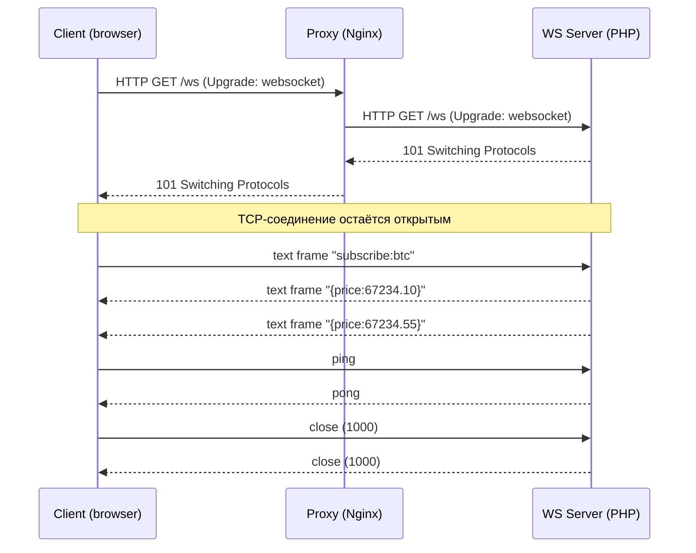

# WebSocket в PHP: полное и исчерпывающее руководство для Senior-разработчика (PHP 8.2 + Symfony 6.4)

> Это руководство — практический справочник по WebSocket для PHP/Symfony-разработчика уровня Senior. Оно покрывает протокол RFC 6455 и его расширения, архитектуру асинхронных PHP-серверов (Ratchet/ReactPHP, Workerman, OpenSwoole, RoadRunner), интеграцию с Symfony 6.4 через Mercure и Centrifugo, аутентификацию, безопасность (WSS, CSWSH, Origin), масштабирование, sticky sessions, Redis Pub/Sub, мониторинг, тестирование и сравнение с альтернативами (SSE, long-polling, HTTP/2, gRPC streaming, MQTT). Все примеры работоспособны и решают конкретные бизнес-задачи: live-нотификации, чаты, биржевые тикеры, collaborative editing, мониторинг.

---

## Оглавление

1. [[#1. Что такое WebSocket и зачем он нужен|Что такое WebSocket и зачем он нужен]]
2. [[#2. Протокол WebSocket (RFC 6455) изнутри|Протокол WebSocket (RFC 6455) изнутри]]
3. [[#3. Жизненный цикл соединения и состояния|Жизненный цикл соединения и состояния]]
4. [[#4. WebSocket vs SSE vs Long-polling vs HTTP/2 vs gRPC streaming|WebSocket vs SSE vs Long-polling vs HTTP/2 vs gRPC streaming]]
5. [[#5. Почему классический PHP-FPM не подходит и как это решить|Почему классический PHP-FPM не подходит и как это решить]]
6. [[#6. Обзор PHP-стека для WebSocket|Обзор PHP-стека для WebSocket]]
7. [[#7. Ratchet + ReactPHP: базовый сервер|Ratchet + ReactPHP: базовый сервер]]
8. [[#8. Event loop, неблокирующий I/O и подводные камни|Event loop, неблокирующий I/O и подводные камни]]
9. [[#9. OpenSwoole / Workerman / RoadRunner|OpenSwoole / Workerman / RoadRunner]]
10. [[#10. Symfony 6.4: интеграция с Mercure (рекомендованный путь)|Symfony 6.4: интеграция с Mercure (рекомендованный путь)]]
11. [[#11. Centrifugo как production-сервер для PHP-приложений|Centrifugo как production-сервер для PHP-приложений]]
12. [[#12. Аутентификация и авторизация в WebSocket|Аутентификация и авторизация в WebSocket]]
13. [[#13. Безопасность: WSS, CSWSH, Origin, rate limit|Безопасность: WSS, CSWSH, Origin, rate limit]]
14. [[#14. Heartbeat, idle-таймауты, обнаружение разрывов|Heartbeat, idle-таймауты, обнаружение разрывов]]
15. [[#15. Backpressure и flow control|Backpressure и flow control]]
16. [[#16. Масштабирование: sticky sessions, Pub/Sub, шардирование|Масштабирование: sticky sessions, Pub/Sub, шардирование]]
17. [[#17. Reverse proxy: Nginx и HAProxy для WebSocket|Reverse proxy: Nginx и HAProxy для WebSocket]]
18. [[#18. Развёртывание: systemd, supervisord, Docker, K8s|Развёртывание: systemd, supervisord, Docker, K8s]]
19. [[#19. Мониторинг и метрики|Мониторинг и метрики]]
20. [[#20. Тестирование WebSocket-кода|Тестирование WebSocket-кода]]
21. [[#21. Subprotocols, extensions и permessage-deflate|Subprotocols, extensions и permessage-deflate]]
22. [[#22. Бизнес-сценарии и архитектурные паттерны|Бизнес-сценарии и архитектурные паттерны]]
23. [[#23. Типичные ошибки и анти-паттерны|Типичные ошибки и анти-паттерны]]
24. [[#24. Сравнение библиотек и решений|Сравнение библиотек и решений]]
25. [[#25. Проверочные вопросы с ответами|Проверочные вопросы с ответами]]
26. [[#26. Источники|Источники]]

---

## 1. Что такое WebSocket и зачем он нужен

**WebSocket** (RFC 6455, 2011) — прикладной протокол поверх TCP, обеспечивающий **двунаправленный полнодуплексный** канал связи между клиентом и сервером по одному соединению. Стартует как обычный HTTP-запрос с заголовком `Upgrade: websocket`, после чего соединение «переключается» в собственный фрейм-протокол и больше не использует HTTP-семантику.

**Бизнес-ценность:**
- Низкая задержка (нет накладных расходов HTTP-запроса на каждое сообщение).
- Сервер может **сам инициировать** отправку — критично для живых уведомлений, тикеров, чатов, коллаборации.
- Меньше трафика и CPU при частых обменах: handshake один раз, дальше — лёгкие фреймы (2–14 байт оверхеда).

**Где применяется на практике:**
- **Финтех/трейдинг**: котировки, стакан, сделки в реальном времени (Binance, Bybit отдают данные через WS).
- **Чаты и мессенджеры**: WhatsApp Web, Slack, Discord.
- **Collaborative editing**: Google Docs, Figma, Notion (в связке с CRDT/OT).
- **Live-уведомления и dashboards**: админки SaaS, антифрод, мониторинг.
- **Игры**: realtime-мультиплеер, лобби, матчмейкинг.
- **IoT-шлюзы** (хотя для устройств чаще MQTT).

**Когда WebSocket НЕ нужен:**
- Если сервер только отправляет данные клиенту (новости, лента) — достаточно **Server-Sent Events (SSE)**: проще, работает поверх обычного HTTP, переподключается автоматически.
- Если обновления редкие (раз в минуту и реже) — обычный polling или ETag-кеш дешевле.
- Если нужна гарантированная доставка с очередями и retry — берите **брокер сообщений** (RabbitMQ/Kafka), а WS — только как «последняя миля» к браузеру.

> **Аналогия для новичка.** Обычный HTTP — это телеграмма: написал → отправил → ждёшь ответ → канал закрыт. WebSocket — это телефонный разговор: дозвонился один раз и дальше говорите оба, пока кто-то не положит трубку. Звонок дороже одной телеграммы установить, но если вы обмениваетесь сотнями реплик — суммарно выгоднее.

---

## 2. Протокол WebSocket (RFC 6455) изнутри

### 2.1. Handshake (рукопожатие)

Клиент отправляет **обычный HTTP/1.1-запрос** со специальными заголовками:

```http
GET /ws/notifications HTTP/1.1
Host: api.example.com
Upgrade: websocket
Connection: Upgrade
Sec-WebSocket-Key: dGhlIHNhbXBsZSBub25jZQ==
Sec-WebSocket-Version: 13
Origin: https://app.example.com
Sec-WebSocket-Protocol: notifications.v1
```

Сервер, если согласен, отвечает `101 Switching Protocols`:

```http
HTTP/1.1 101 Switching Protocols
Upgrade: websocket
Connection: Upgrade
Sec-WebSocket-Accept: s3pPLMBiTxaQ9kYGzzhZRbK+xOo=
Sec-WebSocket-Protocol: notifications.v1
```

`Sec-WebSocket-Accept` — это `base64(sha1(Sec-WebSocket-Key + "258EAFA5-E914-47DA-95CA-C5AB0DC85B11"))`. GUID фиксирован в RFC. Это защита от того, чтобы случайный кеш или прокси не приняли произвольный ответ за валидный WS-handshake.

После `101` соединение TCP **остаётся открытым**, но HTTP больше не используется — стороны обмениваются **фреймами**.

### 2.2. Формат фрейма

```text
 0                   1                   2                   3
 0 1 2 3 4 5 6 7 8 9 0 1 2 3 4 5 6 7 8 9 0 1 2 3 4 5 6 7 8 9 0 1
+-+-+-+-+-------+-+-------------+-------------------------------+
|F|R|R|R| opcode|M| Payload len |    Extended payload length    |
|I|S|S|S|  (4)  |A|     (7)     |             (16/64)           |
|N|V|V|V|       |S|             |                               |
| |1|2|3|       |K|             |                               |
+-+-+-+-+-------+-+-------------+- - - - - - - - - - - - - - - -+
|     Extended payload length continued, if payload len == 127  |
+ - - - - - - - - - - - - - - - +-------------------------------+
|                               |Masking-key, if MASK set       |
+-------------------------------+-------------------------------+
|             Payload Data continued ...                        |
+---------------------------------------------------------------+
```

Ключевые поля:
- **FIN** — последний фрейм сообщения (одно сообщение может быть нарезано на несколько фреймов).
- **opcode** (4 бита):
  - `0x0` continuation, `0x1` text (UTF-8), `0x2` binary,
  - `0x8` close, `0x9` ping, `0xA` pong.
- **MASK** — клиент **ОБЯЗАН** маскировать payload (XOR со случайным 4-байтным ключом). Сервер маскировать не должен. Маскирование — защита от cache poisoning через прокси, которые могли бы интерпретировать специально подобранные payload как HTTP-запрос.
- **Payload length** — 7 бит, если ≤125; иначе 7+16 бит (если 126), либо 7+64 (если 127). Максимум — 2^63 байт, но на практике сервер обязан ограничивать.

### 2.3. Контрольные фреймы (control frames)

`close`, `ping`, `pong` — control frames. Они **не могут быть фрагментированы** и их payload **не больше 125 байт**. Это сделано, чтобы их можно было обработать «между» большими сообщениями.

Закрытие соединения — это обмен `close`-фреймами с кодом причины (`1000` нормально, `1001` уход, `1006` abnormal — никогда не отправляется по сети, только генерируется библиотекой при разрыве, `1008` policy violation, `1011` server error и т.д., см. RFC 6455 §7.4).

> **Подводный камень.** Бинарные фреймы с opcode `0x2` приходят как сырые байты — текст внутри них **не обязан** быть UTF-8. Если вы шлёте JSON — используйте text frames (`0x1`). Если шлёте protobuf/MsgPack — binary. Не путать: невалидный UTF-8 в text frame — это причина закрытия с кодом `1007`.



---

## 3. Жизненный цикл соединения и состояния

```text
[OPENING] --handshake OK--> [OPEN] --close frame--> [CLOSING] --TCP FIN--> [CLOSED]
                                |
                                +--TCP error--> [CLOSED] (code 1006)
```

В браузерном API эти состояния доступны как `WebSocket.readyState`: `CONNECTING (0)`, `OPEN (1)`, `CLOSING (2)`, `CLOSED (3)`.

**Что важно для PHP-сервера:**
- На **OPEN** — регистрируем соединение в реестре (memory map `connectionId → user`), подписываем на нужные каналы, шлём начальный snapshot.
- На каждое **сообщение** — НЕ блокируем обработку. Если работа тяжёлая (запрос в БД, внешний API), уносим в очередь (Symfony Messenger) и отдаём ответ позже.
- На **CLOSING/CLOSED** — освобождаем ресурсы, отписываемся от каналов, обновляем «онлайн» статус пользователя.

> **Аналогия.** Соединение — это арендованный стол в ресторане. Вы не можете под одним столом обслужить тысячу клиентов: либо стол занят надолго (WS), либо это «фастфуд» (HTTP — пришёл, забрал, ушёл). Поэтому WS-сервер всегда выглядит как **долгоживущий процесс с реестром столов**.

---

## 4. WebSocket vs SSE vs Long-polling vs HTTP/2 vs gRPC streaming

| Критерий | WebSocket | SSE (EventSource) | Long-polling | HTTP/2 push | gRPC streaming |
|---|---|---|---|---|---|
| Направление | bidirectional | server→client only | client→server (с задержкой) | server→client | bidirectional |
| Поверх HTTP | upgrade | да (text/event-stream) | да | да | да (HTTP/2) |
| Авто-reconnect | нет (вручную) | да (`Last-Event-ID`) | вручную | — | вручную |
| Бинарные данные | да | нет (только UTF-8) | да | да | да (protobuf) |
| Поддержка прокси | требует настройки | работает «из коробки» | да | требует HTTP/2 e2e | требует HTTP/2 e2e |
| Браузер | да | да (кроме старого IE) | да | устаревшее | через grpc-web |
| Сложность сервера | высокая (stateful) | низкая | низкая | средняя | средняя |
| Когда выбирать | чаты, игры, торговля | live-feed, нотификации, прогресс задач | legacy/совместимость | (не рекомендуется) | межсервисное API |

**Эвристика выбора:**
- Сервер только пушит обновления → **SSE**. Это самый недооценённый инструмент. Mercure (Symfony) построен на SSE именно поэтому.
- Клиент и сервер одинаково активны → **WebSocket**.
- Микросервис ↔ микросервис → **gRPC streaming** (или Kafka), не WebSocket.
- Нет HTTP/2 в инфраструктуре или нужна мобильная батареесберегающая реализация → **MQTT** (но это не браузерный протокол).

---

## 5. Почему классический PHP-FPM не подходит и как это решить

PHP-FPM — это «request-per-process» модель: воркер живёт **только** на время одного HTTP-запроса. После ответа — `cleanup`, освобождение памяти, ожидание следующего запроса. Долгоживущее TCP-соединение в такую модель не вписывается:

1. Воркер был бы занят одним пользователем неограниченное время → пул быстро исчерпан.
2. У FPM нет event loop — `fread()` на сокете блокирует процесс.
3. Нет общей памяти между воркерами для реестра соединений.

**Решения (по порядку популярности):**

1. **Внешний WebSocket-сервер**, общающийся с PHP-приложением через HTTP/Pub-Sub:
   - **Mercure Hub** (SSE-based, Symfony first-class).
   - **Centrifugo** (WS/SSE/HTTP-stream, бэкенд может оставаться FPM).
   - **Soketi** (Pusher-протокол, drop-in для Laravel Echo).
2. **Долгоживущий PHP-процесс** на event loop:
   - **Ratchet** (поверх ReactPHP, чистый PHP).
   - **Workerman** (свой event loop, libevent/event).
   - **OpenSwoole / Swoole** (C-расширение, корутины).
   - **RoadRunner** (Go-сервер + PHP-воркеры через goridge).
3. **Гибрид**: Symfony-приложение остаётся на FPM, отдельный WS-демон (Ratchet/Centrifugo) обслуживает соединения и принимает команды от FPM по Redis Pub/Sub или HTTP.

> **Совет.** Для 95% задач в Symfony 6.4 правильный ответ — **Mercure** (если хватает SSE) или **Centrifugo** (если нужен полноценный WS с подпиской/историей/RPC). Писать свой WS-сервер на Ratchet оправдано только если у вас нестандартный бинарный subprotocol или жёсткие требования к latency и контролю над event loop.

---

## 6. Обзор PHP-стека для WebSocket

| Инструмент | Тип | PHP | Кейсы | Сильные стороны | Слабые стороны |
|---|---|---|---|---|---|
| Ratchet (`cboden/ratchet`) | библиотека на ReactPHP | 7.4+ (работает на 8.2) | свой WS-сервер на чистом PHP | низкий порог входа, чистый PHP | развитие медленное, без корутин |
| ReactPHP | event loop фреймворк | 8.1+ | основа для Ratchet, async HTTP | зрелая, без расширений | нужно мыслить в Promise/coroutine |
| Workerman | свой event loop | 7.0+ | масштабные WS, gateway/worker модель | свой Gateway-Worker для масштаба | другой стиль, не Symfony-friendly |
| OpenSwoole | C-расширение | 8.0+ | высоконагруженные сервисы, корутины | производительность, корутины | требует ext, отдельная экосистема |
| RoadRunner v3 | Go-сервер + PHP | 8.1+ | Symfony as long-running service | прод-готовый, plugins | плагин WS требует настройки |
| Mercure Hub | сервер на Go | — (HTTP API) | live updates, SSE, Symfony | официальная интеграция, простота | только server→client (SSE) |
| Centrifugo | сервер на Go | — (HTTP/GRPC API) | чаты, нотификации, presence | history, presence, RPC, scale | внешняя зависимость на Go |
| Soketi | сервер на Node.js | — (Pusher API) | drop-in Pusher для Laravel/Echo | совместимость Pusher | Node, не PHP-нативно |
| ApiPlatform Mercure | надстройка | 8.2+ | автоматический CRUD + live | zero-config Live updates | только GET-обновления ресурсов |

В этом руководстве мы детально рассмотрим: **Ratchet** (как ввод в тему), **Mercure** и **Centrifugo** (как основные production-инструменты для Symfony), а также **OpenSwoole** (для high-load).

---
